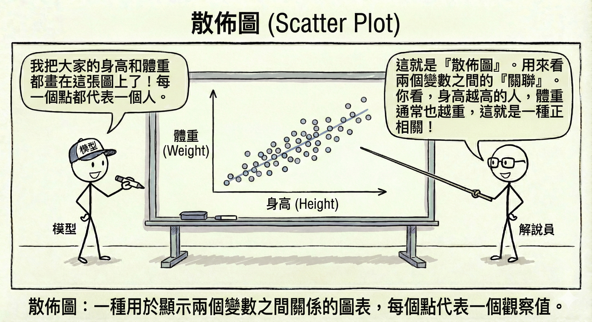
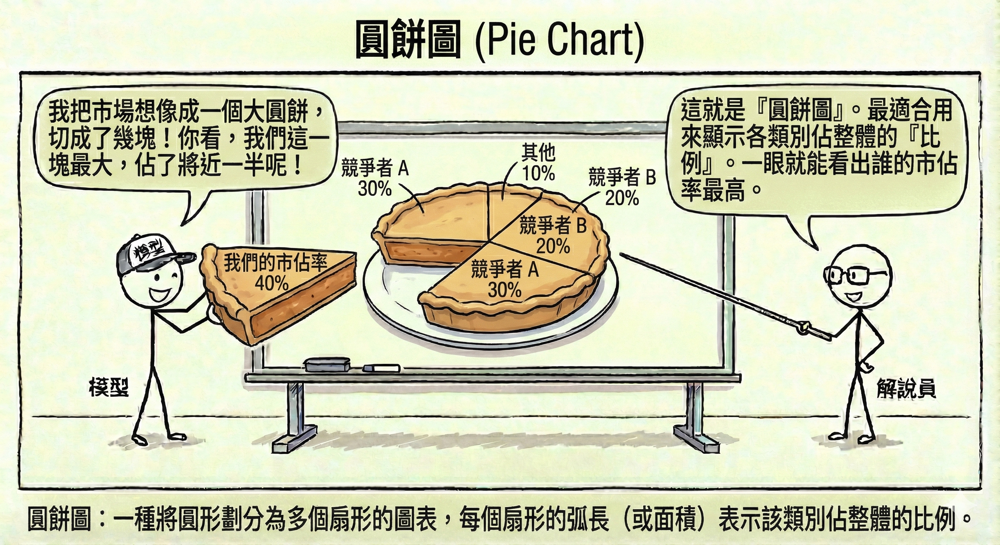
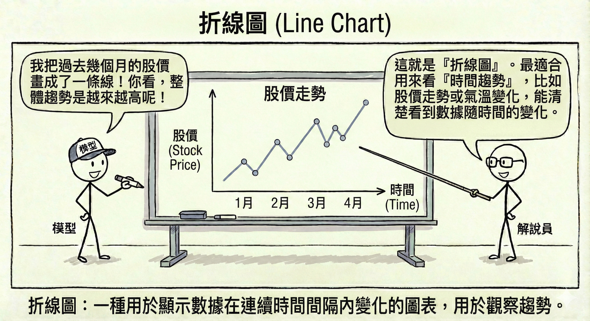
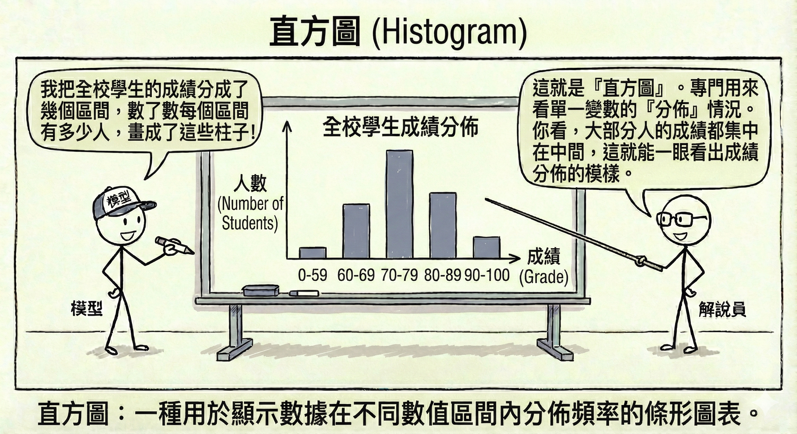
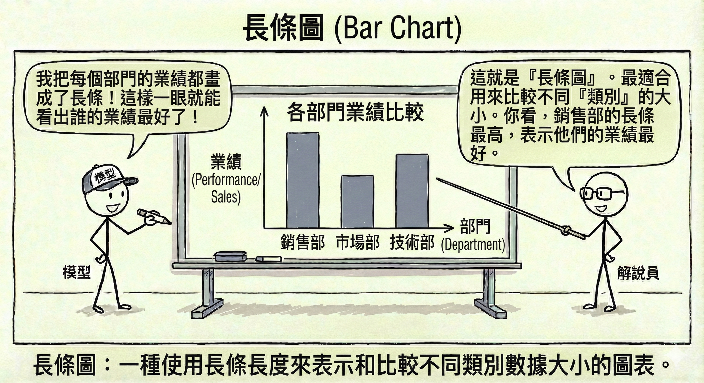
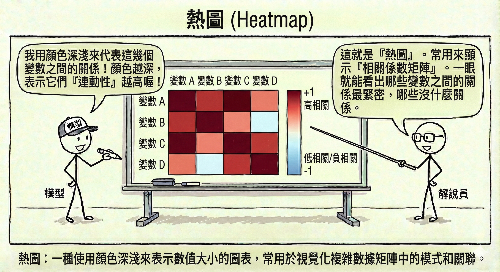
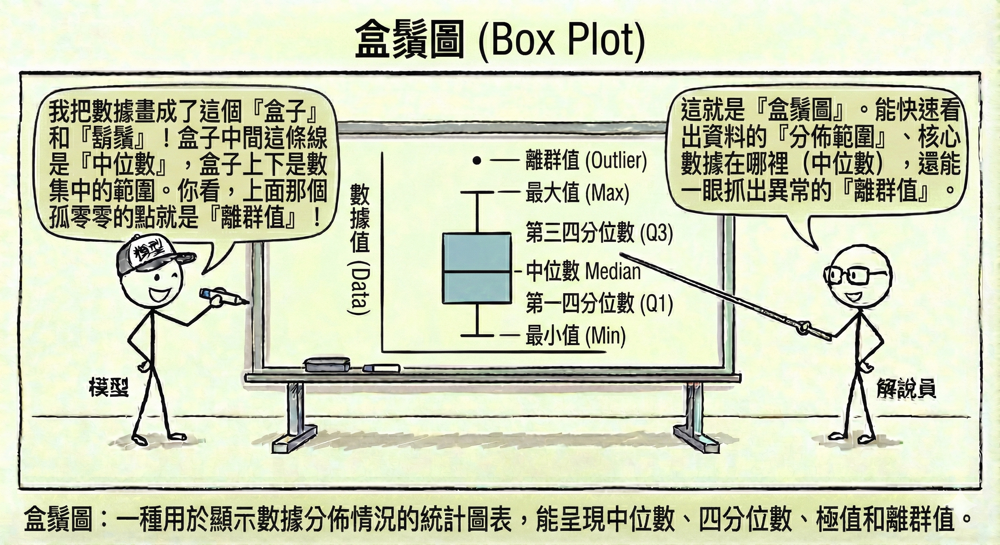

# 數據處理生命週期與架構

在 AI 的世界裡，有一句名言：「垃圾進，垃圾出 (Garbage In, Garbage Out, GIGO)」。無論你的模型多麼先進，如果餵給它的資料品質低劣，結果也將毫無價值。本章將探討資料如何從原始狀態，經過層層處理，最終變成模型可用的燃料。

## 3.1 資料管道 (Data Pipeline) {#sec-data-pipeline}

資料管道就像是城市的**供水系統**。水源（原始資料）可能來自水庫、河流或地下水，必須經過過濾、消毒、輸送（處理過程），最後才能從家裡的水龍頭流出乾淨的自來水（可用資料）。

### ETL (Extract-Transform-Load) 架構 {#sec-etl}

這是最傳統也最常見的資料處理流程，特別適用於結構化資料（如資料庫表格）。

1.  **資料擷取 (Extract)**：從各種來源（資料庫、API、檔案）收集資料。就像去市場**買菜**。
2.  **資料轉換 (Transform)**：清洗、格式化、計算衍生欄位。就像在廚房**備料**（洗菜、切肉、醃製）。這是最耗時的步驟。
3.  **資料載入 (Load)**：將處理好的資料存入目標系統（通常是資料倉儲 Data Warehouse）。就像將煮好的菜**端上桌**。

*   **特點**：先處理再儲存，確保進入倉庫的資料都是乾淨、格式統一的。但若需求變更，需要重新設計轉換流程。

### ELT (Extract-Load-Transform) 架構與資料湖 (Data Lake) {#sec-elt}

隨著大數據 (Big Data) 的興起，資料量大到無法先處理再儲存，或者資料是非結構化的（如日誌、圖片、影片），ELT 架構應運而生。

*   **流程**：先把所有資料（不管髒不髒）全部抓進來（Extract & Load），存放在一個巨大的儲存庫中，稱為**資料湖 (Data Lake)**。等到需要分析時，再進行轉換 (Transform)。
*   **類比**：這就像**搬家**。先把舊家的東西全部裝箱搬到新家（Load），等到要用某個東西時，再打開箱子整理（Transform）。
*   **優勢**：靈活、速度快，保留了原始資料的細節。

### 批次處理 vs. 串流處理 {#sec-batch-vs-streaming}

*   **批次處理 (Batch Processing)**：累積一段時間的資料後，一次性處理。
    *   **類比**：**公車**。要等到時刻表到了或人坐滿了才發車。
    *   **適用**：日報表、月結算、不需要即時性的分析。
*   **串流處理 (Streaming Processing)**：資料一產生就立刻處理。
    *   **類比**：**計程車**。隨叫隨走，來一個載一個。
    *   **適用**：即時詐欺偵測、股市交易監控、即時推薦系統。

## 3.2 探索性資料分析 (EDA) {#sec-eda}

在正式建模之前，我們必須先「認識」資料。探索性資料分析 (Exploratory Data Analysis, EDA) 就像是**相親**，你需要透過各種方式了解對方的個性、習慣和背景。

### 統計摘要 (Descriptive Statistics) {#sec-descriptive-statistics}

用數字來描述資料的整體樣貌。

*   **集中趨勢**：尋找資料的「中心」。
    *   **平均數 (Mean)**：所有數值加總除以個數。容易受極端值影響（如比爾蓋茲走進酒吧，平均財富瞬間飆升）。
    *   **中位數 (Median)**：將資料由小到大排列，位於中間的那個數。代表「一般人」的水準，不受極端值影響。
    *   **眾數 (Mode)**：出現次數最多的數值。
*   **離散程度**：資料分佈得有多「散」。
    *   **標準差 (Standard Deviation)**：數值與平均數的平均距離。標準差越大，代表資料越參差不齊。
    *   **四分位數 (Quartiles)**：將資料切成四等份的切點。
*   **偏態 (Skewness)**：資料分佈是偏左還是偏右。

### 資料視覺化決策邏輯 {#sec-data-visualization}

一張圖勝過千言萬語，但選錯圖表會造成誤導。

*   **散佈圖 (Scatter Plot)**：看兩個變數之間的**關聯**（例如：身高 vs. 體重）。

*   **圓餅圖 (Pie Chart)**：顯示各類別佔整體的**比例**（例如：市佔率）。

*   **折線圖 (Line Chart)**：看**時間趨勢**（例如：股價走勢、氣溫變化）。

*   **直方圖 (Histogram)**：看單一變數的**分佈**情況（例如：全校學生的成績分佈）。

*   **長條圖 (Bar Chart)**：比較不同**類別**的大小（例如：各部門的業績比較）。

*   **熱圖 (Heatmap)**：用顏色深淺表示數值大小，常用於顯示**相關係數矩陣**（哪些變數連動性高）。

*   **盒鬚圖 (Box Plot)**：快速看出資料的分佈範圍、中位數以及**離群值**。

## 3.3 資料清理與品質管理 {#sec-data-cleaning}

現實世界的資料往往是髒亂的。資料清理 (Data Cleaning) 通常佔據資料科學家 80% 的時間。

### 缺失值處理 (Missing Values) {#sec-missing-values}

資料中有空格怎麼辦？

*   **刪除法**：如果缺失比例很低，直接刪除該筆資料。但可能會丟失重要資訊。
*   **插補法 (Imputation)**：用「猜」的。
    *   用平均數、中位數填補（最簡單）。
    *   用機器學習模型預測缺失值（較精準）。

### 異常值/離群值處理 (Outliers) {#sec-outliers}

有些資料點明顯與眾不同，例如身高 300 公分的人，或是年齡 200 歲。

*   **偵測方法**：
    *   **Z-score**：超過平均數 3 個標準差以外的數值。
    *   **四分位距 (IQR)**：在盒鬚圖鬚鬚之外的點。
*   **處理方式**：
    *   如果是輸入錯誤（如年齡 200），直接修正或刪除。
    *   如果是真實存在的極端值（如億萬富翁的收入），可以使用**對數轉換 (Log Transformation)** 來壓縮數值，減少其對模型的影響。

### 數據一致性處理 {#sec-consistency}

*   **欄位標準化**：將 "Taipei", "Taipei City", "TP" 統一為 "Taipei"。
*   **去重 (Deduplication)**：刪除重複的紀錄。

### 資料匿名化與隱私保護 (PII 處理) {#sec-anonymization}

在處理涉及個人隱私 (PII, Personally Identifiable Information) 的資料時，必須進行去識別化。
*   **遮罩 (Masking)**：將姓名顯示為 "王O明"。
*   **泛化 (Generalization)**：將年齡 "25 歲" 改為 "20-30 歲區間"。
