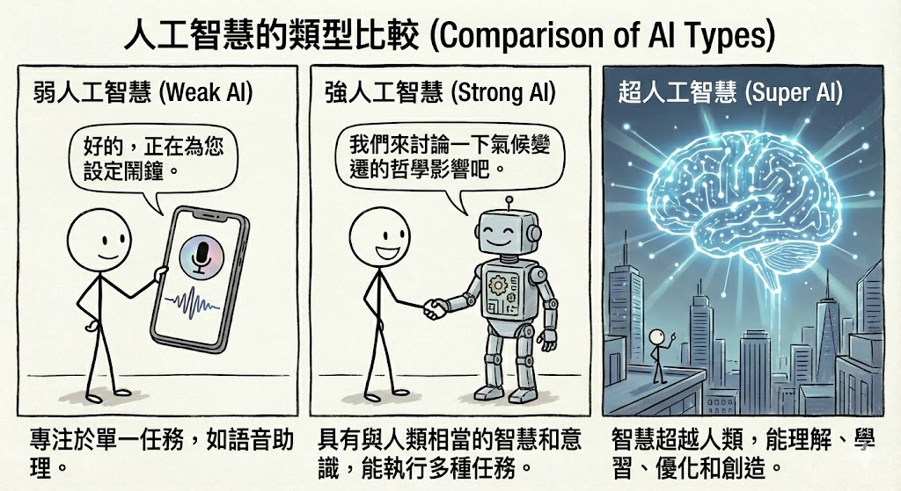
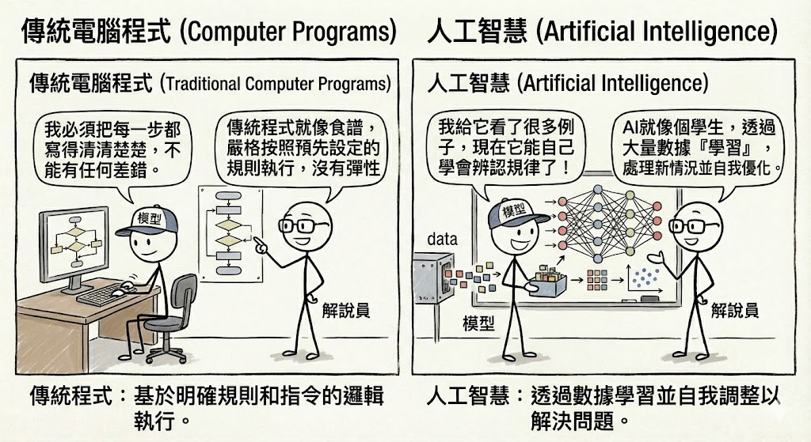
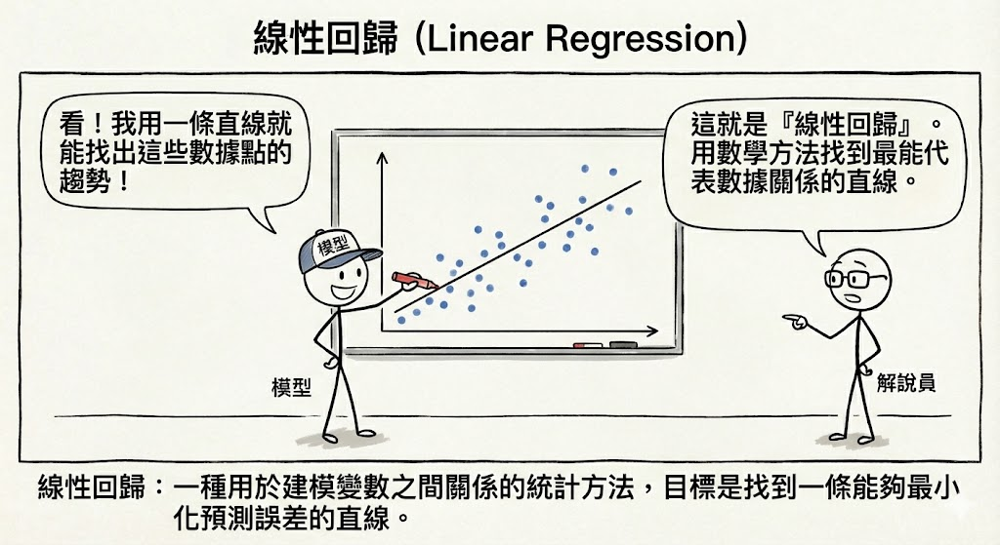
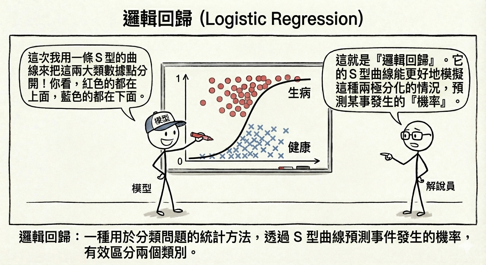
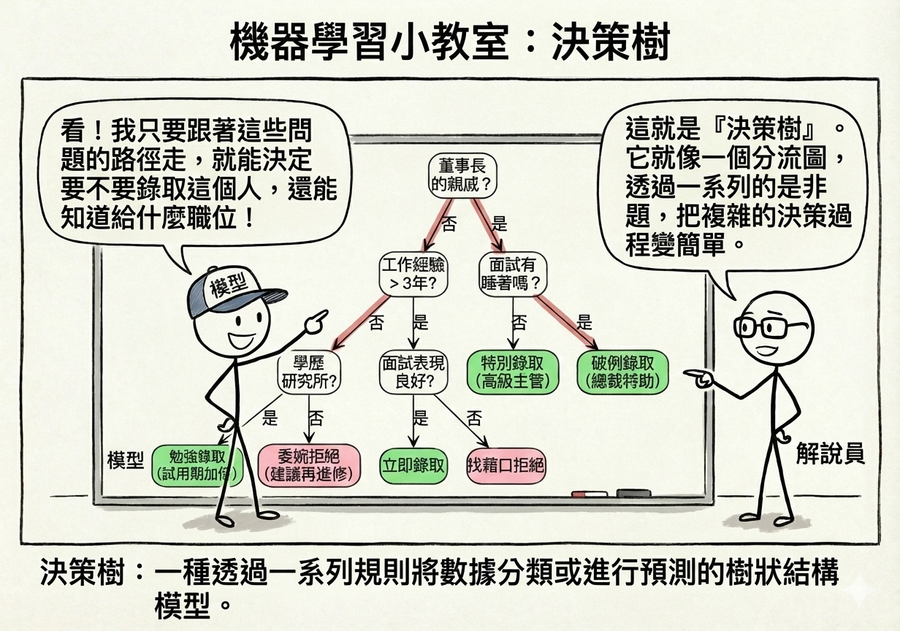

# 第一篇：人工智慧與機器學習基礎 (AI & Machine Learning Fundamentals)

歡迎來到人工智慧 (AI) 的世界！這本書將帶領你從零開始，深入淺出地理解 AI 的核心概念、運作原理以及它如何改變我們的生活。我們不需要複雜的數學公式，而是用直觀的語言和生動的例子，讓你輕鬆掌握這些看似高深的技術。

## 第一章：人工智慧概論 (Introduction to AI)

### 什麼是人工智慧？

簡單來說，人工智慧 (Artificial Intelligence, AI) 就是讓電腦擁有像人類一樣的「智慧」。這包括學習、推理、解決問題、理解語言，甚至感知環境的能力。想像一下，傳統的電腦程式就像是一個只會聽命行事的工廠作業員，你必須給它明確的指令（程式碼），它才會動作。而 AI 則像是一個聰明的學徒，它可以透過觀察數據和經驗，自己學會如何完成任務。

### AI 的三種型態

我們可以將 AI 依據其能力的強弱，分為三個等級：

<!-- Generate a flat illustration comparing three types of AI. 1. Weak AI: A smartphone showing Siri/Assistant icon. 2. Strong AI: A robot shaking hands with a human, looking equal. 3. Super AI: A glowing, abstract digital brain hovering above a city, symbolizing superior intelligence. Style: Modern, clean, vector art. -->

1.  **弱人工智慧 (Artificial Narrow Intelligence, ANI)**：
    這是我們目前生活中最常見的 AI。它們是「專才」，非常擅長做某一件特定的事情，甚至做得比人類更好，但在其他方面則一竅不通。
    *   **例子**：打敗圍棋冠軍的 AlphaGo、手機裡的 Siri 語音助理、Netflix 的影片推薦系統。AlphaGo 雖然下圍棋無敵，但它不會開車，也不會和你哈拉聊天。

2.  **強人工智慧 (Artificial General Intelligence, AGI)**：
    這是科學家們努力的目標，也是科幻電影中常見的 AI。它們是「通才」，具備像人類一樣的通用智慧，可以學習任何人類能學會的技能，具備常識、情感和自我意識。
    *   **例子**：電影《雲端情人 (Her)》中的薩曼莎，或是《鋼鐵人》中的賈維斯。目前我們尚未真正達成 AGI。

3.  **超人工智慧 (Artificial Super Intelligence, ASI)**：
    這是理論上 AI 發展的終極階段。當 AI 的智慧在所有領域（包括創造力、社交技巧、問題解決能力）都遠遠超越最聰明的人類時，我們就稱之為超人工智慧。這是一個充滿未知與想像的領域。

---

## 第二章：機器學習基礎 (Machine Learning Basics)

### 教電腦「學習」，而不是「聽令」

機器學習 (Machine Learning, ML) 是 AI 的一個子領域，也是目前 AI 發展的核心動力。

*   **傳統程式設計**：我們輸入「規則」和「數據」，電腦給出「答案」。例如，我們告訴電腦「如果下雨，就帶傘」，電腦看到「下雨」的數據，就會輸出「帶傘」。
*   **機器學習**：我們輸入「數據」和「答案」，電腦自己找出「規則」。例如，我們給電腦看一萬張貓的照片（數據）並告訴它這些是貓（答案），電腦就會自己分析出貓的特徵（有尖耳朵、鬍鬚...），最後學會如何辨識貓。

> **Figure Prompt:** Generate a diagram contrasting "Traditional Programming" vs "Machine Learning". Top flow: Rules + Data -> [Traditional Programming] -> Answers. Bottom flow: Data + Answers -> [Machine Learning] -> Rules. Use icons for Data (document), Rules (scroll), and Answers (lightbulb).

### 常見的機器學習模型 (你的 AI 工具箱)

機器學習有很多種方法（模型），就像工具箱裡有不同的工具，適用於不同的問題。

{#fig-linear-regression}

1.  **線性回歸 (Linear Regression)**：
    *   **概念**：想像你在畫一張圖，橫軸是房子的大小，縱軸是房價。你會發現點點大致分佈在一條線附近。線性回歸就是試著畫出這條「最佳直線」，用來預測未來的趨勢。
    *   **數學原理 (Friendly Math)**：
        其實這條線的公式非常簡單，就是國中學過的：
        $$ y = wx + b $$
        *   **$y$ (預測值)**：我們想知道的答案（例如：房價）。
        *   **$x$ (輸入值)**：我們已知的資訊（例如：房子坪數）。
        *   **$w$ (權重 Weight)**：這代表影響力的大小。例如，每多一坪，房價會增加多少？這個「多少」就是 $w$（斜率）。
        *   **$b$ (偏差 Bias)**：這代表起跑點。就算坪數是 0，房子也不會是免費的（可能有地段的基本價值），這個基本值就是 $b$（截距）。
        
        **AI 的任務**，就是透過看大量的數據，自動算出最準確的 $w$ 和 $b$ 是多少。
    *   **應用**：預測房價、股票走勢、銷售量。
    *   **如何知道準不準？(RSE)**：
        我們怎麼知道這條線畫得好不好？這就要看 **RSE (殘差標準誤, Residual Standard Error)**。
        *   **概念**：想像這條線是「標準答案」，但真實的房價（紅點）通常不會剛好落在線上，而是會散落在線的上下。RSE 就是在計算這些點**平均偏離**這條線多遠。
        *   **解讀**：RSE **越小越好**。
            *   如果 RSE = 0，代表所有點都在線上，預測完美（但現實中幾乎不可能）。
            *   如果 RSE 很大，代表點點分佈得很散，這條線的預測能力很差。
        *   **公式 (Friendly Math)**：
            $$ RSE = \sqrt{\frac{1}{n-2}\sum (y_i - \hat{y}_i)^2} $$
            別被嚇到了！簡單來說就是：把每個點的誤差 $(y - \hat{y})$ 平方加起來，除以點的數量，再開根號。就像是算所有誤差的「平均值」。

2.  **邏輯回歸 (Logistic Regression)**：

{#fig-logistic-regression}

    *   **概念**：雖然名字有「回歸」，但它其實是用來做「分類」的。它像是一個開關，判斷事情是「是」或「否」（0 或 1）。
    *   **數學原理 (Friendly Math)**：
        它其實就是把線性回歸的結果，丟進一個 S 型的函數（Sigmoid 函數）裡面：
        $$ P(y=1) = \frac{1}{1 + e^{-(wx+b)}} $$
        *   **Sigmoid 函數**：這個函數很神奇，不管你輸入多大或多小的數字，它吐出來的結果永遠在 0 到 1 之間。
        *   **機率**：這個 0 到 1 的數字，就代表「機率」。例如算出 0.8，就代表有 80% 的機率是垃圾郵件。
        *   **決策**：通常我們設 0.5 為門檻。大於 0.5 就是「是」，小於 0.5 就是「否」。
    *   **應用**：判斷電子郵件是不是垃圾郵件、這筆交易是不是詐騙。

3.  **決策樹 (Decision Tree)**：
{#fig-decision-tree}
    *   **概念**：這就像是在玩「20 個問題」遊戲。透過一連串的「是/否」問題，將數據層層分類，直到得出結論。
    *   **數學原理 (Friendly Math)**：
        決策樹怎麼知道要先問哪個問題？它會算一個叫做 **「亂度 (Entropy)」** 或 **「基尼係數 (Gini Impurity)」** 的東西。
        *   **亂度**：想像一個房間裡有紅球和藍球。如果紅藍各半，亂度最大（最難猜）；如果全是紅球，亂度為 0（最好猜）。
        *   **資訊獲利 (Information Gain)**：AI 會試著問一個問題（例如：球是大顆的嗎？），如果問完之後，分出來的兩堆球「亂度」變小了，代表這個問題問得好！AI 就是一直在找能讓亂度下降最快的問題。
    *   **結構**：樹根是第一個問題，樹枝是選項，樹葉是最終的分類結果。
    *   **應用**：銀行審核貸款（年收入 > 100萬？是 -> 信用良好？是 -> 核准）。

> **Figure Prompt:** Generate a visualization of a Decision Tree. The root node asks "Is it raining?". Left branch "Yes" -> "Is it windy?" -> "Don't go out". Right branch "No" -> "Go out". Style: Clean, flowchart style with icons.

4.  **隨機森林 (Random Forest)**：
    *   **概念**：俗話說「三個臭皮匠，勝過一個諸葛亮」。隨機森林就是種植很多棵「決策樹」，然後讓它們投票。如果大部分的樹都說是「A 類」，那結果就是 A。這通常比單一決策樹更準確。
    *   **數學原理 (Friendly Math)**：
        *   **集成學習 (Ensemble Learning)**：這背後的數學原理叫做「大數法則」。假設每一棵樹的準確率只有 60%（比亂猜好一點），但如果我們有 100 棵樹一起投票，犯錯的機率就會大幅下降。
        *   **隨機性**：為什麼叫「隨機」？因為每棵樹看到的數據都不太一樣（隨機抽樣），這樣它們才會有不同的觀點，投票起來才客觀。

5.  **支援向量機 (SVM)**：
    *   **概念**：想像桌上有紅球和藍球混在一起。SVM 的任務就是拿一根棍子（在二維平面是線，三維空間是面），試著把紅球和藍球分得越開越好，這根棍子就是「最佳超平面」。
    *   **數學原理 (Friendly Math)**：
        SVM 不只是要分開，還要找 **「最寬的馬路 (Margin)」**。
        *   **Margin**：這條線到最近的紅球和最近的藍球的距離。SVM 想要讓這個距離最大化。
        *   **公式**：目標是 Maximize $\frac{2}{||w||}$。簡單說，就是讓路越寬越好，這樣以後有新的球丟進來，才不會容易判斷錯誤。

6.  **K-近鄰演算法 (KNN)**：
    *   **概念**：物以類聚。當來了一個新數據，KNN 會看它最近的 K 個鄰居是誰。如果鄰居大多是紅球，那它大概也是紅球。
    *   **數學原理 (Friendly Math)**：
        怎麼算「最近」？就是用我們國中學過的 **「距離公式 (Euclidean Distance)」**：
        $$ d = \sqrt{(x_1-x_2)^2 + (y_1-y_2)^2} $$
        *   AI 會算出新點跟所有舊點的距離，然後挑出最近的 K 個（例如 K=3）。
        *   如果這 3 個鄰居是「紅、紅、藍」，那新點就是「紅」。

7.  **K-平均演算法 (K-Means)**：
    *   **概念**：這是一種「非監督式學習」（沒有標準答案）。想像你有一堆混在一起的珠子，K-Means 會自動幫你把顏色或大小相近的珠子分成 K 堆。
    *   **數學原理 (Friendly Math)**：
        它在找 **「重心 (Centroid)」**。
        1.  先隨便選 K 個點當隊長（重心）。
        2.  每個人（數據點）都加入離自己最近的隊長那組。
        3.  隊長重新計算自己這組的中心位置，移動過去。
        4.  重複步驟 2 和 3，直到隊長不再移動為止。
        *   這就像是大家在操場上集合，最後會自然形成幾個小圈圈，每個圈圈都有一個中心點。

---

## 第三章：深度學習與神經網路 (Deep Learning & Neural Networks)

### 模仿大腦的運作

深度學習 (Deep Learning) 是機器學習的一種特殊形式，它的靈感來自於人類大腦的運作方式。我們的大腦由數十億個神經元組成，它們相互連接傳遞訊號。深度學習使用「人工神經網路 (Artificial Neural Networks)」，模擬這種結構。

*   **神經元 (Neuron)**：接收輸入訊號，經過處理（權重加權），決定是否向下傳遞。
*   **層 (Layer)**：神經網路通常有好幾層。輸入層接收數據，隱藏層負責複雜的運算，輸出層給出結果。「深度」學習就是指有很多層隱藏層。

> **Figure Prompt:** Generate a diagram of a Neural Network. Left side: Input Layer (nodes). Middle: Several Hidden Layers (nodes connected by lines). Right side: Output Layer (nodes). Highlight the connections showing data flowing from left to right. Style: Tech, glowing lines, dark background.

### 深度學習的三大巨頭

1.  **卷積神經網路 (CNN - Convolutional Neural Networks)**：
    *   **專長**：**看**。CNN 非常擅長處理影像。它像人類的眼睛一樣，會先辨識邊緣、線條，再組合成形狀，最後辨識出物體。
    *   **應用**：人臉辨識、醫療影像診斷、自駕車看路標。

2.  **循環神經網路 (RNN - Recurrent Neural Networks)**：
    *   **專長**：**記**。RNN 擅長處理有順序的數據，它有「記憶」功能，能記住前面的資訊來幫助理解後面的資訊。
    *   **應用**：語音辨識（理解句子的前後文）、股票預測（時間序列）、語言翻譯。

3.  **Transformer**：
    *   **專長**：**專注**。這是目前最強大的架構（如 ChatGPT 背後的技術）。它引入了「自注意力機制 (Self-Attention)」，能同時看到整篇文章，並知道哪些字詞之間有強烈的關聯，而不受距離限制。
    *   **應用**：大型語言模型 (LLM)、生成式 AI。

---

## 第四章：建模與調校 (Modeling & Tuning)

### 打造完美的 AI 模型

建立一個 AI 模型就像是訓練一個運動員，需要經過精心的準備和訓練。

1.  **數據準備 (Data Preparation)**：
    *   **垃圾進，垃圾出 (Garbage In, Garbage Out)**：如果你給模型錯誤或雜亂的數據，它學出來的東西也會是一團糟。
    *   **特徵工程**：把數據轉換成電腦好理解的格式。例如，電腦看不懂「紅色」、「藍色」，我們要把它變成數字編碼 (One-hot Encoding)。
    *   **標準化**：把不同單位的數據（如身高 180 cm 和體重 70 kg）縮放到同一個範圍，避免模型產生偏差。

2.  **模型訓練與評估 (Training & Evaluation)**：
    *   **訓練集與測試集**：我們通常把數據分成兩份。80% 用來訓練（像課本），20% 用來考試（像期末考），看看模型是不是真的學會了，還是只是死背答案。
    *   **交叉驗證 (Cross-validation)**：為了更客觀，我們會輪流用不同的數據來考試。

3.  **評估指標 (Metrics)**：
    *   **準確率 (Accuracy)**：考對了幾題？（最直觀，但不一定最好）。
    *   **召回率 (Recall)**：該抓出來的壞人，抓出了幾個？（在醫療診斷或詐騙偵測中很重要，我們寧可抓錯，不可放過）。

4.  **過擬合 (Overfitting) 與 欠擬合 (Underfitting)**：
    *   **過擬合**：書讀太死。模型在訓練集（課本）表現滿分，但遇到新數據（考試）就掛了。解決方法：多做題目（增加數據）、不要讀太細（正規化）。
    *   **欠擬合**：書沒讀懂。模型連訓練集都學不好。解決方法：換個更聰明的腦袋（更複雜的模型）。

這就是 AI 與機器學習的基礎之旅。希望這些概念能幫助你更好地理解這個正在改變世界的技術！
