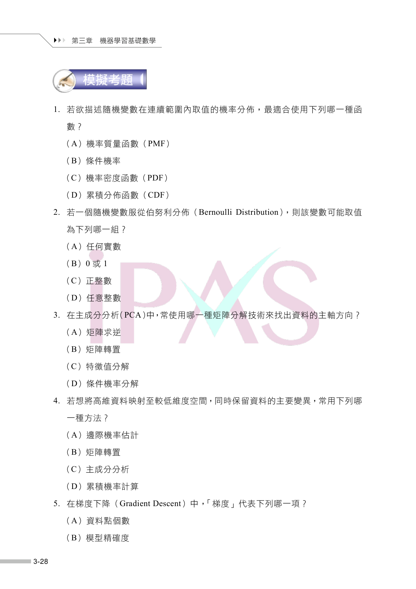
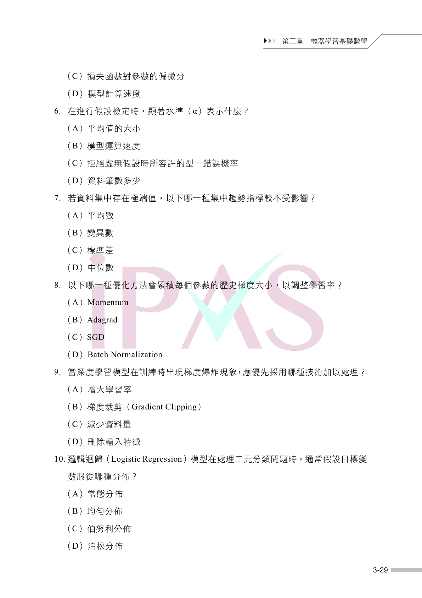
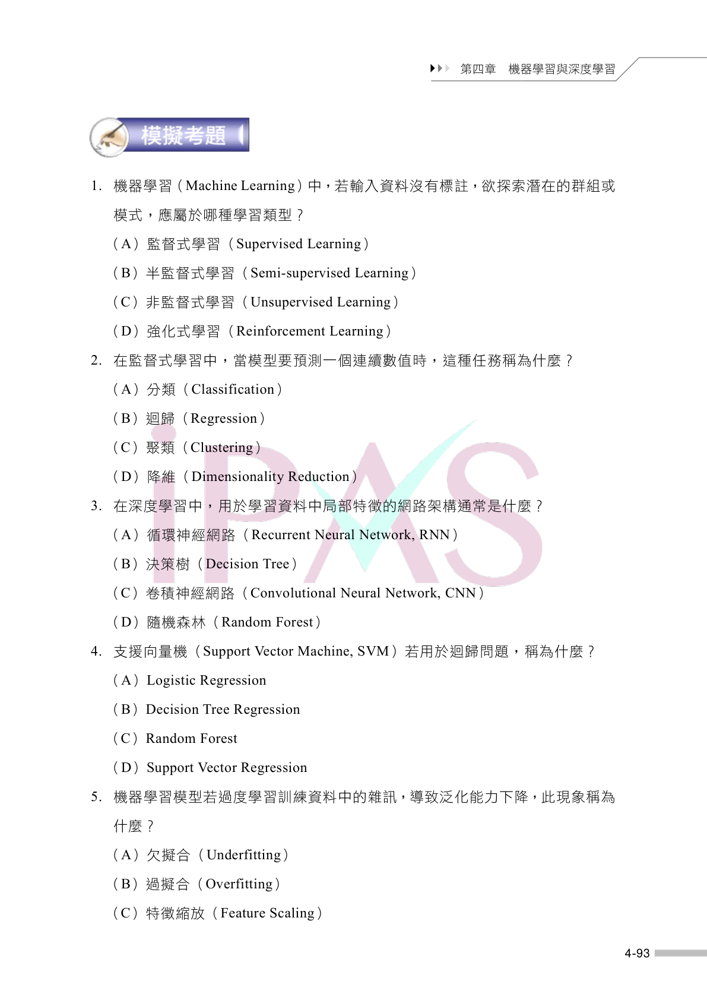
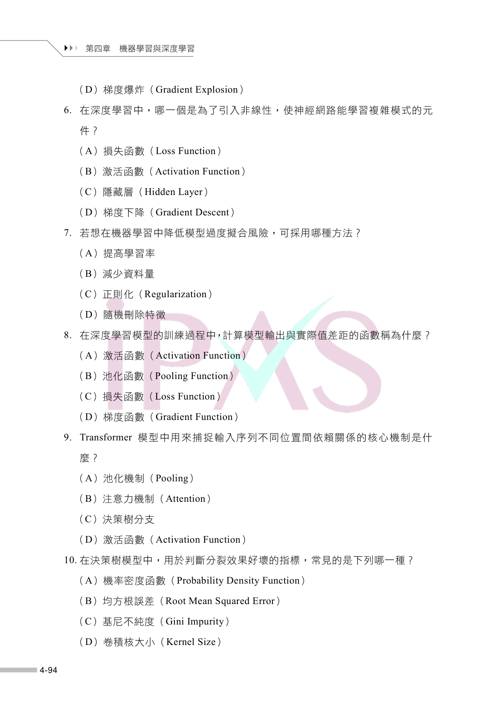
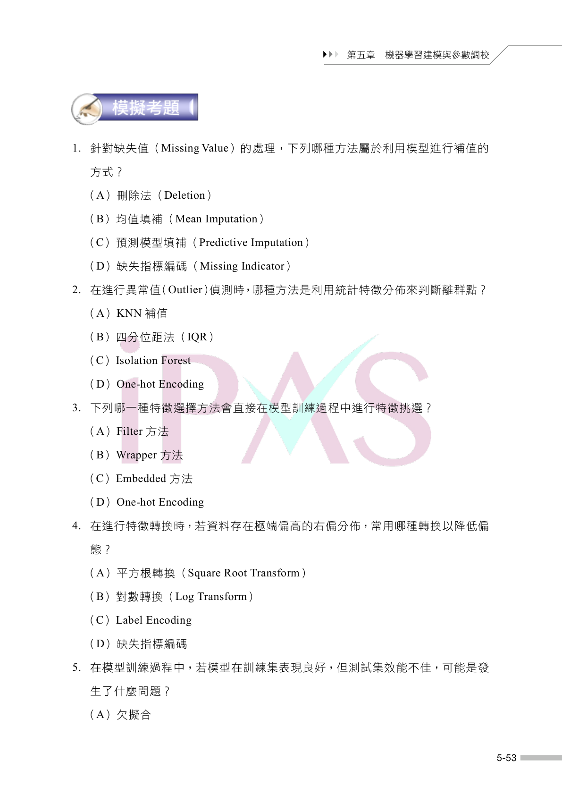
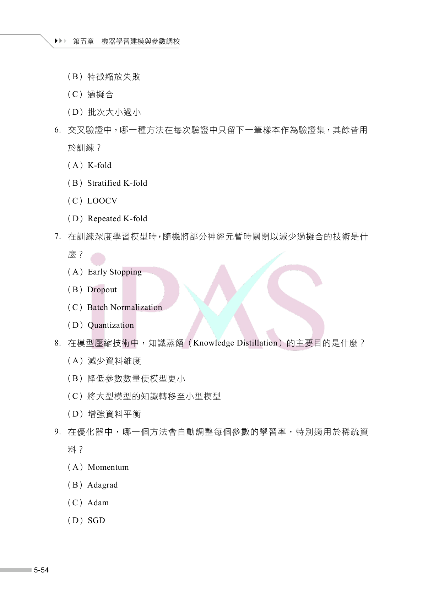
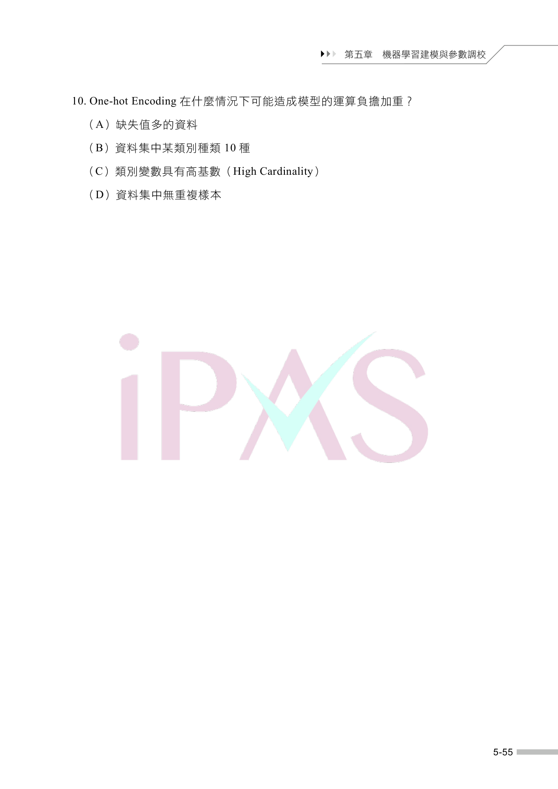
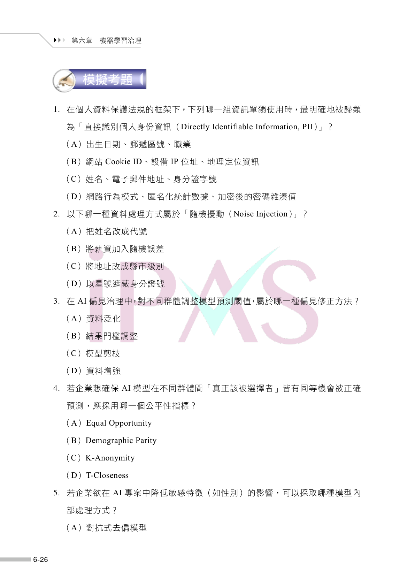
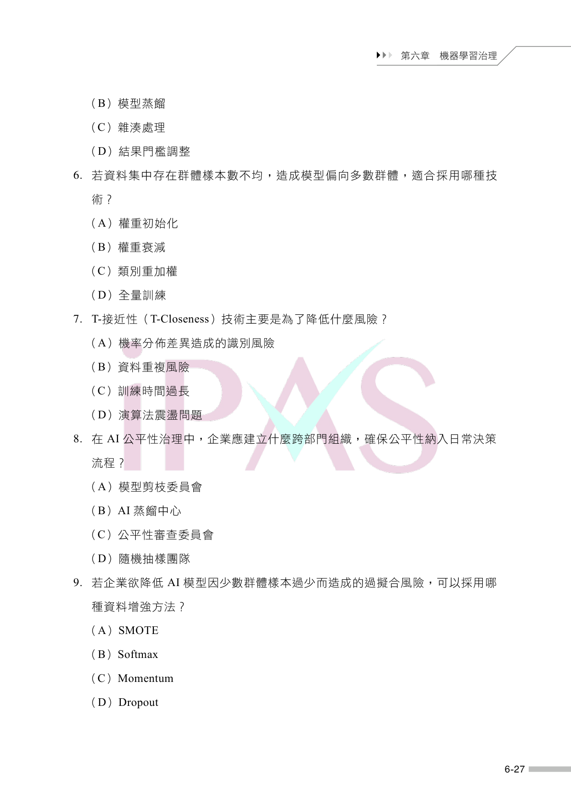
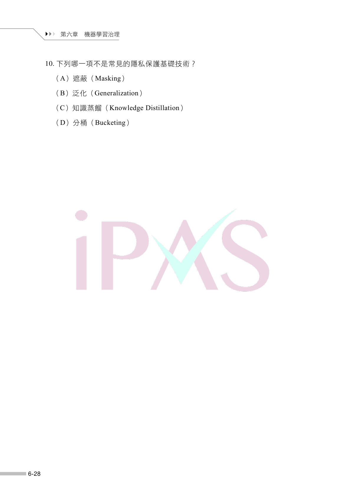

# AI 應用規劃師（中級）科目 3：機器學習技術與應用 — 練習題（含圖片）

Source: `AI應用規劃師(中級)-學習指引-科目3機器學習技術與應用_20251222101907.pdf`

## 第三章 機器學習基礎數學

### Source question-page images

### 1. （原題號：1）

若欲描述隨機變數在連續範圍內取值的機率分佈，最適合使用下列哪一種函數？

(A) 機率質量函數（PMF）  
(B) 條件機率  
(C) 機率密度函數（PDF）  
(D) 累積分佈函數（CDF）  

---

### 2. （原題號：2）

若一個隨機變數服從伯努利分佈（Bernoulli Distribution），則該變數可能取值為下列哪一組？

(A) 任何實數  
(B) 0 或1  
(C) 正整數  
(D) 任意整數  

---

### 3. （原題號：3）

在主成分分析（PCA）中，常使用哪一種矩陣分解技術來找出資料的主軸方向？

(A) 矩陣求逆  
(B) 矩陣轉置  
(C) 特徵值分解  
(D) 條件機率分解  

---

### 4. （原題號：4）

若想將高維資料映射至較低維度空間，同時保留資料的主要變異，常用下列哪一種方法？

(A) 邊際機率估計  
(B) 矩陣轉置  
(C) 主成分分析  
(D) 累積機率計算  

---

### 5. （原題號：5）

在梯度下降（Gradient Descent）中，「梯度」代表下列哪一項？

(A) 資料點個數  
(B) 模型精確度  
(C) 損失函數對參數的偏微分  
(D) 模型計算速度  

---

### 6. （原題號：6）

在進行假設檢定時，顯著水準（α）表示什麼？

(A) 平均值的大小  
(B) 模型運算速度  
(C) 拒絕虛無假設時所容許的型一錯誤機率  
(D) 資料筆數多少  

---

### 7. （原題號：7）

若資料集中存在極端值，以下哪一種集中趨勢指標較不受影響？

(A) 平均數  
(B) 變異數  
(C) 標準差  
(D) 中位數  

---

### 8. （原題號：8）

以下哪一種優化方法會累積每個參數的歷史梯度大小，以調整學習率？

(A) Momentum  
(B) Adagrad  
(C) SGD  
(D) Batch Normalization  

---

### 9. （原題號：9）

當深度學習模型在訓練時出現梯度爆炸現象，應優先採用哪種技術加以處理？

(A) 增大學習率  
(B) 梯度裁剪（Gradient Clipping）  
(C) 減少資料量  
(D) 刪除輸入特徵  

---

### 10. （原題號：10）

邏輯迴歸（Logistic Regression）模型在處理二元分類問題時，通常假設目標變數服從哪種分佈？

(A) 常態分佈  
(B) 均勻分佈  
(C) 伯努利分佈  
(D) 泊松分佈  

---

## 第四章 機器學習與深度學習

### Source question-page images

### 11. （原題號：1）

機器學習（Machine Learning）中，若輸入資料沒有標註，欲探索潛在的群組或模式，應屬於哪種學習類型？

(A) 監督式學習（Supervised Learning）  
(B) 半監督式學習（Semi-supervised Learning）  
(C) 非監督式學習（Unsupervised Learning）  
(D) 強化式學習（Reinforcement Learning）  

---

### 12. （原題號：2）

在監督式學習中，當模型要預測一個連續數值時，這種任務稱為什麼？

(A) 分類（Classification）  
(B) 迴歸（Regression）  
(C) 聚類（Clustering）  
(D) 降維（Dimensionality Reduction）  

---

### 13. （原題號：3）

在深度學習中，用於學習資料中局部特徵的網路架構通常是什麼？

(A) 循環神經網路（Recurrent Neural Network, RNN）  
(B) 決策樹（Decision Tree）  
(C) 卷積神經網路（Convolutional Neural Network, CNN）  
(D) 隨機森林（Random Forest）  

---

### 14. （原題號：4）

支援向量機（Support Vector Machine, SVM）若用於迴歸問題，稱為什麼？

(A) Logistic Regression  
(B) Decision Tree Regression  
(C) Random Forest  
(D) Support Vector Regression  

---

### 15. （原題號：5）

機器學習模型若過度學習訓練資料中的雜訊，導致泛化能力下降，此現象稱為什麼？

(A) 欠擬合（Underfitting）  
(B) 過擬合（Overfitting）  
(C) 特徵縮放（Feature Scaling）  
(D) 梯度爆炸（Gradient Explosion）  

---

### 16. （原題號：6）

在深度學習中，哪一個是為了引入非線性，使神經網路能學習複雜模式的元件？

(A) 損失函數（Loss Function）  
(B) 激活函數（Activation Function）  
(C) 隱藏層（Hidden Layer）  
(D) 梯度下降（Gradient Descent）  

---

### 17. （原題號：7）

若想在機器學習中降低模型過度擬合風險，可採用哪種方法？

(A) 提高學習率  
(B) 減少資料量  
(C) 正則化（Regularization）  
(D) 隨機刪除特徵  

---

### 18. （原題號：8）

在深度學習模型的訓練過程中，計算模型輸出與實際值差距的函數稱為什麼？

(A) 激活函數（Activation Function）  
(B) 池化函數（Pooling Function）  
(C) 損失函數（Loss Function）  
(D) 梯度函數（Gradient Function）  

---

### 19. （原題號：9）

Transformer 模型中用來捕捉輸入序列不同位置間依賴關係的核心機制是什麼？

(A) 池化機制（Pooling）  
(B) 注意力機制（Attention）  
(C) 決策樹分支  
(D) 激活函數（Activation Function）  

---

### 20. （原題號：10）

在決策樹模型中，用於判斷分裂效果好壞的指標，常見的是下列哪一種？

(A) 機率密度函數（Probability Density Function）  
(B) 均方根誤差（Root Mean Squared Error）  
(C) 基尼不純度（Gini Impurity）  
(D) 卷積核大小（Kernel Size）  

---

## 第五章 機器學習建模與參數調校

### Source question-page images

### 21. （原題號：1）

針對缺失值（Missing Value）的處理，下列哪種方法屬於利用模型進行補值的方式？

(A) 刪除法（Deletion）  
(B) 均值填補（Mean Imputation）  
(C) 預測模型填補（Predictive Imputation）  
(D) 缺失指標編碼（Missing Indicator）  

---

### 22. （原題號：2）

在進行異常值（Outlier）偵測時，哪種方法是利用統計特徵分佈來判斷離群點？

(A) KNN 補值  
(B) 四分位距法（IQR）  
(C) Isolation Forest  
(D) One-hot Encoding  

---

### 23. （原題號：3）

下列哪一種特徵選擇方法會直接在模型訓練過程中進行特徵挑選？

(A) Filter 方法  
(B) Wrapper 方法  
(C) Embedded 方法  
(D) One-hot Encoding  

---

### 24. （原題號：4）

在進行特徵轉換時，若資料存在極端偏高的右偏分佈，常用哪種轉換以降低偏態？

(A) 平方根轉換（Square Root Transform）  
(B) 對數轉換（Log Transform）  
(C) Label Encoding  
(D) 缺失指標編碼  

---

### 25. （原題號：5）

在模型訓練過程中，若模型在訓練集表現良好，但測試集效能不佳，可能是發生了什麼問題？

(A) 欠擬合  
(B) 特徵縮放失敗  
(C) 過擬合  
(D) 批次大小過小  

---

### 26. （原題號：6）

交叉驗證中，哪一種方法在每次驗證中只留下一筆樣本作為驗證集，其餘皆用於訓練？

(A) K-fold  
(B) Stratified K-fold  
(C) LOOCV  
(D) Repeated K-fold  

---

### 27. （原題號：7）

在訓練深度學習模型時，隨機將部分神經元暫時關閉以減少過擬合的技術是什麼？

(A) Early Stopping  
(B) Dropout  
(C) Batch Normalization  
(D) Quantization  

---

### 28. （原題號：8）

在模型壓縮技術中，知識蒸餾（Knowledge Distillation）的主要目的是什麼？

(A) 減少資料維度  
(B) 降低參數數量使模型更小  
(C) 將大型模型的知識轉移至小型模型  
(D) 增強資料平衡  

---

### 29. （原題號：9）

在優化器中，哪一個方法會自動調整每個參數的學習率，特別適用於稀疏資料？

(A) Momentum  
(B) Adagrad  
(C) Adam  
(D) SGD  

---

### 30. （原題號：10）

One-hot Encoding 在什麼情況下可能造成模型的運算負擔加重？

(A) 缺失值多的資料  
(B) 資料集中某類別種類10 種  
(C) 類別變數具有高基數（High Cardinality）  
(D) 資料集中無重複樣本  

---

## 第六章 機器學習治理

### Source question-page images

### 31. （原題號：1）

在個人資料保護法規的框架下，下列哪一組資訊單獨使用時，最明確地被歸類為「直接識別個人身份資訊（Directly Identifiable Information, PII）」？

(A) 出生日期、郵遞區號、職業  
(B) 網站Cookie ID、設備IP 位址、地理定位資訊  
(C) 姓名、電子郵件地址、身分證字號  
(D) 網路行為模式、匿名化統計數據、加密後的密碼雜湊值  

---

### 32. （原題號：2）

以下哪一種資料處理方式屬於「隨機擾動（Noise Injection）」？

(A) 把姓名改成代號  
(B) 將薪資加入隨機誤差  
(C) 將地址改成縣市級別  
(D) 以星號遮蔽身分證號  

---

### 33. （原題號：3）

在AI 偏見治理中，對不同群體調整模型預測閾值，屬於哪一種偏見修正方法？

(A) 資料泛化  
(B) 結果門檻調整  
(C) 模型剪枝  
(D) 資料增強  

---

### 34. （原題號：4）

若企業想確保AI 模型在不同群體間「真正該被選擇者」皆有同等機會被正確預測，應採用哪一個公平性指標？

(A) Equal Opportunity  
(B) Demographic Parity  
(C) K-Anonymity  
(D) T-Closeness  

---

### 35. （原題號：5）

若企業欲在AI 專案中降低敏感特徵（如性別）的影響，可以採取哪種模型內部處理方式？

(A) 對抗式去偏模型  
(B) 模型蒸餾  
(C) 雜湊處理  
(D) 結果門檻調整  

---

### 36. （原題號：6）

若資料集中存在群體樣本數不均，造成模型偏向多數群體，適合採用哪種技術？

(A) 權重初始化  
(B) 權重衰減  
(C) 類別重加權  
(D) 全量訓練  

---

### 37. （原題號：7）

T-接近性（T-Closeness）技術主要是為了降低什麼風險？

(A) 機率分佈差異造成的識別風險  
(B) 資料重複風險  
(C) 訓練時間過長  
(D) 演算法震盪問題  

---

### 38. （原題號：8）

在AI 公平性治理中，企業應建立什麼跨部門組織，確保公平性納入日常決策流程？

(A) 模型剪枝委員會  
(B) AI 蒸餾中心  
(C) 公平性審查委員會  
(D) 隨機抽樣團隊  

---

### 39. （原題號：9）

若企業欲降低AI 模型因少數群體樣本過少而造成的過擬合風險，可以採用哪種資料增強方法？

(A) SMOTE  
(B) Softmax  
(C) Momentum  
(D) Dropout  

---

### 40. （原題號：10）

下列哪一項不是常見的隱私保護基礎技術？

(A) 遮蔽（Masking）  
(B) 泛化（Generalization）  
(C) 知識蒸餾（Knowledge Distillation）  
(D) 分桶（Bucketing）  

---
