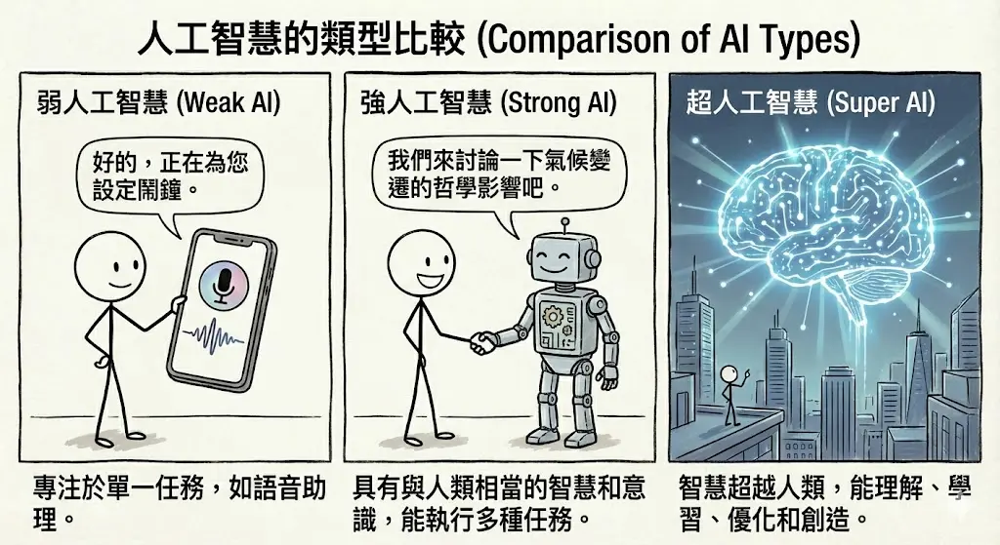
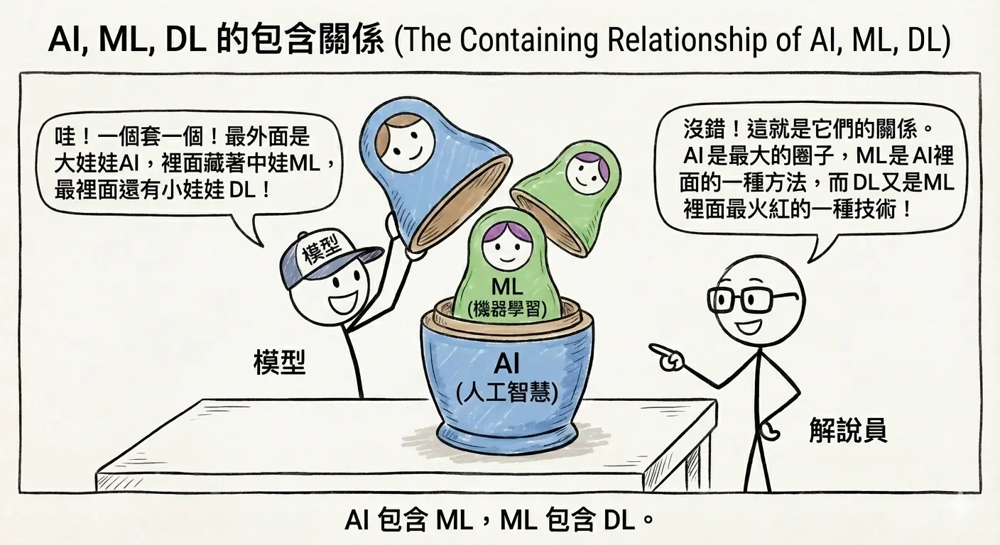
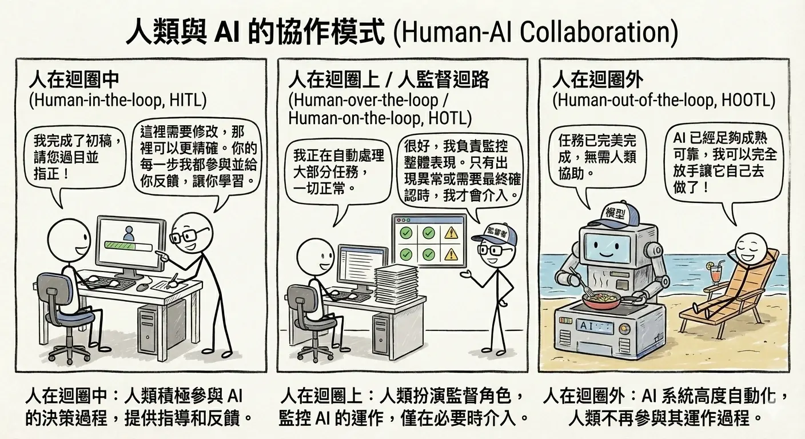

<!-- # 人工智慧的本質與層次架構 -->

人工智慧 (Artificial Intelligence, AI) 已經成為當今科技發展的核心驅動力，深刻地改變著我們的生活與工作方式。本章將帶領讀者深入探討 AI 的定義、技術層次架構，以及人類與 AI 之間多樣化的協作模式，為後續的學習奠定堅實的基礎。

## AI 的定義與範疇

### 人工智慧 (Artificial Intelligence, AI) 定義 {#sec-ai-def}

人工智慧 (AI) 是一個廣泛的學科，旨在創造能夠展現「智慧」行為的機器或軟體。簡單來說，AI 就是讓電腦具備模擬人類認知功能的能力，例如學習、推理、解決問題、感知環境、理解語言等。

AI 的目標並非僅僅是模仿人類，更在於透過計算能力來增強人類的智慧，解決複雜的問題。從早期的邏輯推理程式到現在的生成式 AI，AI 的定義隨著技術的演進而不斷擴展。

### 弱 AI (Narrow AI) vs. 強 AI (General AI/AGI)

根據 AI 的能力範圍，我們可以將其分為兩大類：

1.  **弱人工智慧 (Artificial Narrow Intelligence, ANI)** {#def-ani}：
    *   **定義**：又稱為「專用 AI」。這類 AI 專精於執行「單一」或「特定」的任務，且在該領域的表現可能超越人類。目前我們生活中所見到的 AI 幾乎都屬於此類。
    *   **特徵**：不具備自我意識，無法跨領域學習。它的智慧是「被設計」出來解決特定問題的。
    *   **例子**：
        *   **AlphaGo**：雖然圍棋下得比世界冠軍好，但它不會開車，也不會聊天。
        *   **Siri / Google Assistant**：能聽懂語音指令，但無法理解複雜的情感或進行深度的哲學思考。
        *   **人臉辨識系統**：能精準辨識身分，但無法欣賞照片的美感。

2.  **強人工智慧 (Artificial General Intelligence, AGI)** {#def-agi}：
    *   **定義**：又稱為「通用 AI」。這類 AI 具備像人類一樣的「通用智慧」，能夠像人類一樣學習任何智力任務。它具備常識、推理能力、情感理解，甚至自我意識。
    *   **特徵**：能夠跨領域遷移學習，面對未曾見過的問題也能嘗試解決。
    *   **現狀**：目前仍處於理論和研發階段，尚未真正實現。電影《雲端情人 (Her)》中的薩曼莎或《鋼鐵人》中的賈維斯 (Jarvis) 就是 AGI 的想像。

### 超人工智慧 (Super AI) {#sec-super-ai}
*   **定義**：當 AI 在所有領域（包括科學創新、藝術創作、社交技巧）的智慧都遠遠超越最聰明的人類時，我們稱之為「超人工智慧」。
*   **展望**：這是一個充滿未知與想像的領域，也是許多科幻作品探討的主題，同時引發了關於 AI 安全與控制的深刻倫理討論。

### 符號式 AI (Symbolic AI) {#sec-symbolic-ai}

早期的 AI 發展（約 1950-1980 年代）主要集中在「符號式 AI」，又稱為「邏輯式 AI」或「老派 AI (Good Old-Fashioned AI, GOFAI)」。

*   **核心概念**：由人類專家將知識轉化為明確的邏輯規則 (If-Then Rules) 和符號，輸入電腦進行邏輯推論。
*   **代表技術**：專家系統 (Expert Systems) {#def-expert-systems}、邏輯程式設計 (Logic Programming)。
*   **優勢**：邏輯清晰，推論過程透明且具備高度可解釋性 (Explainability)。
*   **缺點**：
    *   **缺乏彈性**：無法處理模糊、不確定或規則難以窮舉的問題（例如：如何定義「貓」的長相？）。一旦遇到規則庫以外的情況，系統就會崩潰。
    *   **知識擷取瓶頸 (Knowledge Acquisition Bottleneck)** {#def-knowledge-bottleneck}：將人類專家的隱性知識轉化為明確的規則，需要耗費大量的人力與時間。

### 統計式 AI (Statistical AI) {#sec-statistical-ai}

隨著電腦算力的提升和大數據的出現，AI 的發展重心轉向了「統計式 AI」，也就是現在主流的機器學習。

*   **核心概念**：不再由人類手寫規則，而是讓電腦從大量的「數據」中，利用統計學方法自己找出規律和模式。
*   **代表技術**：決策樹 (Decision Tree)、支援向量機 (SVM)、類神經網路 (Neural Networks) 等。
*   **優勢**：能夠處理複雜、模糊的非結構化數據（如影像、語音、自然語言），並且具備從經驗中學習的能力。
*   **缺點**：
    *   **可解釋性低 (Black Box)**：統計模型內部的運作複雜，基本上是無法理解的黑盒子，難以解釋為何做出某個判斷。
    *   **依賴數據 (Data Dependency)**：模型的好壞取決於數據的品質與數量（Garbage In, Garbage Out）。
    *   **偏差風險 (Bias)**：如果訓練數據包含偏見，模型也會學到這些偏見。

---

## 技術層次關係

要釐清 AI 領域的各種名詞，最簡單的方法是理解它們之間的「包含關係」。

### AI、機器學習 (ML)、深度學習 (DL) 的包含關係 {#sec-ai-ml-dl}

這三者就像是俄羅斯娃娃一樣，一層包著一層：

1.  **人工智慧 (Artificial Intelligence)** {#def-ai}：最外層的大圈圈。包含了所有讓機器展現智慧的技術，包括早期的符號式 AI 和現代的機器學習。
2.  **機器學習 (Machine Learning, ML)** {#def-ml}：AI 的子集。專指那些「不需明確編寫指令，就能讓電腦從數據中學習」的演算法。它包含了傳統的統計學習方法（如決策樹、SVM）和深度學習。
3.  **深度學習 (Deep Learning, DL)** {#def-dl}：機器學習的子集。特指使用「多層類神經網路 (Deep Neural Networks)」來模擬人類大腦運作的技術。它是目前推動 AI 爆發性成長（如 AlphaGo, ChatGPT）的核心技術。

### 資料驅動 (Data-Driven) vs. 規則驅動 (Rule-Based) {#sec-data-vs-rule}

*   **規則驅動 (Rule-Based)** {#def-rule-based}：
    *   **代表**：符號式 AI、專家系統。
    *   **邏輯**：輸入 + 規則 = 輸出。
    *   **比喻**：像是一個只會照著食譜做菜的廚師，食譜沒寫的就不會做。
*   **資料驅動 (Data-Driven)** {#def-data-driven}：
    *   **代表**：機器學習、深度學習。
    *   **邏輯**：輸入 + 輸出 = 規則（模型）。
    *   **比喻**：像是一個聰明的學徒，看了一萬次師傅做菜（數據），自己領悟出了做菜的訣竅（模型）。

### 傳統機器學習 vs. 深度學習的適用場景與成本效益分析 {#sec-ml-vs-dl-cost}

| 特性 | 傳統機器學習 (Traditional ML) | 深度學習 (Deep Learning) |
| :--- | :--- | :--- |
| **數據需求量** | 較少，小數據集也能運作良好。 | 極大，需要海量數據才能發揮優勢。 |
| **硬體需求** | 較低，一般 CPU 即可訓練。 | 極高，通常需要高階 GPU 加速運算。 |
| **特徵工程** | **關鍵**。需要人類專家手工提取特徵（如定義貓有尖耳朵）。 | **自動化**。模型能自動從數據中提取特徵（End-to-End Learning）。 |
| **可解釋性** | 較高（如決策樹），容易理解判斷依據。 | 較低（黑盒子），難以解釋神經網路內部的運作。 |
| **適用場景** | 表格數據 (Tabular Data)、簡單分類、資源受限的環境。 | 影像辨識、自然語言處理 (NLP)、語音生成、複雜決策。 |

---

## 人類與 AI 的協作模式 (Human-AI Collaboration) {#sec-human-ai-collab}

AI 並非要完全取代人類，更多時候是與人類協作。根據人類介入的程度，我們可以將協作模式分為三種：

### 1. 人在迴圈中 (Human-in-the-loop, HITL) {#sec-hitl}

*   **定義**：人類是 AI 系統運作流程中**不可或缺**的一部分。AI 無法獨立完成任務，必須由人類進行確認、修正或提供回饋，系統才能繼續運作或改進。
*   **應用場景**：
    *   **資料標註 (Data Labeling)**：AI 需要人類教它什麼是「貓」。人類負責標記圖片，AI 才能學習。
    *   **醫療診斷輔助**：AI 分析 X 光片並標記出可疑病灶，但**最終診斷**必須由醫生確認並簽名。AI 只是醫生的助手，決策權在人。
    *   **AI 輔助寫作/翻譯**：AI 產生初稿，人類進行潤飾與確認。
    *   **法律合約審查**：AI 標記潛在風險條款，律師進行最終判斷。

### 2. 人在迴圈上 / 人監督迴路 (Human-over-the-loop / Human-on-the-loop, HOTL) {#sec-hotl}

*   **定義**：AI 可以獨立完成大部分的任務，人類扮演**監督者 (Supervisor)** 的角色。人類不直接參與每一個決策，但會監控系統運作，並在發生異常或信心不足時介入。
*   **應用場景**：
    *   **智慧工廠監控**：AI 自動控制生產線的溫度與速度。人類工程師在控制室監控儀表板，只有在警報響起或數值異常時，才手動接管控制。
    *   **自駕車 (Level 3)**：車輛在高速公路上自動駕駛，但駕駛人必須隨時準備好在系統請求時接手方向盤。
    *   **IT 維運監控 (AIOps)**：AI 自動偵測並修復常見故障，遇到未知問題才通知工程師。
    *   **智慧交通號誌控制**：AI 根據車流自動調整紅綠燈，交警僅在特殊狀況（如事故）時介入。

### 3. 人在迴圈外 (Human-out-of-the-loop, HOOTL) {#sec-hootl}

*   **定義**：AI 系統完全**全自動化**運作，人類不介入其決策過程，甚至無法即時干預。這通常用於需要極快反應速度或人類無法處理的場景。
*   **應用場景**：
    *   **高頻交易 (High-Frequency Trading)**：AI 在毫秒等級內分析股市並自動下單。人類根本來不及反應，只能事後檢討演算法。
    *   **全自動化網路防禦**：面對大規模 DDoS 攻擊，AI 必須即時自動阻擋惡意流量，等待人類批准會造成系統癱瘓。
    *   **個人化推薦系統**：Netflix 或 YouTube 根據你的觀看紀錄自動推薦影片，人類完全不介入。
    *   **動態定價 (Dynamic Pricing)**：Uber 或機票網站根據供需自動調整價格。
*   **風險**：由於人類無法即時監控，HOOTL 系統必須具備極高的可靠性，並內建嚴格的安全機制 (Safety Guardrails) 以防止災難性的錯誤（如股市閃崩）。

## 本章總結與考點提示 {#chap-chapter1-summary}

### 核心概念回顧

本章建立了 AI 的基礎世界觀，釐清了 AI、機器學習與深度學習的層級關係，並介紹了 AI 的發展歷史與分類。

*   **AI 層級關係**：同心圓結構。
    *   **AI (人工智慧)**：最外層，模擬人類智慧的總稱。
    *   **ML (機器學習)**：AI 的子集，讓機器從資料中學習規則，而非人工撰寫規則。
    *   **DL (深度學習)**：ML 的子集，使用多層神經網路，具備自動特徵提取能力。
*   **AI 發展史**：
    *   **1956 達特茅斯會議**：AI 誕生。
    *   **寒冬與復甦**：經歷兩次寒冬，因算力不足與資料缺乏。
    *   **2012 AlexNet**：深度學習爆發。
    *   **2022 ChatGPT**：生成式 AI 普及。
*   **AI 類型**：
    *   **弱 AI (ANI)**：專精單一任務（如下棋、導航）。目前所有的 AI 都是弱 AI。
    *   **強 AI (AGI)**：具備人類般的通用智慧。尚未實現。
    *   **超 AI (ASI)**：超越人類智慧。

### AI 應用規劃師認證考點

**常考題型與解題策略**：

1.  **層級關係題**：
    *   *例題*：「下列關於 AI、ML、DL 的關係何者正確？」
    *   **解答**：AI > ML > DL。深度學習是機器學習的一種，機器學習是人工智慧的一種。

2.  **定義辨析題**：
    *   *例題*：「AlphaGo 是屬於哪一種 AI？」
    *   **解答**：弱 AI (ANI)。因為它只會下圍棋，不會開車或聊天。
    *   *例題*：「圖靈測試 (Turing Test) 的目的是什麼？」
    *   **解答**：測試機器是否具備人類智慧（能否騙過人類評審）。

3.  **歷史里程碑題**：
    *   *關鍵字*：達特茅斯會議 (AI 誕生)、AlexNet (深度學習爆發)、Deep Blue (擊敗西洋棋王)、AlphaGo (擊敗圍棋王)。

### 記憶口訣

*   **層級**：「大中細」（AI 大、ML 中、DL 細）。
*   **類型**：「弱強超」（現在是弱、未來是強、科幻是超）。

### 延伸思考

*   為什麼深度學習直到 2010 年代才爆發？（關鍵：大數據 + GPU 算力）
*   目前的生成式 AI (如 ChatGPT) 是強 AI 嗎？為什麼？（它看起來很全能，但本質上還是基於機率預測，且缺乏真正的理解與意識，仍處於弱 AI 邁向強 AI 的過渡期）。

