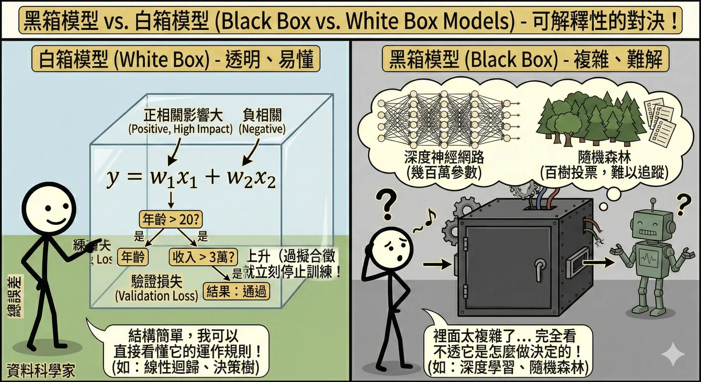
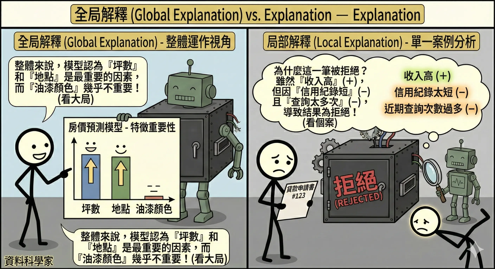
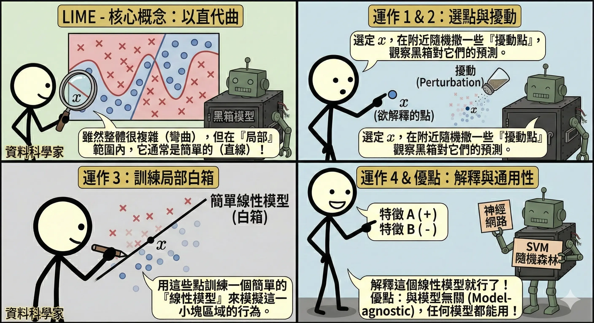
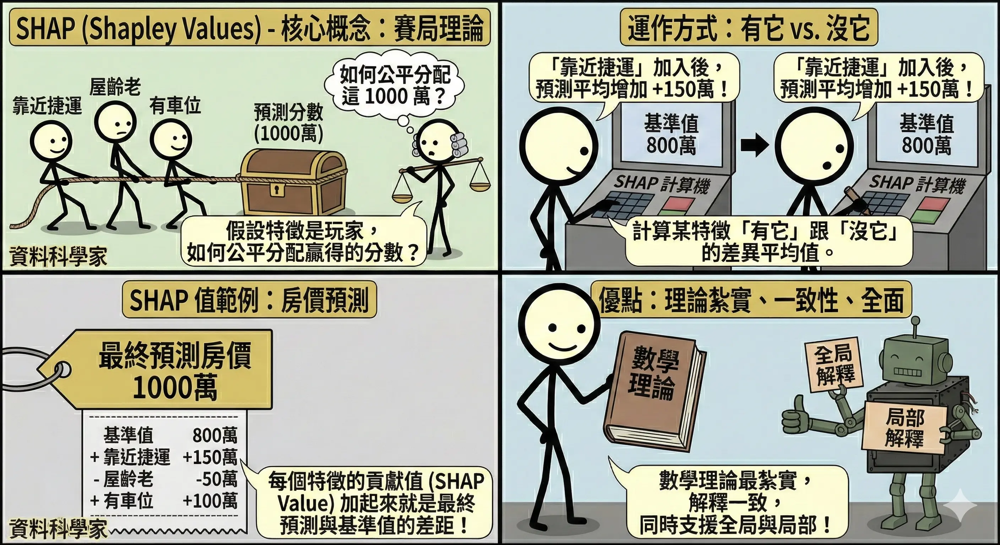
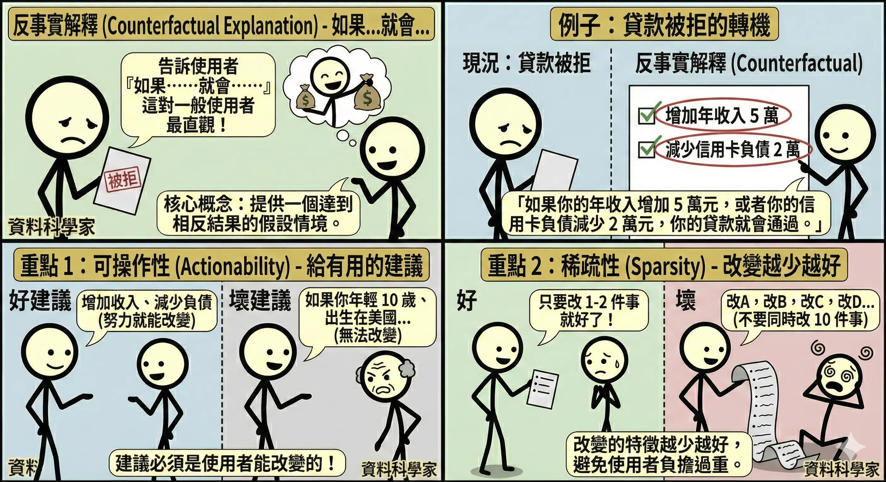

<!-- # 可解釋 AI (XAI) -->

隨著 AI 模型越來越複雜（尤其是深度學習），它們變成了「黑箱 (Black Box)」。我們把資料丟進去，答案跑出來，但沒人知道中間發生了什麼。在醫療、金融、法律等高風險領域，我們不能只知道「結果」，必須知道「原因」。這就是**可解釋 AI (Explainable AI, XAI)** 的使命。

## XAI 的層次 {#sec-xai-levels}

### 黑箱模型 vs. 白箱模型 {#sec-black-white-box}

*   **白箱模型 (White Box)**：結構簡單，人類可以直接看懂。
    *   **線性迴歸**：係數 $w$ 直接代表特徵的影響力（正/負相關、大小）。
    *   **決策樹**：規則清楚（如果年齡 > 20 且 收入 > 3萬，則...）。
*   **黑箱模型 (Black Box)**：結構複雜，人類無法直觀理解。
    *   **深度神經網路**：幾百萬個參數，看不出意義。
    *   **隨機森林**：幾百棵樹的投票結果，難以追蹤。

### 全局解釋 vs. 局部解釋 {#sec-global-local}

*   **全局解釋 (Global Explanation)**：
    *   **問題**：這個模型**整體來說**是怎麼運作的？哪些特徵最重要？
    *   **例子**：在預測房價時，模型認為「坪數」和「地點」是最重要的因素，「油漆顏色」不重要。
*   **局部解釋 (Local Explanation)**：
    *   **問題**：為什麼**這一筆**特定的貸款申請被拒絕了？
    *   **例子**：雖然這人收入高（正向因素），但因為「信用紀錄太短」（負向因素）且「近期查詢次數過多」（負向因素），綜合起來導致被拒絕。

## 解釋技術與工具 {#sec-xai-techniques}

### LIME (Local Interpretable Model-agnostic Explanations) {#sec-lime}

*   **核心概念**：雖然整個黑箱模型很複雜（像彎彎曲曲的曲線），但在「局部」範圍內，它通常是簡單的（像直線）。
*   **運作方式**：
    1.  選定想解釋的那個資料點 $x$。
    2.  在 $x$ 附近隨機撒一些擾動過的資料點，並觀察黑箱模型對這些點的預測。
    3.  用這些點訓練一個簡單的**線性模型**（白箱）來模擬黑箱模型在這一小塊區域的行為。
    4.  解釋這個線性模型。
*   **優點**：與模型無關 (Model-agnostic)，任何模型（神經網路、SVM、隨機森林）都能用。

### SHAP (Shapley Values) {#sec-shap}

*   **核心概念**：源自**賽局理論 (Game Theory)**。假設所有特徵是合作玩遊戲的玩家，最後贏得的分數（預測結果）該如何**公平分配**給每個玩家（特徵）？
*   **運作方式**：計算某個特徵「有它」跟「沒它」時，預測結果的差異平均值。
    *   例如：預測房價 1000 萬。基準值是 800 萬。
    *   「靠近捷運」貢獻了 +150 萬。
    *   「屋齡老」貢獻了 -50 萬。
    *   「有車位」貢獻了 +100 萬。
*   **優點**：數學理論最紮實，能提供**一致性 (Consistency)** 的解釋，且同時支援全局與局部解釋。

### 特徵重要度 (Feature Importance) {#sec-feature-importance}

*   **概念**：直接列出哪些特徵對模型的貢獻最大。
*   **應用**：隨機森林 (Random Forest) 和 XGBoost 內建特徵重要度排序（基於分裂時帶來的資訊增益）。
*   **限制**：只能看全局，不能解釋單一筆預測。

### 反事實解釋 (Counterfactual Explanation) {#sec-counterfactual}

*   **核心概念**：告訴使用者「**如果**做什麼改變，結果**就會**不同」。
    *   大多數 XAI 技術（如 SHAP）是在解釋「為什麼你會被拒絕」（回顧過去）。
    *   反事實解釋是在告訴你「怎麼做才能被接受」（展望未來）。
*   **類比**：**醫生的處方**。
    *   *解釋 (SHAP)*：「你生病是因為血壓高和缺乏運動。」（分析原因）
    *   *反事實 (Counterfactual)*：「**如果**你每天運動 30 分鐘並少吃鹽，你**就會**恢復健康。」（提供行動指南）
*   **例子**：
    *   *現況*：小明的貸款申請被 AI 拒絕了。
    *   *解釋*：「**如果**你的年收入從 50 萬增加到 55 萬，**或者**你的信用卡負債減少 2 萬元，你的貸款**就會**通過。」
*   **三大原則**：
    1.  **可操作性 (Actionability)**：建議必須是使用者**能改變**的。
        *   *好建議*：增加收入、減少負債、考取證照。
        *   *壞建議*：如果你年輕 10 歲、如果你是女生、如果你出生在美國（這些都改不了，講了只會讓人生氣）。
    2.  **稀疏性 (Sparsity)**：改變的特徵**越少越好**。
        *   不要叫使用者同時改 10 件事（如：收入加倍、換工作、搬家、結婚...），這太難做到了。通常建議 1-2 個最有效的改變。
    3.  **有效性 (Validity)**：這個改變必須真的能讓 AI 的預測結果翻盤（從 Reject 變 Accept）。

## 本章總結與考點提示 {#chap-chapter10-summary}

### 核心概念回顧

XAI 是建立 AI 信任的關鍵。

*   **模型類型**：
    *   **白箱**：線性迴歸、決策樹 (簡單、可解釋)。
    *   **黑箱**：深度學習、隨機森林 (複雜、難解釋)。
*   **解釋範圍**：
    *   **全局**：整體特徵重要性。
    *   **局部**：單一案例的判斷依據。
*   **技術工具**：
    *   **LIME**：局部線性近似 (Model-agnostic)。
    *   **SHAP**：賽局理論 (公平分配貢獻)。
    *   **Counterfactual**：如果...就會... (行動建議)。

### AI 應用規劃師認證考點

**常考題型與解題策略**：

1.  **情境選擇題**：
    *   *例題*：「銀行拒絕貸款，客戶要求解釋，哪種方法最適合？」
    *   **解答**：反事實解釋 (Counterfactual)。因為客戶想知道「怎麼做才能通過」。
    *   *例題*：「想知道模型整體最看重哪些特徵？」
    *   **解答**：全局特徵重要性 (Global Feature Importance) 或 SHAP Summary Plot。

2.  **黑白箱辨析**：
    *   *例題*：「下列哪個模型的可解釋性最高？」
    *   **解答**：決策樹 > 線性迴歸 > 隨機森林 > 神經網路。

3.  **工具特性題**：
    *   *例題*：「LIME 的核心思想是什麼？」
    *   **解答**：在局部範圍內，用簡單的線性模型來模擬複雜的黑箱模型。

### 記憶口訣

*   **LIME**：「以管窺天」（局部近似）。
*   **SHAP**：「分錢分得平」（賽局理論）。
*   **Counterfactual**：「早知如此，何必當初」（如果...就會...）。

### 延伸思考

*   可解釋性與準確率通常存在什麼關係？（Trade-off。通常模型越複雜準確率越高，但可解釋性越低。XAI 的目標就是打破這個權衡）。

