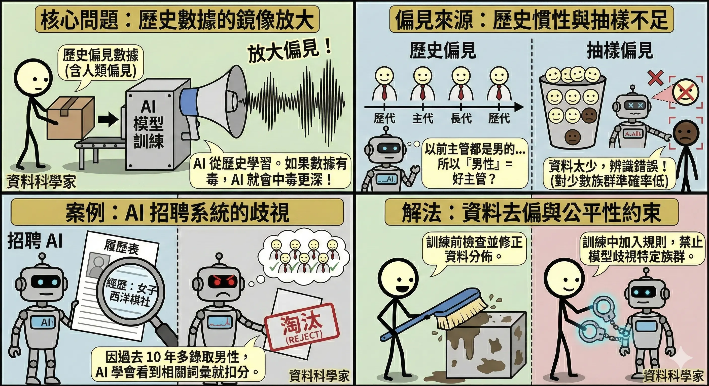
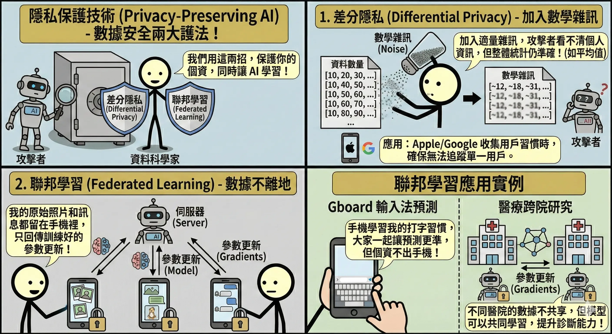
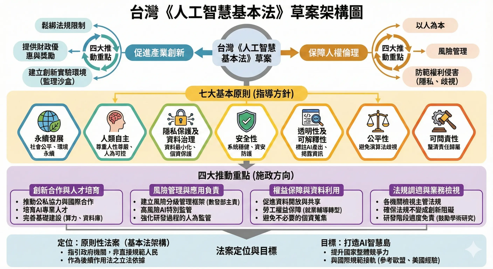
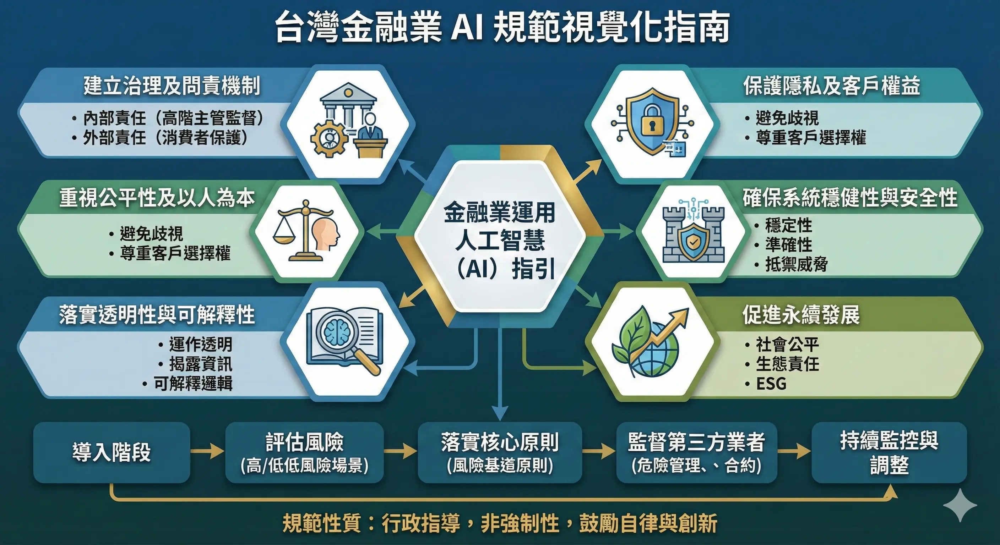
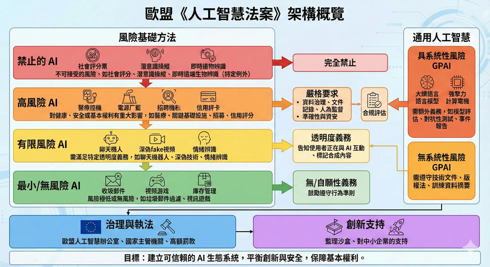
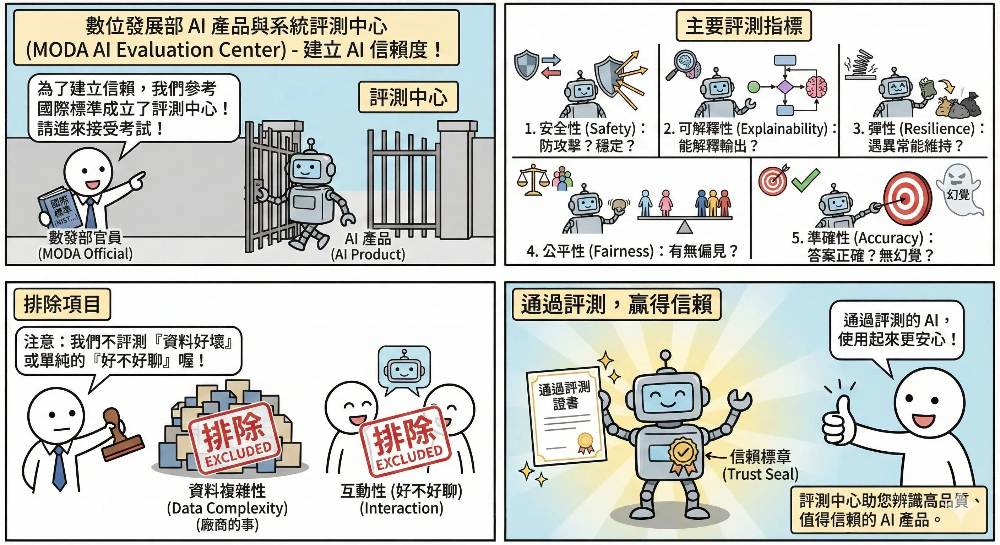

<!-- # AI 治理、法規與倫理 (AI Governance, Regulations & Ethics) -->

AI 的強大能力伴隨著巨大的風險。如何確保 AI 是向善的 (AI for Good)，而不是帶來歧視、侵犯隱私或失控，是當前各國政府與企業最關注的議題。這不僅是道德問題，更是法律合規問題。

## 倫理原則與風險管理 {#sec-ethics-risk}

### 公平性與偏見 (Bias & Fairness) {#sec-bias-fairness}

AI 模型是從歷史數據中學習的，如果歷史數據包含人類的偏見，AI 就會放大這些偏見。

*   **偏見來源**：
    *   **歷史偏見**：例如過去主管多為男性，AI 學習後可能會認為「男性」是好主管的特徵。
    *   **抽樣偏見**：訓練資料中某些族群樣本太少（例如人臉辨識對深色人種準確率較低）。
*   **案例**：Amazon 的 AI 招聘系統因為過去 10 年都錄取男性，學會了歧視女性履歷（看到 "Women's Chess Club" 就扣分）。
*   **解法**：**資料去偏 (Data Debiasing)**。在訓練前檢查資料分佈，或在訓練中加入公平性約束 (Fairness Constraints)。

### 隱私保護技術 (Privacy-Preserving AI) {#sec-privacy}

*   **差分隱私 (Differential Privacy)**：
    *   **概念**：在資料中加入適量的**數學雜訊 (Noise)**，使得攻擊者無法反推出特定個人的資訊，但整體的統計特性（如平均值）仍然準確。
    *   **應用**：Apple/Google 收集用戶使用習慣時，會加入雜訊，確保無法追蹤到單一用戶。
*   **聯邦學習 (Federated Learning)**：
    *   **核心概念**：**數據不離地 (Data stays local)**。
    *   **運作流程**：
        1.  **下發模型**：伺服器將通用的 AI 模型傳送到你的裝置（如手機）。
        2.  **在地訓練**：手機利用你的私密資料（如打字習慣、照片）在本地訓練模型，讓模型變聰明一點點。
        3.  **上傳參數**：手機只回傳**訓練心得 (參數更新/梯度)** 給伺服器，**絕對不回傳**原始資料。
        4.  **整合更新**：伺服器將成千上萬人的「心得」融合起來，更新成一個更強大的通用模型，再發送給大家。
    *   **類比**：**連鎖餐廳的新菜研發**。
        *   總部（伺服器）不把客人的食材（私密資料）收回來。
        *   而是把食譜（模型）發給各地分店（手機）。
        *   分店廚師試做後，回報「鹽要多加一點」（參數更新）。
        *   總部修改食譜，發布新版本。
    *   **應用**：Google Gboard 輸入法預測（不會上傳你打的字）、醫療跨院研究（醫院不能共享病患個資，但可以共享模型參數）。

### 責任歸屬與問責性 (Accountability) {#sec-accountability}

*   當 AI 犯錯（如自駕車撞人、醫療 AI 誤診）時，誰該負責？是開發者、使用者，還是 AI 本身？
*   **人機協作 (Human-in-the-loop)**：目前的共識是，高風險決策（如醫療、司法）不能全交給 AI，必須有人類專家介入審核。最終決策權與責任仍在人類身上。

### 模型維運風險 (Model Maintenance Risks) {#sec-model-maintenance-risks}

模型上線後的長期維運是一大挑戰，其中最值得關注的問題包括資料分布的變化與偏見的處理。

*   **資料分布漂移 (Data Drift)** {#def-data-drift}：
    *   **定義**：當模型上線數月後發現準確度顯著下降，最可能的原因是「近期使用者行為模式與訓練期間的資料統計特徵發生了顯著改變」。
    *   *應對*：必須持續監控數據分佈並適時重新訓練模型。
*   **偏見檢測 vs. 偏見緩解 (Bias Detection vs. Bias Mitigation)** {#def-bias-detection-mitigation}：
    *   **偏見檢測 (Bias Detection)**：著重於「發現」問題。例如：比較模型在不同資料分佈（如不同性別、不同種族）下的錯誤率差異。
    *   **偏見緩解 (Bias Mitigation)**：著重於「解決」問題。例如：透過重新加權訓練樣本 (Reweighting) 以平衡資料分佈，確保模型輸出更加公平。

## 台灣與國際法規架構 {#sec-regulations}

### 台灣《人工智慧基本法》草案 {#sec-taiwan-ai-law}

*   **定位**：作為上位法，確立 AI 發展的基本原則（如以人為本、永續發展）。
*   **重點機制**：
    *   **監理沙盒 (Regulatory Sandbox)**：為了鼓勵創新，允許企業在風險可控的範圍內測試新技術，暫時豁免部分法規限制。
    *   **風險分級管理**：不一竿子打翻一船人，依據 AI 應用的風險程度，採取不同強度的管理。

### 台灣金融業 AI 規範 {#sec-financial-ai}

金融業因涉及金錢與個資，監管最嚴格。金管會發布了「金融業運用人工智慧之核心原則」。

金管會發布了「金融業運用人工智慧之核心原則」，共六大項。

**記憶口訣：治平隱安透責 (治平專案隱藏透徹責任)**

1.  **建立治理架構 (Governance)**：
    *   **重點**：**董事會要負責**。不能把 AI 當成單純的技術問題丟給 IT 部門，高層必須監督 AI 的使用策略與風險。
2.  **公平性 (Fairness)**：
    *   **重點**：**不歧視**。模型不能因為性別、種族等特徵而給予差別待遇（例如無故拒絕女性貸款）。需定期檢測模型偏見。
3.  **保護隱私及客戶權益 (Privacy)**：
    *   **重點**：**最小化蒐集**。只蒐集必要的資料，且必須妥善保管，不能未經同意就拿去訓練模型或賣給第三方。
4.  **系統安全性與強健性 (System Security)**：
    *   **重點**：**防駭客**。要防止對抗式攻擊（騙過 AI），並確保系統在突發狀況下（如資料異常）仍能穩定運作。
5.  **透明度與可解釋性 (Transparency & Explainability)**：
    *   **重點**：**給理由**。當 AI 做出對客戶有重大影響的決策（如拒保、拒貸）時，必須能解釋原因，不能只說「電腦算出來的」。
6.  **當責性 (Accountability)**：
    *   **重點**：**有人扛**。無論 AI 多聰明，最終的決策責任還是在人類身上。必須確保有申訴管道與補救機制。

### 歐盟《人工智慧法案》(EU AI Act) {#sec-eu-ai-act}

全球第一部綜合性 AI 法規，採**風險導向 (Risk-based approach)**，影響力如同 GDPR：

1.  **不可接受風險 (Unacceptable Risk)**：**完全禁止**。
    *   社會信用評分 (Social Scoring)。
    *   公共場所的即時遠端生物辨識（警察抓重犯除外）。
    *   潛意識操縱（如用 AI 誘導兒童）。
2.  **高風險 (High Risk)**：**嚴格監管**。
    *   醫療器材、招聘系統、信用評分、關鍵基礎設施、邊境管制。
    *   **義務**：必須通過合規評估 (Conformity Assessment)、使用高品質資料、保留紀錄、有人類監督。
3.  **有限風險 (Limited Risk)**：**透明度義務**。
    *   Chatbot、Deepfake。
    *   **義務**：必須明確告知使用者「你正在跟 AI 說話」或「這是生成的影像」。
4.  **最小風險 (Minimal Risk)**：**不監管**。
    *   垃圾郵件過濾器、電玩遊戲 AI。

## AI 產品評測標準 {#sec-ai-evaluation}

### 數位發展部 AI 產品與系統評測中心 {#sec-moda-eval}

為了建立 AI 產品的信賴度，台灣成立了評測中心，參考國際標準（如 NIST）制定評測規範。

*   **主要評測指標**：
    1.  **安全性 (Safety)**：系統是否穩定？是否容易被攻擊（如 Prompt Injection）？
    2.  **可解釋性 (Explainability)**：能否解釋輸出結果？
    3.  **彈性 (Resilience)**：遇到異常輸入時，是否能維持運作？
    4.  **公平性 (Fairness)**：是否存在偏見？
    5.  **準確性 (Accuracy)**：答案是否正確？有無幻覺？
*   **排除項目**：目前的評測主要針對語言模型本身，不包含「資料複雜性」（資料好不好是廠商的事）或單純的「互動性」（好不好聊）。

### 核心概念回顧

AI 治理是確保 AI 永續發展的基石。

*   **倫理風險**：
    *   **偏見**：歷史數據、抽樣偏差。解法：去偏。
    *   **隱私**：差分隱私 (加雜訊)、聯邦學習 (數據不離地)。
    *   **當責**：Human-in-the-loop (人機協作)。
*   **法規架構**：
    *   **歐盟 AI Act**：風險導向 (禁止、高風險、有限、最小)。
    *   **台灣 AI 基本法**：監理沙盒、風險分級。
    *   **金融業規範**：公平、隱私、透明、當責。

### AI 應用規劃師認證考點

**常考題型與解題策略**：

1.  **法規分級題 (EU AI Act)**：
    *   *例題*：「社會信用評分屬於哪一級風險？」
    *   **解答**：不可接受風險 (禁止)。
    *   *例題*：「招聘系統或醫療器材屬於哪一級？」
    *   **解答**：高風險 (嚴格監管)。
    *   *例題*：「聊天機器人屬於哪一級？」
    *   **解答**：有限風險 (需揭露是 AI)。

2.  **隱私技術題**：
    *   *例題*：「希望多家醫院聯合訓練模型，但病歷不能出醫院，該用什麼技術？」
    *   **解答**：聯邦學習 (Federated Learning)。
    *   *例題*：「Apple 收集用戶數據時加入雜訊以保護隱私，這是什麼技術？」
    *   **解答**：差分隱私 (Differential Privacy)。

3.  **倫理情境題**：
    *   *例題*：「AI 判斷履歷時，對女性分數較低，這是什麼問題？」
    *   **解答**：偏見 (Bias)。
    *   *例題*：「醫生使用 AI 輔助診斷，最後簽名負責的是誰？」
    *   **解答**：醫生 (Human-in-the-loop)。

### 記憶口訣

*   **EU AI Act**：「禁高限微」（禁止、高、有限、微小）。
*   **聯邦學習**：「資料不動模型動」。
*   **差分隱私**：「加點雜訊更安全」。

### 延伸思考

*   為什麼「監理沙盒」對 AI 新創很重要？（因為法規通常落後於科技，沙盒提供了一個合法的試錯空間，避免創新被舊法規扼殺）。

## 歷屆考題 {#sec-past-exam}

請做測驗看歷屆考題。

