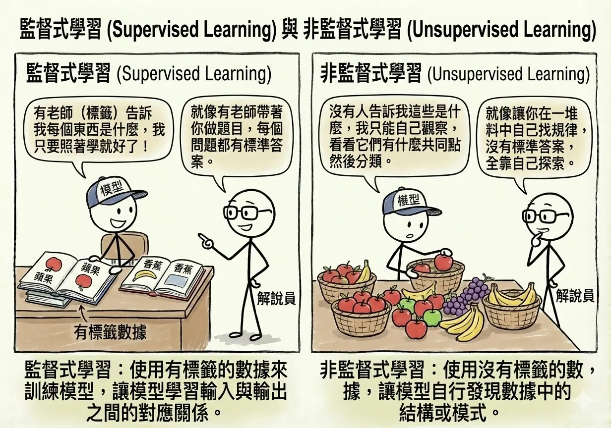
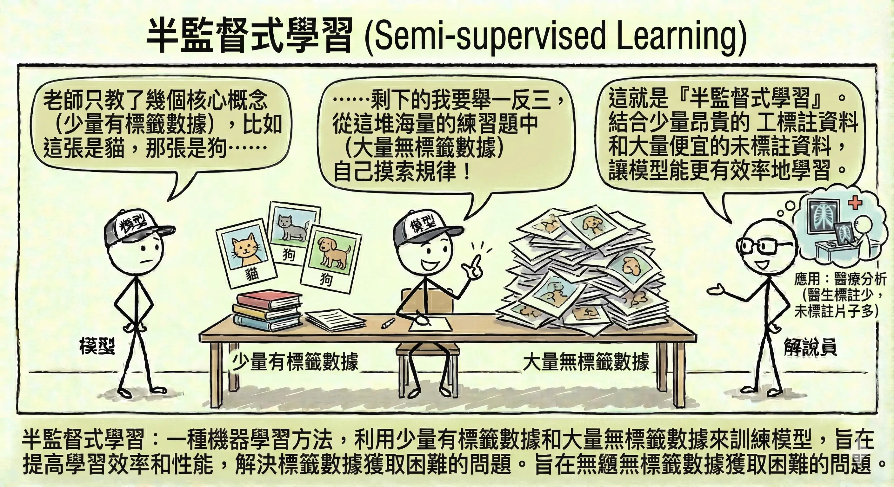
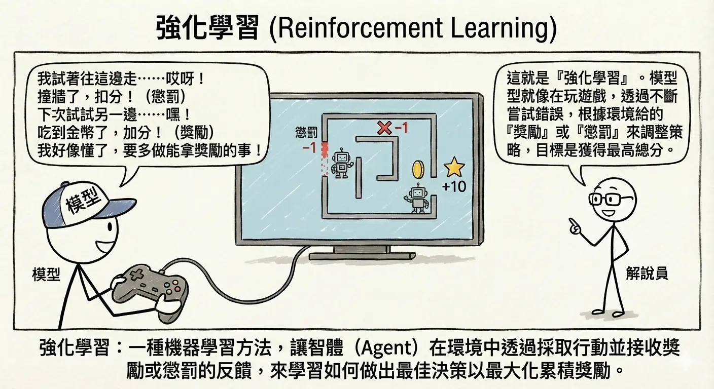
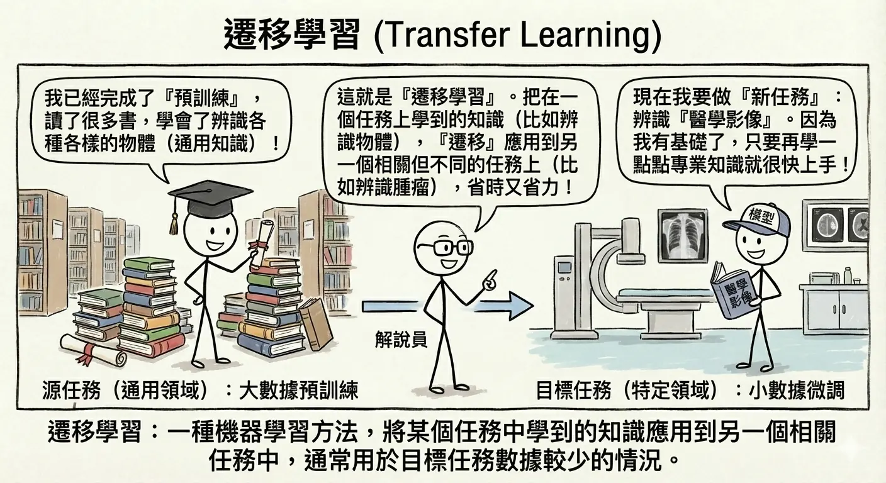
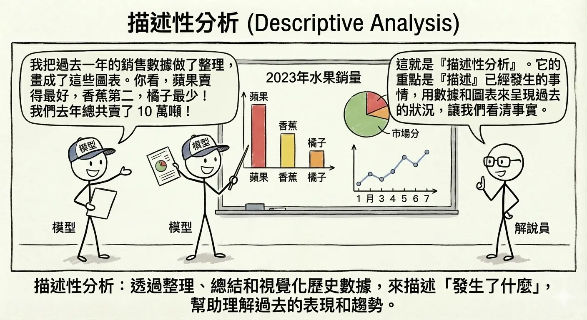
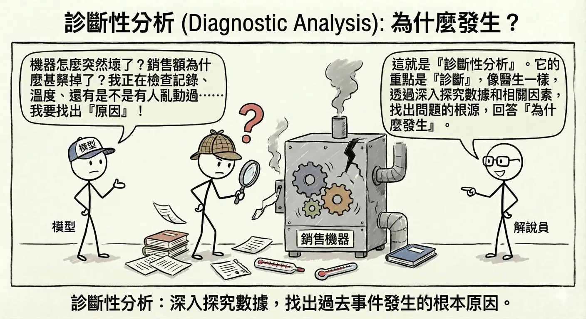
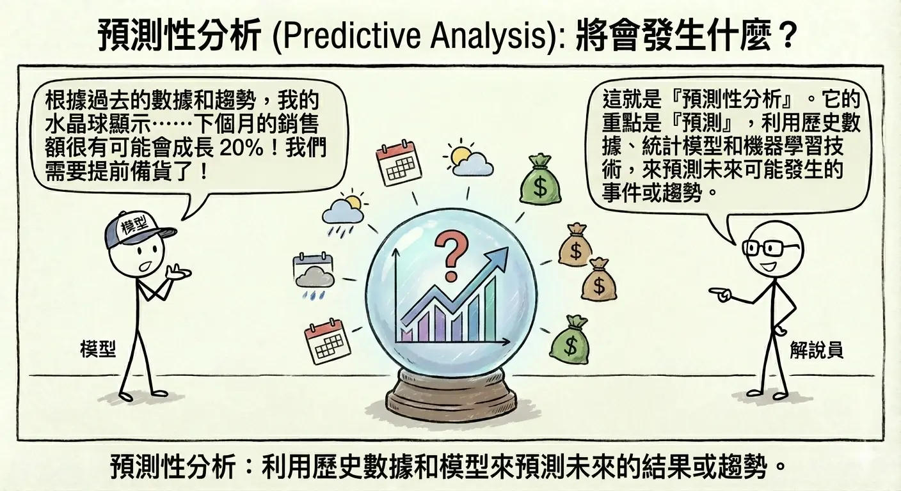
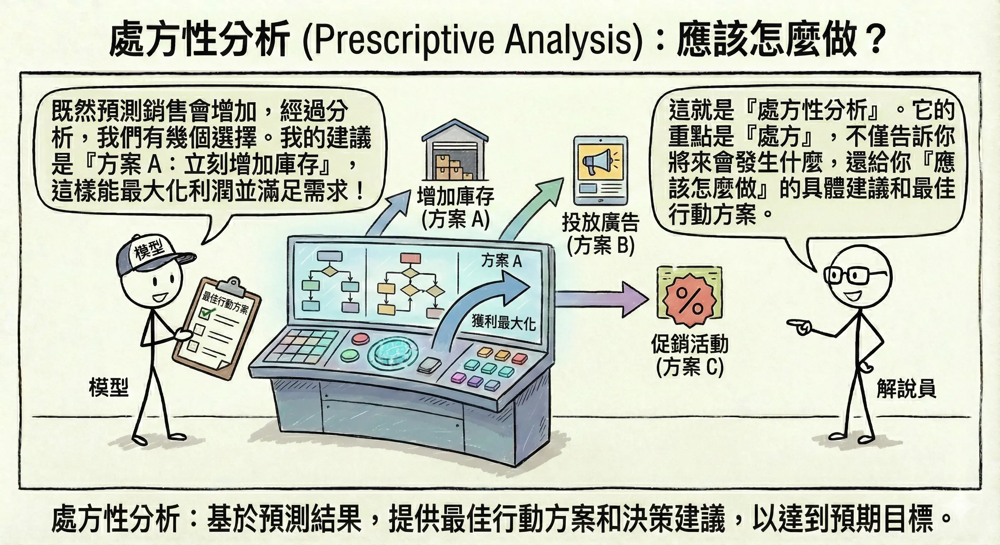

<!-- # AI 應用問題類型 -->

在開始深入各種技術細節之前，我們需要先了解 AI 究竟能解決什麼樣的問題。這就像在學習使用工具箱之前，先了解有哪些類型的釘子和螺絲一樣。本章將介紹 AI 的學習範式（它是如何學習的）以及資料分析的層次（它能提供多深的見解）。

## 學習範式 {#sec-learning-paradigms}

機器學習的核心在於「從資料中學習」。根據資料的型態以及學習的方式，我們可以將其分為幾種主要的範式。

### 監督式學習 (Supervised Learning) {#sec-supervised-learning}

這是目前應用最廣泛的 AI 學習方式。想像一位**老師**在教導學生，老師會提供題目（輸入資料）以及標準答案（標籤）。學生的目標是找出題目與答案之間的關聯規則，以便將來遇到沒有答案的新題目時，也能答對。

*   **關鍵要素**：需要有標籤的資料 (Labeled Data)。
*   **生活案例**：
    *   **垃圾郵件過濾**：系統看過成千上萬封標示為「垃圾信」或「正常信」的郵件後，學會分辨新郵件。
    *   **房價預測**：根據過去房屋的坪數、地點、屋齡（輸入）以及最終成交價（答案），預測新房子的價格。

### 非監督式學習 (Unsupervised Learning) {#sec-unsupervised-learning}

這種方式就像是**自修**，或者是一個嬰兒在探索世界。沒有老師告訴它什麼是對的、什麼是錯的，也沒有標準答案。模型必須自己從資料中尋找隱藏的結構或規律。

*   **關鍵要素**：只有輸入資料，沒有標籤。
*   **生活案例**：
    *   **顧客分群 (Customer Segmentation)**：電商平台分析消費者的購買紀錄，自動將顧客分成「精打細算型」、「衝動購物型」等群體，但系統事先並不知道這些群體的定義。
    *   **異常偵測**：信用卡公司分析刷卡行為，發現某筆交易與平常的模式差異過大，判定為潛在盜刷。

### 半監督式學習 (Semi-supervised Learning) {#sec-semi-supervised-learning}

這是一種折衷方案。在現實世界中，取得有標籤的資料往往很昂貴（需要人工標註），但沒標籤的資料卻隨處可見。半監督式學習結合了少量的標籤資料和大量的無標籤資料。

*   **類比**：老師只教了幾個核心概念（少量標籤），剩下的要學生舉一反三，從大量練習題中自己摸索（大量無標籤）。
*   **應用**：醫療影像分析（醫生標註幾張 X 光片很花時間，但醫院有大量未標註的片子）。

### 強化學習 (Reinforcement Learning) {#sec-reinforcement-learning}

這就像是**訓練寵物**。我們不會直接告訴 AI 每一步該怎麼走，而是讓它在一個環境中嘗試。做對了就給予獎勵（Reward），做錯了就給予懲罰（Penalty）。AI 的目標是透過不斷嘗試錯誤（Trial and Error），找出能獲得最大累積獎勵的策略。

強化學習的過程可以拆解為以下幾個關鍵要素的互動：

1.  **代理人 (Agent)**：也就是正在學習的 AI 模型（例如：掃地機器人）。
2.  **環境 (Environment)**：代理人所處的世界（例如：充滿家具的客廳）。
3.  **狀態 (State)**：代理人當前的情況（例如：前方 10 公分有障礙物）。
4.  **行動 (Action)**：代理人採取的動作（例如：向左轉）。
5.  **獎勵 (Reward)**：環境給予的回饋（例如：成功避開障礙物得 +1 分，撞到桌腳得 -10 分）。

**探索與利用 (Exploration vs. Exploitation)**

強化學習中有一個經典的難題：
*   **探索 (Exploration)**：嘗試新的、未知的行動，希望能發現更好的策略（但也可能失敗）。
*   **利用 (Exploitation)**：堅持目前已知最好的策略，確保獲得穩定的獎勵。
AI 必須在這兩者之間取得平衡，才能不斷進步。

*   **生活案例**：
    *   **AlphaGo**：圍棋程式透過無數次的自我對弈，學習如何贏得比賽。它不僅學習人類棋譜，更透過自我探索發現了人類未曾想過的下法。
    *   **掃地機器人**：在房間裡碰撞學習，慢慢規劃出最有效率的清掃路徑，同時避開障礙物。

### 遷移學習 (Transfer Learning) {#sec-transfer-learning}

這就是所謂的「站在巨人的肩膀上」。人類在學習新技能時，通常會運用舊有的經驗。例如學會騎腳踏車的人，學騎機車會比較快。遷移學習就是將一個已經訓練好的強大模型（預訓練模型），微調後應用到新的、類似的任務上。

*   **優勢**：不需要從頭開始訓練，大幅節省時間與資料需求。
*   **生活案例**：
    *   **醫療影像診斷**：使用一個已經看過數百萬張日常照片（如貓、狗、車）的模型，因為它已經學會了如何辨識邊緣、形狀和紋理，只需要再給它少量的 X 光片或 MRI 影像，它就能快速學會判讀病灶。
    *   **特定領域的語言模型**：使用像 GPT 這樣已經讀過整個網際網路的通用模型，針對「法律文件」或「醫療報告」進行微調，讓它變成該領域的專家助手。
    *   **風格轉換**：將一位畫家（如梵谷）的畫風「遷移」到一張普通的風景照上，讓照片瞬間變成名畫風格。

## 資料分析層次 {#sec-data-analysis-levels}

AI 與資料科學不僅僅是預測未來，它在商業應用上通常被分為四個價值層次，由淺入深：

### 1. 描述性分析 (Descriptive Analysis): 發生了什麼？ {#sec-descriptive-analysis}

這是最基礎的層次，重點在於**總結過去**。透過報表、儀表板 (Dashboard) 來呈現歷史數據。

*   **例子**：
    *   **銷售報表**：上個月的總銷售額是多少？哪個產品賣得最好？
    *   **網站分析**：昨天有多少人造訪網站？平均停留時間多久？
    *   **人資盤點**：目前公司有多少員工？各部門的人數分佈為何？

### 2. 診斷性分析 (Diagnostic Analysis): 為什麼發生？ {#sec-diagnostic-analysis}

這層次試圖找出**原因**。透過資料鑽取 (Drill-down) 或相關性分析，解釋過去事件的成因。
*   **例子**：
    *   **銷售檢討**：為什麼上個月銷售額下降？是因為季節性因素，還是競爭對手降價？
    *   **設備故障**：為什麼這台機器突然停機？是因為過熱還是零件磨損？
    *   **客戶流失**：為什麼這群客戶不再續約？是因為價格太高還是服務滿意度下降？

### 3. 預測性分析 (Predictive Analysis): 將會發生什麼？ {#sec-predictive-analysis}

這正是 AI 與機器學習大顯身手的地方。利用過去的模式來**預測未來**的趨勢或事件。
*   **例子**：
    *   **銷售預測**：根據目前的趨勢，下個月的銷售額預計會是多少？
    *   **預防性維護**：這台機器在未來一週內故障的機率有多高？
    *   **信用評分**：這位申請人未來違約的機率是多少？

### 4. 處方性分析 (Prescriptive Analysis): 應該怎麼做？ {#sec-prescriptive-analysis}

這是分析的最高境界。不僅預測未來，還能提供**最佳行動建議**，告訴決策者如何優化結果。
*   **例子**：
    *   **庫存優化**：既然預測下個月庫存會不足，系統建議現在應該向供應商 A 訂購 500 個零件，並向供應商 B 訂購 300 個，以達到成本最低且到貨最快。
    *   **路徑規劃**：考量到預測的塞車狀況，導航系統建議司機改走 B 路線以節省 10 分鐘。
    *   **行銷配置**：為了最大化轉換率，系統建議將 60% 的預算投入 Instagram 廣告，40% 投入 Google 關鍵字。

## 本章總結與考點提示 {#chap-ai-foundation-chapter2-summary}

### 核心概念回顧

本章介紹了 AI 應用的兩大基礎框架：**學習範式**（AI 如何學習）與**資料分析層次**（AI 能提供什麼價值）。

**學習範式比較表**：

| 學習範式 | 資料特性 | 典型應用 | 關鍵概念 |
|---------|---------|---------|---------|
| **監督式學習** | 有標籤資料 | 分類、迴歸 | 訓練集、測試集 |
| **非監督式學習** | 無標籤資料 | 分群、降維 | 隱藏結構、模式發現 |
| **半監督式學習** | 少量標籤 + 大量無標籤 | 醫療影像 | 標註成本 |
| **強化學習** | 獎勵/懲罰訊號 | 遊戲、機器人 | Agent、Environment、Policy |
| **遷移學習** | 預訓練模型 | 微調應用 | Pre-training、Fine-tuning |

**資料分析層次**：

1. **描述性** → 發生了什麼？（報表、儀表板）
2. **診斷性** → 為什麼發生？（根因分析）
3. **預測性** → 將會發生什麼？（機器學習預測）
4. **處方性** → 應該怎麼做？（最佳化建議）

### AI 應用規劃師認證考點

**常考題型與解題策略**：

1. **情境判斷題**：給定商業問題，選擇最適合的學習範式
    *   *例題*：「公司想根據客戶過去的購買紀錄預測流失率」
        *   **解答**：監督式學習（分類問題）
        *   **關鍵字**：「過去紀錄」= 有標籤資料；「預測」= 監督式學習
    *   *例題*：「想將客戶分成不同群組進行精準行銷，但不知道該分幾群」
        *   **解答**：非監督式學習（分群）
        *   **關鍵字**：「不知道分幾群」= 無預設標籤；「分群」= 非監督式學習

2. **分析層次判斷題**：識別問題屬於哪個分析層次
    *   *例題*：「為什麼上個月銷售下降？」→ **診斷性分析**（找原因）
    *   *例題*：「下個月銷售會是多少？」→ **預測性分析**（預測未來）
    *   *例題*：「應該如何調整行銷策略以提升銷售？」→ **處方性分析**（給建議）

3. **概念辨析題**：
    *   **監督 vs. 非監督**：關鍵在於「是否有標籤」
    *   **強化學習的特點**：透過「試錯」學習，需要「獎勵機制」
    *   **遷移學習的優勢**：「站在巨人肩膀上」，減少訓練時間與資料需求
    *   **探索 vs. 利用**：新嘗試（可能更好但有風險）vs. 已知最佳（穩定但不會進步）

4. **應用場景配對題**：
    *   垃圾郵件過濾 → 監督式學習（分類）
    *   客戶分群 → 非監督式學習
    *   AlphaGo 圍棋 → 強化學習
    *   醫療影像診斷（資料少）→ 遷移學習
    *   異常交易偵測 → 非監督式學習（異常偵測）

### 記憶口訣

*   **學習範式**：「監非半強遷」（監督、非監督、半監督、強化、遷移）
*   **分析層次**：「描診預處」（描述、診斷、預測、處方）
*   **強化學習**：「代環狀動獎」（代理人、環境、狀態、行動、獎勵）

### 延伸思考

*   為什麼 AlphaGo 使用強化學習而不是監督式學習？
*   在什麼情況下，描述性分析就足夠了，不需要預測性分析？
*   遷移學習為何能讓小公司也能使用 AI？

