<!-- # 數據處理生命週期與架構 -->

在 AI 的世界裡，有一句名言：「垃圾進，垃圾出 (Garbage In, Garbage Out, GIGO)」。無論你的模型多麼先進，如果餵給它的資料品質低劣，結果也將毫無價值。本章將探討資料如何從原始狀態，經過層層處理，最終變成模型可用的燃料。

## 資料類型與儲存 (Data Types & Storage) {#sec-data-types-storage}

在建立資料管道之前，我們必須先了解手上有什麼樣的資料，以及該把它存在哪裡。

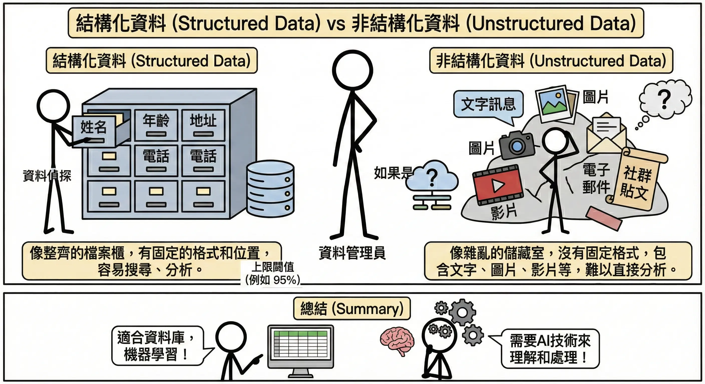

### 結構化資料 (Structured Data)

*   **定義**：高度組織化，有固定的格式與長度。通常以「表格」形式呈現（行與列）。
*   **例子**：Excel 報表、銀行交易紀錄、客戶資料表 (Name, Age, Phone)。
*   **儲存方式**：**關聯式資料庫 (RDB, Relational Database)**。
    *   **SQL (Structured Query Language)**：用於查詢和管理資料的標準語言。
    *   **特性**：強調 **ACID**（原子性、一致性、隔離性、持久性），確保交易絕對準確。
    *   **常見工具**：MySQL, PostgreSQL, Oracle, Microsoft SQL Server。

### 非結構化資料 (Unstructured Data)

*   **定義**：沒有固定格式，電腦難以直接解析。佔了全世界資料的 80% 以上。
*   **例子**：圖片、影片、音訊、PDF 文件、社群貼文、電子郵件內容。
*   **儲存方式**：**NoSQL 資料庫** 或 **物件儲存 (Object Storage)**。
    *   **特性**：靈活、擴充性強 (Scalable)，通常不保證強一致性 (BASE)。
    *   **常見工具**：
        *   **物件儲存**：Amazon S3, Google Cloud Storage (存圖片、影片)。
        *   **NoSQL**：MongoDB (存文件), Redis (存快取), Cassandra (存大量日誌)。

### 半結構化資料 (Semi-structured Data)

*   **定義**：介於兩者之間。沒有嚴格的表格架構，但有標籤 (Tags) 或鍵值 (Keys) 來描述資料層次。
*   **例子**：**JSON** (API 回傳格式), **XML**, **HTML**, Log 檔。
*   **儲存方式**：通常存於 **NoSQL (Document DB)** 如 MongoDB，或現代 RDB 的 JSON 欄位中。

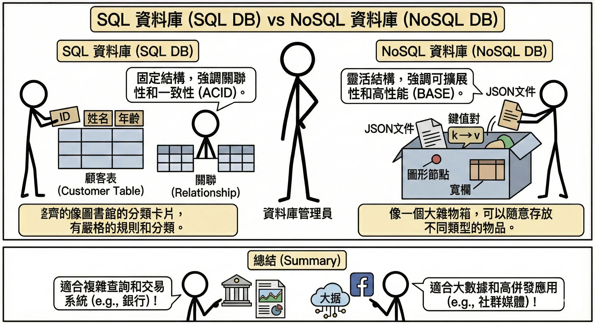

## 資料管道 (Data Pipeline) {#sec-data-pipeline}

資料管道就像是城市的**供水系統**。水源（原始資料）可能來自水庫、河流或地下水，必須經過過濾、消毒、輸送（處理過程），最後才能從家裡的水龍頭流出乾淨的自來水（可用資料）。

### ETL (Extract-Transform-Load) 架構 {#sec-etl}

這是最傳統也最常見的資料處理流程，特別適用於結構化資料（如資料庫表格）。

1.  **資料擷取 (Extract)**：從各種來源（資料庫、API、檔案）收集資料。就像去市場**買菜**。
2.  **資料轉換 (Transform)**：清洗、格式化、計算衍生欄位。就像在廚房**備料**（洗菜、切肉、醃製）。這是最耗時的步驟。
3.  **資料載入 (Load)**：將處理好的資料存入目標系統（通常是資料倉儲 Data Warehouse）。就像將煮好的菜**端上桌**。

**優缺點分析**：

*   **優點 (Pros)**：
    *   **資料品質高**：進入倉儲的資料都經過清洗和驗證，乾淨且格式統一。
    *   **查詢效能好**：資料倉儲通常針對讀取優化，分析速度快。
    *   **節省儲存空間**：只儲存需要的、處理過的資料。
*   **缺點 (Cons)**：
    *   **靈活性低**：如果分析需求改變（例如想看原始資料），需要重新設計轉換流程。
    *   **延遲較高**：必須等所有轉換步驟完成才能使用資料，不適合即時分析。

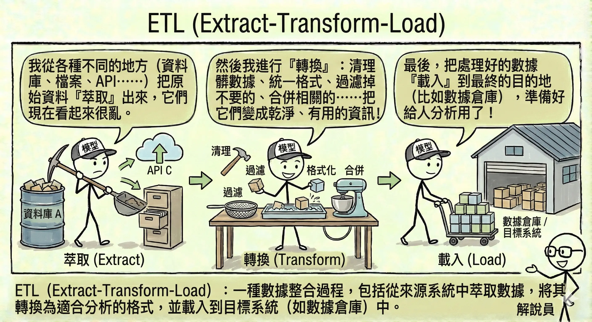

### ELT (Extract-Load-Transform) 架構與資料湖 (Data Lake) {#sec-elt}

隨著大數據 (Big Data) 的興起，資料量大到無法先處理再儲存，或者資料是非結構化的（如日誌、圖片、影片），ELT 架構應運而生。

*   **流程**：先把所有資料（不管髒不髒）全部抓進來（Extract & Load），存放在一個巨大的儲存庫中，稱為**資料湖 (Data Lake)**。等到需要分析時，再進行轉換 (Transform)。
*   **類比**：這就像**搬家**。先把舊家的東西全部裝箱搬到新家（Load），等到要用某個東西時，再打開箱子整理（Transform）。

**優缺點分析**：

*   **優點 (Pros)**：
    *   **極高靈活性**：保留了所有原始資料，隨時可以根據新需求進行不同的轉換分析。
    *   **載入速度快**：不需要等待繁重的轉換過程，資料能快速進入系統。
    *   **支援非結構化資料**：圖片、影片、日誌都可以先丟進去再說。
*   **缺點 (Cons)**：
    *   **資料治理困難**：如果沒有妥善管理，資料湖很容易變成「資料沼澤 (Data Swamp)」，充滿垃圾資料。
    *   **查詢效能較差**：因為資料未經優化，查詢時可能需要即時處理大量原始數據。

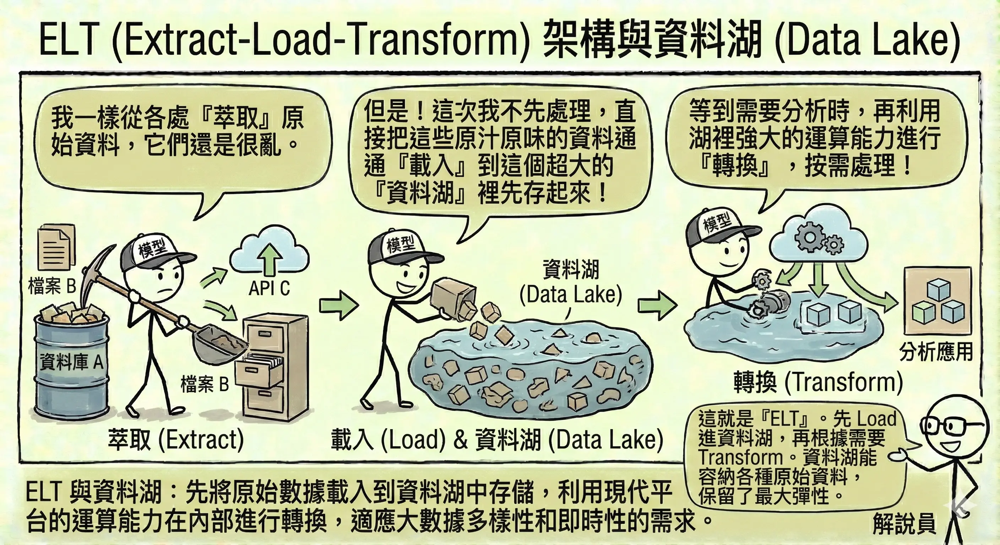

### 批次處理 vs. 串流處理 {#sec-batch-vs-streaming}

*   **批次處理 (Batch Processing)**：累積一段時間的資料後，一次性處理。
    *   **類比**：**公車**。要等到時刻表到了或人坐滿了才發車。
    *   **優點 (Pros)**：
        *   **技術成熟**：工具多，容易實作與維護。
        *   **計算效率高**：一次處理大量資料，平均成本低。
    *   **缺點 (Cons)**：
        *   **資料延遲**：無法看到最新的數據，通常有數小時到數天的落差。
    *   **適用**：日報表、月結算、不需要即時性的分析。

*   **串流處理 (Streaming Processing)**：資料一產生就立刻處理。
    *   **類比**：**計程車**。隨叫隨走，來一個載一個。
    *   **優點 (Pros)**：
        *   **即時性**：能立刻對新事件做出反應（如阻擋盜刷）。
        *   **平滑負載**：資料持續流入處理，不會像批次處理那樣在特定時間出現巨大的運算高峰。
    *   **缺點 (Cons)**：
        *   **技術複雜**：需要處理資料亂序、遺失、重複等問題，開發難度高。
        *   **成本較高**：需要 24 小時運行的基礎設施。
    *   **適用**：即時詐欺偵測、股市交易監控、即時推薦系統。

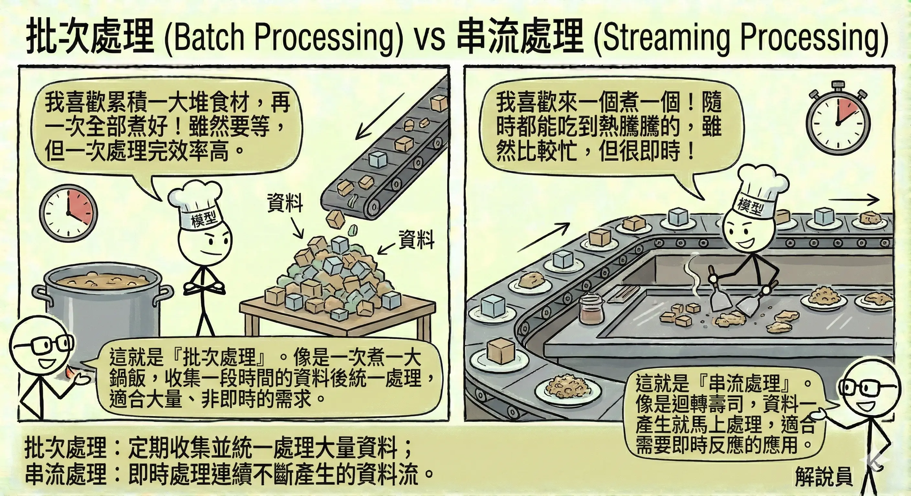

## 探索性資料分析 (Exploratory Data Analysis, EDA) {#sec-eda}

在正式建模之前，我們必須先「認識」資料。探索性資料分析 (Exploratory Data Analysis, EDA) 就像是**相親**，你需要透過各種方式了解對方的個性、習慣和背景。

### 數值型 vs. 類別型資料 (Numerical vs. Categorical Data) {#sec-data-types}

在資料科學中，區分資料的類型至關重要，因為不同的演算法適用於不同類型的資料。

#### 1. 數值型資料 (Numerical Data)
代表**數量**或**大小**的資料，可以進行數學運算（加減乘除）。

*   **連續型 (Continuous)**：可以取任意小數點的值。例如：身高 (175.5 cm)、溫度 (26.8°C)、股價。
*   **離散型 (Discrete)**：只能取整數值。例如：小孩的人數 (1, 2, 3)、網頁點擊次數。

#### 2. 類別型資料 (Categorical Data)
代表**特徵**或**群組**的資料，通常是文字或代碼，無法直接進行數學運算。

*   **名目型 (Nominal)**：沒有順序關係。例如：血型 (A, B, O, AB)、顏色 (紅, 藍, 綠)、城市 (台北, 東京, 紐約)。
*   **順序型 (Ordinal)**：有順序或等級關係，但間距不一定相等。例如：滿意度 (非常滿意 > 滿意 > 普通 > 不滿意)、衣服尺寸 (S < M < L < XL)。

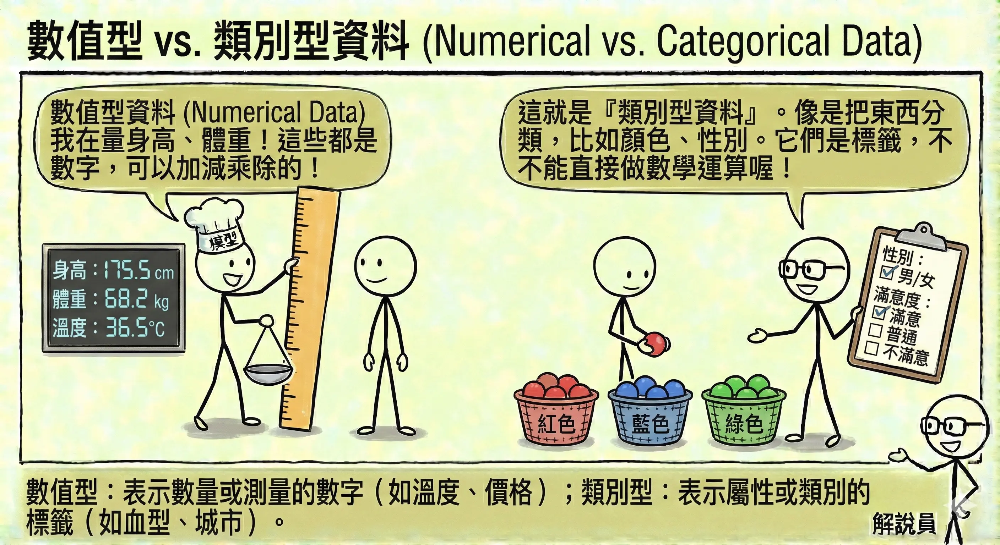

#### 為什麼不能輕易轉換？

雖然電腦最終只看得懂數字，但我們不能隨意將類別轉為數字，或將數字轉為類別，這會造成模型誤解：

1.  **類別轉數值的陷阱**：
    *   如果將「顏色」編碼為：紅=1, 綠=2, 藍=3。
    *   **誤解**：模型會以為「藍色 (3) 大於 紅色 (1)」，或者「紅色 (1) + 綠色 (2) = 藍色 (3)」。這在數學上是荒謬的。
    *   **解法**：對於類別型資料，應使用**獨熱編碼 (One-Hot Encoding)**，將每個顏色變成獨立的欄位（是紅色嗎？是綠色嗎？）。

2.  **數值轉類別的代價**：
    *   如果將「年齡」轉為「年齡層」（0-18歲, 19-35歲...）。
    *   **資訊流失**：19 歲和 35 歲被視為完全一樣，失去了細微的差異。這稱為**離散化 (Discretization)**，雖然有助於簡化問題，但會犧牲精確度。

### 統計摘要 (Descriptive Statistics) {#sec-descriptive-statistics}

用數字來描述資料的整體樣貌，這是了解資料的第一步。

*   **集中趨勢 (Central Tendency)**：尋找資料的「中心」，代表大多數資料落在哪裡。
    *   **平均數 (Mean)**：所有數值加總除以個數。
        *   *缺點*：非常容易受**極端值 (Outliers)** 影響。
    *   **中位數 (Median)**：將資料由小到大排列，位於正中間的那個數（第 50 百分位數）。
        *   *優點*：不受極端值影響，更能代表「一般人」的水準。在房價或薪資統計中，中位數通常比平均數更有參考價值。
    *   **眾數 (Mode)**：出現次數最多的數值。適用於類別資料（如「最熱賣的飲料」）。

    > **實例演練：薪資統計**
    >
    > 假設一間新創公司有 5 位員工，月薪（萬元）分別為：`3, 3, 4, 5, 100`（最後一位是老闆）。
    >
    > *   **平均數**：(3+3+4+5+100) / 5 = 23 萬。
    >     *   *解讀*：平均薪資 23 萬，聽起來這家公司待遇超好？但其實 4 個人都領不到 6 萬。這就是平均數被極端值（老闆的 100 萬）拉高的假象。
    > *   **中位數**：排序後是 `3, 3, [4], 5, 100`。中位數是 **4** 萬。
    >     *   *解讀*：4 萬比較接近大多數員工的真實感受。
    > *   **眾數**：**3** 萬（出現 2 次，最多）。
    >     *   *解讀*：領 3 萬的人最多。

*   **離散程度 (Dispersion)**：資料分佈得有多「散」，代表資料的波動性或不確定性。
    *   **標準差 (Standard Deviation, SD)**：數值與平均數的平均距離。
        *   **公式**：$$ s = \sqrt{\frac{\sum_{i=1}^{n} (x_i - \bar{x})^2}{n-1}} $$
        *   **注意 (貝塞爾校正)**：為什麼除以 **n-1** 而不是 **n**？
            *   當我們只擁有**樣本 (Sample)** 資料時，用 **n-1** 能提供對母體標準差更準確的**不偏估計 (Unbiased Estimate)**。
            *   如果是計算**母體 (Population)** 標準差（擁有全部資料），則除以 **n**。
        *   *意義*：SD 越小，代表資料越集中（品質穩定）；SD 越大，代表資料越參差不齊（風險高）。
        *   *例子*：兩個班級平均分都是 80 分。A 班大家都在 75-85 分之間（SD 小）；B 班有人考 100 也有人考 60（SD 大）。
    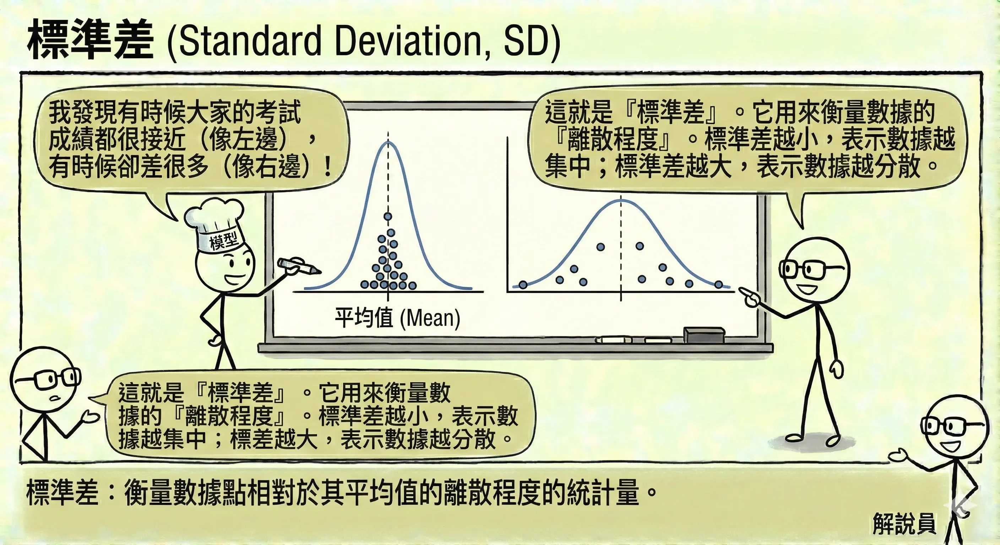

    *   **四分位數 (Quartiles)**：將資料由小到大切成四等份的切點。
        *   **Q1 (第 1 四分位數)**：贏過 25% 的人。
        *   **Q2 (第 2 四分位數)**：即中位數，贏過 50% 的人。
        *   **Q3 (第 3 四分位數)**：贏過 75% 的人。
        *   **四分位距 (IQR)**：代表中間 50% 資料的範圍，常用於偵測離群值。
        *   **公式**：**IQR = Q_3 - Q_1**

*   **分佈形狀 (Distribution Shape)**：
    *   **偏態 (Skewness)**：資料分佈是否對稱。
        *   **公式**：$$ Skewness = \frac{\sum_{i=1}^{n} (x_i - \bar{x})^3}{n \times s^3} $$
        *   **變數說明**：
            *   $x_i$：第 **i** 個資料點。
            *   $\bar{x}$：平均數。
            *   **n**：資料總數。
            *   **s**：標準差。
        *   **右偏 (Right Skewed / Positive Skew)**：長尾巴在右邊（大數值方向）。代表少數極大值拉高了平均數。例如：**所得分佈**（少數富人）、**房價**。此時 **平均數 > 中位數**。
        *   **左偏 (Left Skewed / Negative Skew)**：長尾巴在左邊（小數值方向）。例如：**考試成績**（題目很簡單，大多數人考高分，少數人考低分）。此時 **平均數 < 中位數**。
        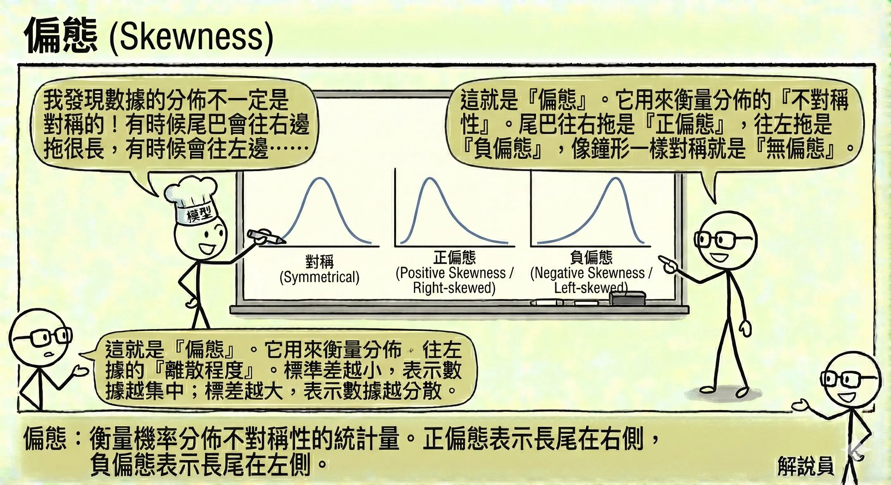    
    
    *   **峰度 (Kurtosis)**：資料分佈的「尖銳」程度。峰度高代表資料集中在中心，且有較厚的尾部（容易出現極端值）。
        *   **公式**：$$ Kurtosis = \frac{\sum_{i=1}^{n} (x_i - \bar{x})^4}{n \times s^4} - 3 $$ (超額峰度)

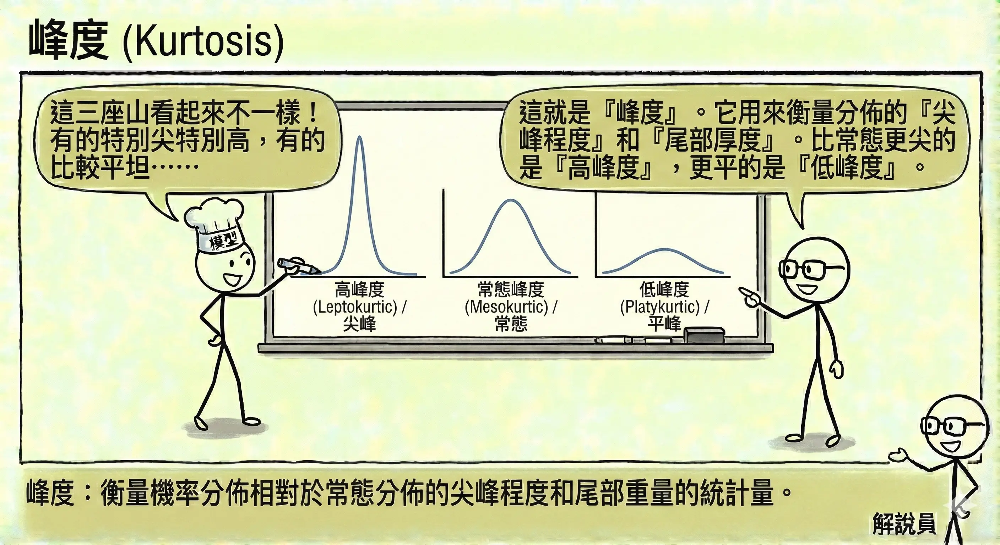

### 資料視覺化決策邏輯 {#sec-data-visualization}

一張圖勝過千言萬語，但選錯圖表會造成誤導。

*   **散佈圖 (Scatter Plot)**：看兩個變數之間的**關聯**（例如：身高 vs. 體重）。
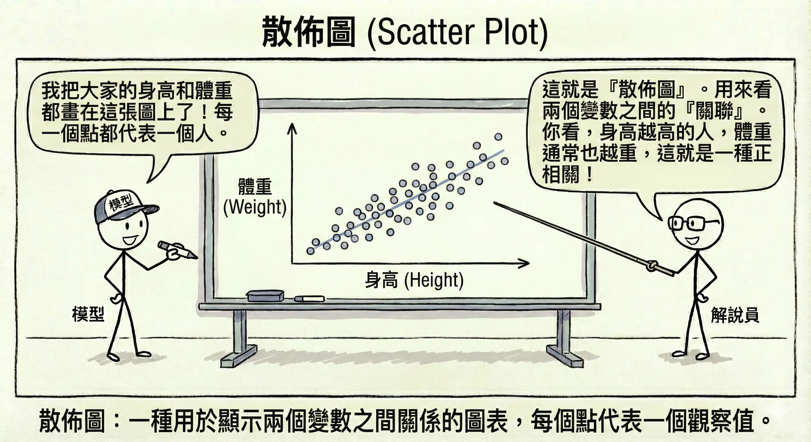
*   **圓餅圖 (Pie Chart)**：顯示各類別佔整體的**比例**（例如：市佔率）。
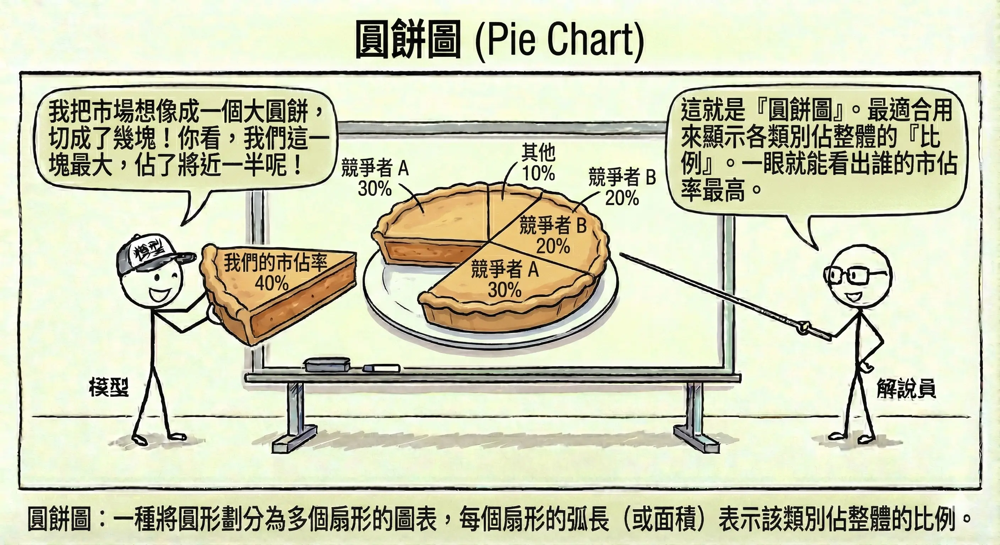

*   **折線圖 (Line Chart)**：看**時間趨勢**（例如：股價走勢、氣溫變化）。
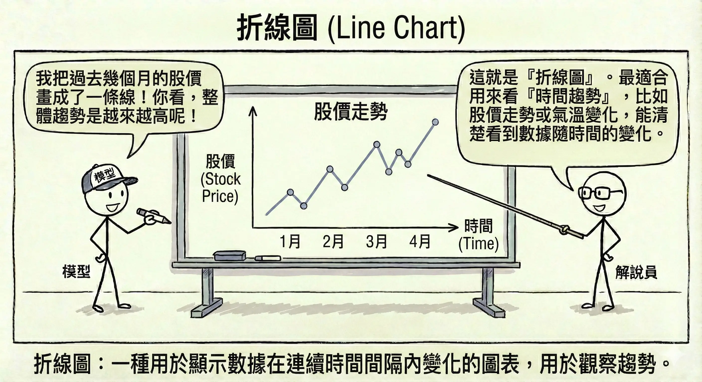
*   **直方圖 (Histogram)**：看單一變數的**分佈**情況（例如：全校學生的成績分佈）。
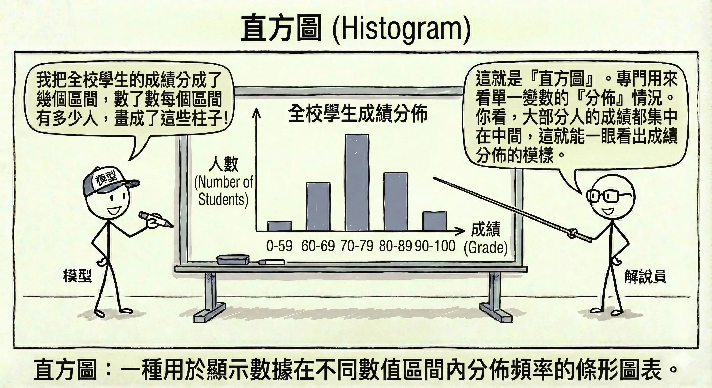
*   **長條圖 (Bar Chart)**：比較不同**類別**的大小（例如：各部門的業績比較）。
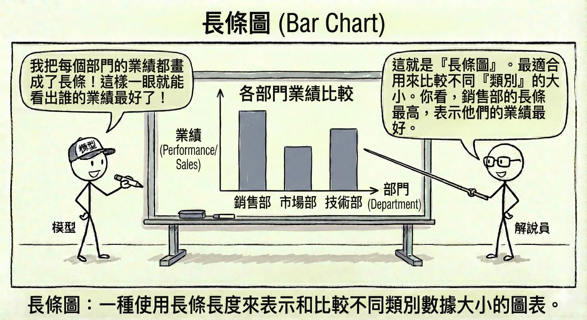
*   **熱圖 (Heatmap)**：用顏色深淺表示數值大小，常用於顯示**相關係數矩陣**（哪些變數連動性高）。
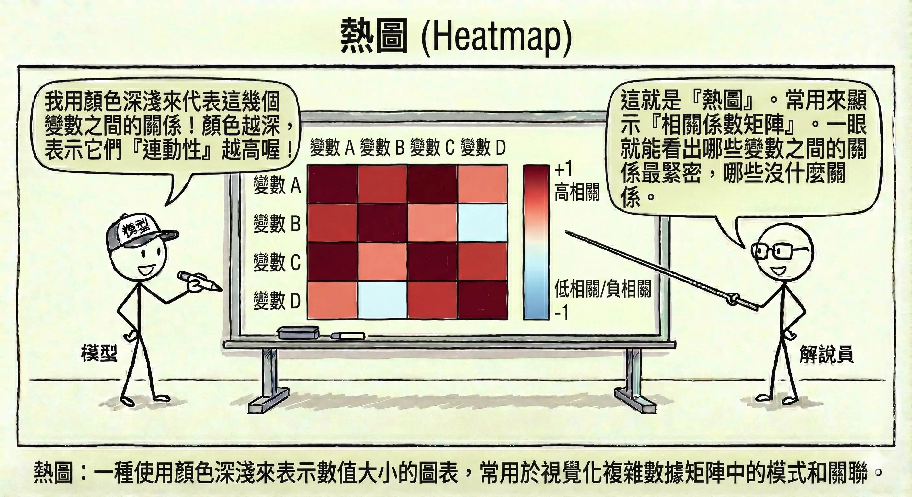
*   **盒鬚圖 (Box Plot)**：快速看出資料的分佈範圍、中位數以及**離群值**。
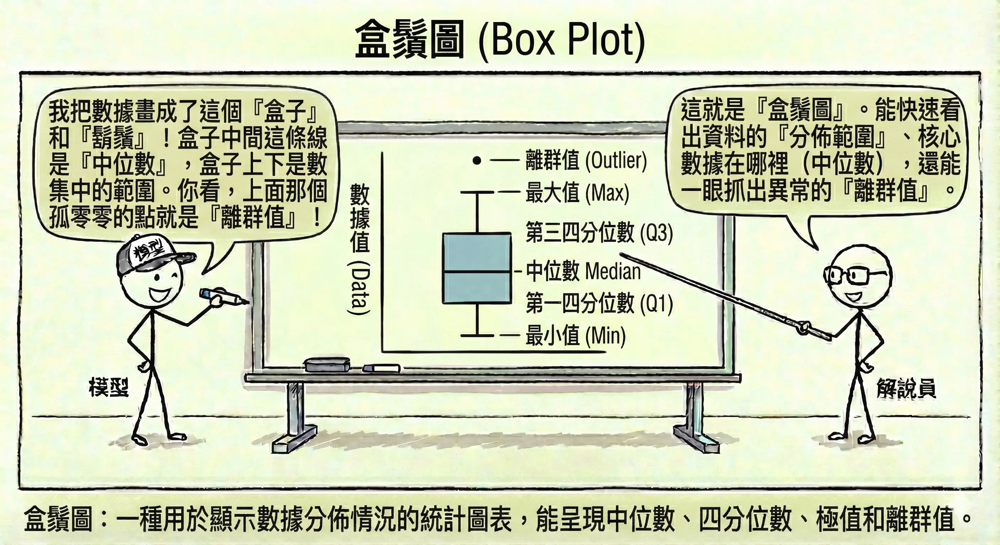

## 資料清理與品質管理 {#sec-data-cleaning}

現實世界的資料往往是髒亂的。資料清理 (Data Cleaning) 通常佔據資料科學家 80% 的時間。

### 缺失值處理 (Missing Values) {#sec-missing-values}

資料中有空格（Null 或 NaN）是常態。這就像拼圖缺了幾片，我們必須決定怎麼處理。

*   **刪除法 (Deletion)**：
    *   **列刪除 (Listwise Deletion)**：只要這一列資料有缺，整列丟掉。
        *   *優點*：簡單快速。
        *   *缺點*：如果資料量本來就不多，會浪費寶貴的資訊。
    *   **欄刪除 (Dropping Features)**：如果某個欄位（如「備註」）缺損率高達 90%，這個欄位可能就沒有參考價值，直接移除。
*   **插補法 (Imputation)**：用「猜」的來填補空格。
    *   **統計值填補**：
        *   **數值型**：用**平均數 (Mean)**（容易受極端值影響）或**中位數 (Median)**（較穩健）填補。
        *   **類別型**：用**眾數 (Mode)**（出現最多次的類別）填補。
    *   **模型預測填補**：將缺失的欄位當作「目標」，其他欄位當作「特徵」，訓練一個模型（如 KNN 或迴歸）來預測缺失值。這是最精準但也最耗算力的方法。

    **插補效果比較表**：
    假設我們有以下員工資料，其中 Bob 的薪資缺失：

    | 員工 | 部門 | 年資 | 薪資 (萬元) |
    |---|---|---|---|
    | Alice | Sales | 2 | 40 |
    | **Bob** | **Sales** | **3** | **?** |
    | Charlie | Sales | 5 | 60 |
    | David | IT | 2 | 80 |
    | Eve | IT | 3 | 90 |

    | 插補方法 | 填補值 | 計算邏輯 | 優缺點 |
    |---|---|---|---|
    | **平均數 (Mean)** | **67.5** | **(40+60+80+90)/4** | 簡單，但被 IT 部門的高薪拉高，不符合 Bob 的 Sales 身分。 |
    | **中位數 (Median)** | **70** | 40, 60, 80, 90 的中間值 | 比平均數穩健，但仍未考慮部門差異。 |
    | **分群平均 (Group Mean)** | **50** | 只算 Sales 部門的平均 (40+60)/2 | 考慮了部門特徵，比全體平均更準確。 |
    | **KNN (K-近鄰)** | **45-55** | 找跟 Bob 最像的人（Sales, 年資 3）。Alice (2年) 和 Charlie (5年) 是鄰居。 | 最精準，利用了「年資」與「部門」的綜合資訊。 |

### 異常值/離群值處理 (Outliers Handling) {#sec-outliers}

有些資料點明顯與眾不同，例如身高 300 公分的人，或是年齡 200 歲。這些點可能是錯誤，也可能是極具價值的特殊案例（如詐欺交易）。

*   **偵測方法**：
    *   **Z-score 檢測**：假設資料呈常態分佈，超過平均數 ±3 個標準差 (3𝛔) 的數值通常被視為異常。
    *   **四分位距 (IQR) 檢測**：利用盒鬚圖的概念。計算 IQR = Q3 - Q1。
        *   上限：Q3 + 1.5 * IQR
        *   下限：Q1 - 1.5 * IQR
        *   超過上下限的點即為離群值。
    
*   **處理方式**：
    *   **修正或刪除**：如果是明顯的輸入錯誤（如年齡 -5 歲），應直接修正或刪除。
    *   **轉換 (Transformation)**：使用**對數轉換 (Log Transformation)**（例如取 **log(x)**）來壓縮數值範圍，讓極端值不再那麼突兀，減少對模型的干擾。
    *   **蓋帽法 (Winsorizing)**：將超過特定百分位數（如 99%）的值，強制設定為該百分位數的值（例如所有超過 1000 的數都設為 1000）。

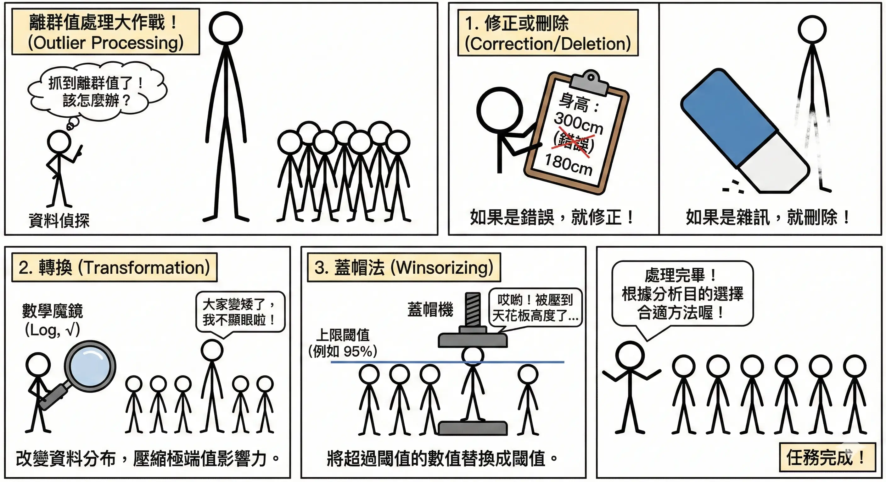

### 數據一致性處理 (Data Consistency) {#sec-consistency}

資料來源不同，格式往往五花八門。這就像聯合國開會，大家得先講好用同一種語言。

*   **格式標準化**：
    *   **日期**：統一將 "2023/1/1", "01-01-2023", "Jan 1st, 23" 轉換為 `YYYY-MM-DD` 格式。
    *   **大小寫**：將 "Apple", "apple", "APPLE" 統一轉為小寫 "apple"。
    *   **單位**：將不同欄位或來源的計量單位（如「公尺」vs「英呎」、「台斤」vs「公斤」、「美金」vs「台幣」）統一換算為同一標準，避免數值比較失準。
*   **語意合併**：
    *   將 "Taipei", "Taipei City", "TP", "台北市" 統一映射為 "Taipei"。
*   **去重 (Deduplication)**：
    *   檢查是否有完全重複的資料列，或者「ID 相同但內容略有不同」的衝突資料，並依據時間戳記保留最新的一筆。

### 資料匿名化與隱私保護 (PII 處理) {#sec-anonymization}

在處理涉及**個人識別資訊 (PII, Personally Identifiable Information)**（如姓名、身分證號、電話、地址）的資料時，必須嚴格遵守法規（如歐盟 GDPR、台灣《個人資料保護法》）。

**個資法合規關鍵 (Compliance Requirements)**：

1.  **告知與同意 (Notice & Consent)**：蒐集資料前，必須明確告知使用者蒐集目的、類別及利用期間，並取得當事人同意。
2.  **目的拘束 (Purpose Limitation)**：資料只能用於當初聲明的特定目的，不得隨意挪作他用（例如：為了「配送商品」蒐集的地址，不能拿去「寄送廣告」）。
3.  **資料最小化 (Data Minimization)**：只蒐集「必要」的資料。如果分析不需要身分證號，就不要蒐集。
4.  **安全維護措施 (Security Measures)**：企業有義務採取適當的技術與組織措施（如加密、存取控制）來防止資料外洩。
5.  **當事人權利 (Data Subject Rights)**：使用者有權要求查詢、更正、或刪除其個人資料（被遺忘權）。

為了符合上述要求，常見的技術手段包括：

*   **遮罩 (Masking)**：隱藏部分資訊。
    *   姓名："王大明" → "王O明"
    *   電話："0912-345-678" → "0912-***-***"
*   **泛化 (Generalization)**：降低資料的精確度，使其無法識別特定個人，但仍保有統計意義。
    *   年齡："25 歲" → "20-30 歲區間"
    *   地址："台北市信義區信義路五段 7 號" → "台北市信義區"
*   **假名化 (Pseudonymization)**：用隨機生成的代碼（Token）取代真實 ID。只有擁有對照表的人才能還原，比單純刪除更具可追溯性。

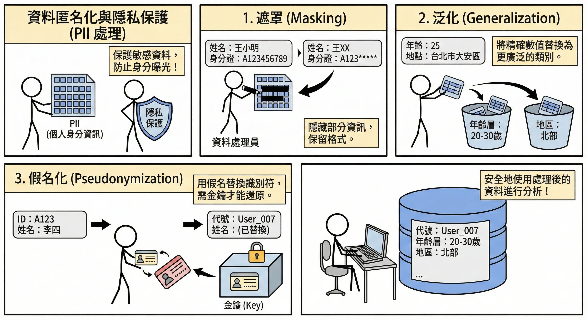

## 本章總結與考點提示 {#chap-ai-foundation-chapter3-summary}

### 核心概念回顧

本章重點在於資料進入模型前的準備工作，這是 AI 專案成敗的關鍵。

*   **資料架構**：
    *   **ETL**：先處理再存（傳統，結構化資料）。
    *   **ELT**：先存再處理（大數據，資料湖）。
*   **資料分析 (EDA)**：
    *   **集中趨勢**：平均數（怕極端值）、中位數（穩健）、眾數。
    *   **離散程度**：標準差（波動大小）、IQR（四分位距）。
    *   **分佈形狀**：偏態（左偏/右偏）、峰度。
*   **資料清理**：
    *   **缺失值**：刪除、插補（平均數/中位數/KNN）。
    *   **離群值**：Z-score (>3)、IQR (1.5倍)。
    *   **隱私**：去識別化、差分隱私。

### AI 應用規劃師認證考點

**常考題型與解題策略**：

1.  **統計指標選擇題**：
    *   *例題*：「某公司薪資分佈極不平均，老闆想用哪個指標來『美化』薪資水準？」
    *   **解答**：平均數 (Mean)。因為會被高薪者拉高。
    *   *例題*：「想了解大多數員工的真實薪資，應看哪個指標？」
    *   **解答**：中位數 (Median)。

2.  **資料處理方法題**：
    *   *例題*：「資料中有大量缺失值，且該欄位對預測很重要，該怎麼辦？」
    *   **解答**：插補法 (Imputation)。不能直接刪除（會掉資料），也不能刪欄位（會掉特徵）。
    *   *例題*：「如何處理年齡欄位中的 '200歲'？」
    *   **解答**：視為異常值，進行修正或刪除。

3.  **架構比較題**：
    *   *關鍵字*：結構化資料/資料倉儲 → ETL；非結構化/大數據/資料湖 → ELT。

4.  **圖表選擇題**：
    *   比例 → 圓餅圖。
    *   趨勢 → 折線圖。
    *   分佈 → 直方圖。
    *   關聯 → 散佈圖。

### 記憶口訣

*   **右偏分佈**：「貧富差距大」，平均數 > 中位數（被富人拉高）。
*   **左偏分佈**：「考試簡單」，平均數 < 中位數（被低分拉低）。
*   **ETL vs ELT**：看「T」(Transform) 的位置。T 在中間是傳統，T 在最後是大數據。

### 延伸思考

*   為什麼在醫療數據中，我們通常不隨意刪除有缺失值的資料？（因為每一筆病歷都很珍貴，且缺失本身可能帶有資訊，例如病人太嚴重無法測量）。

