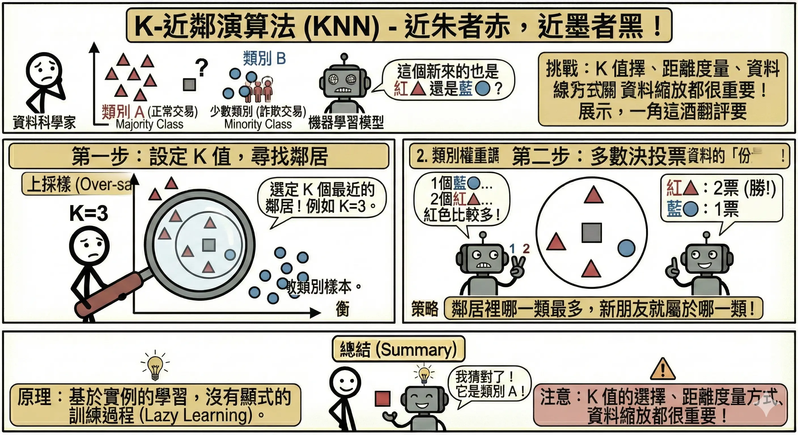
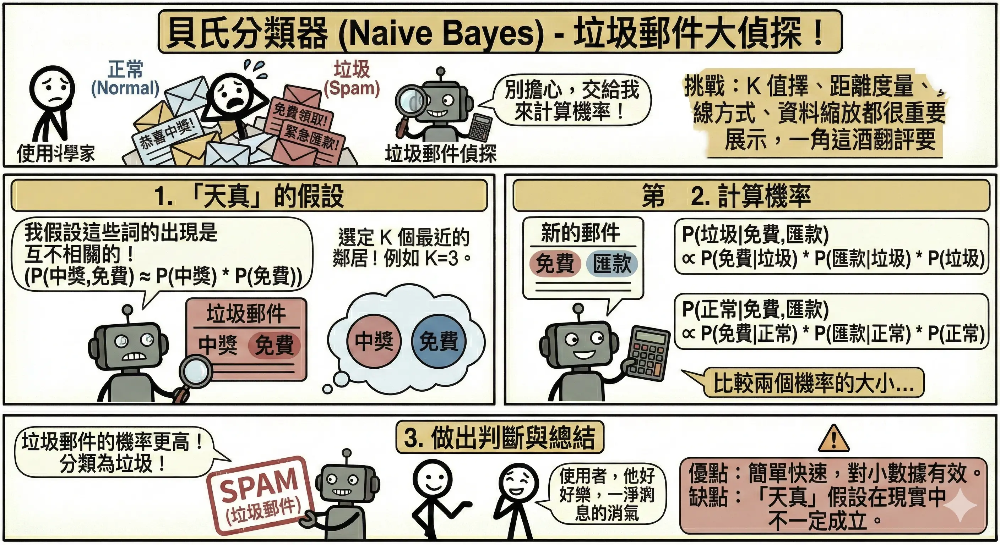
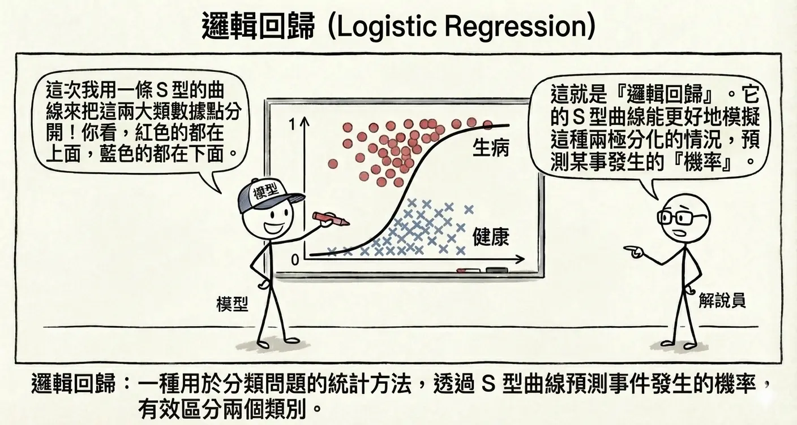
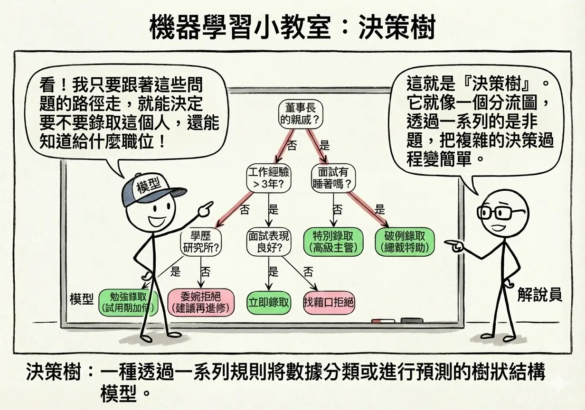
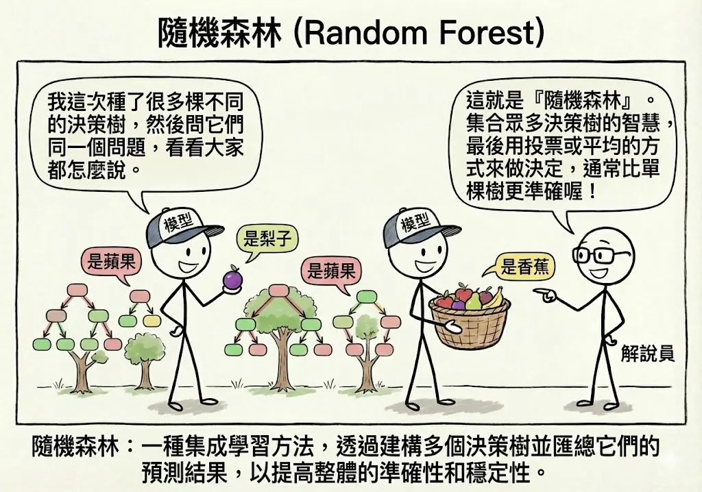
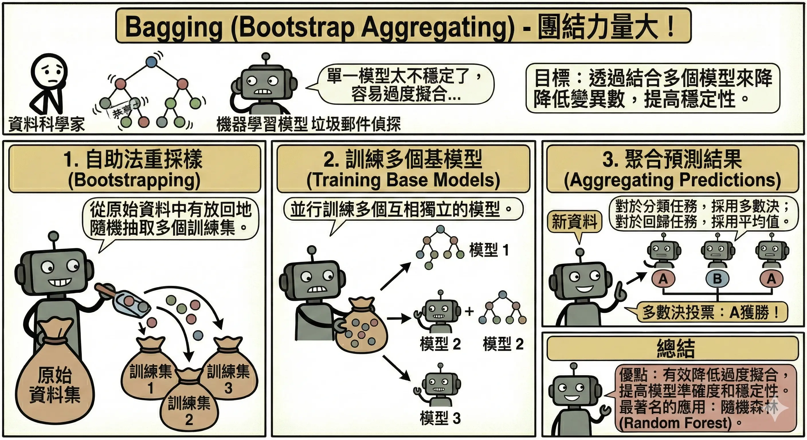
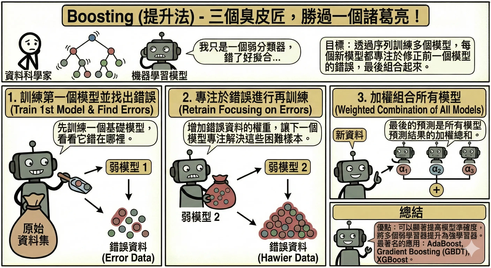
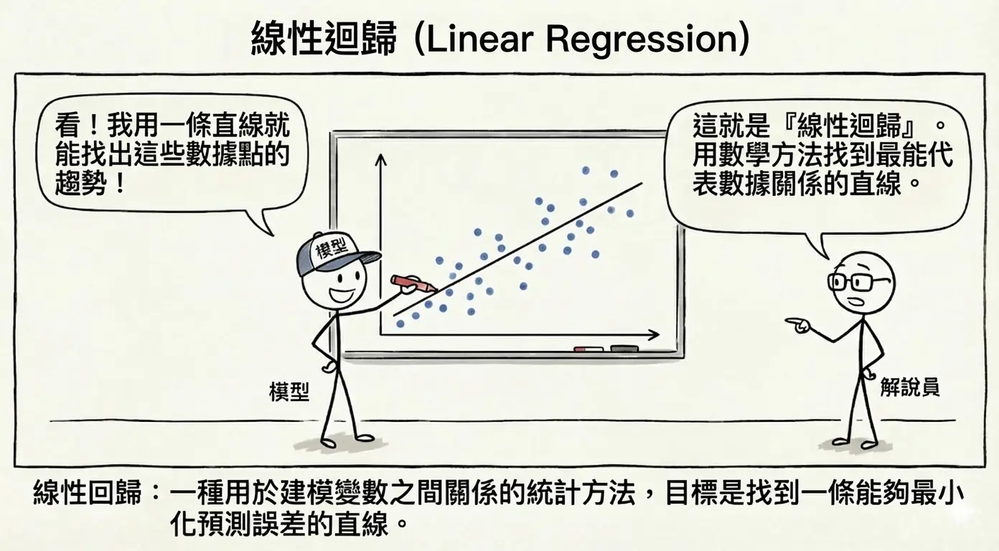
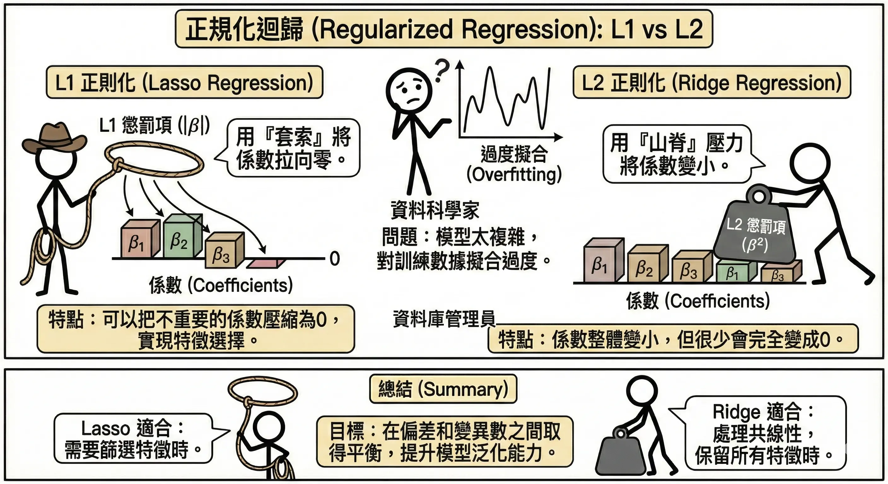

<!-- # 監督式學習演算法 (Supervised Learning Algorithms) -->

監督式學習 (Supervised Learning) 是目前 AI 應用最成熟、商業價值最高的領域。它的核心運作模式就像是**人類的正規教育**：老師（系統）提供大量的題目（輸入 **X**）和標準答案（標籤 **Y**），學生（模型）透過不斷練習，學會找出題目與答案之間的關聯函數 **f**，使得 $f(X) \approx Y$。

根據目標變數 **Y** 的型態，監督式學習主要分為兩大類：
  1.  **分類 (Classification)**：預測的是**類別**（離散值）。例如：這封信是垃圾郵件嗎？（是/否）、這張照片是貓還是狗？
  2.  **迴歸 (Regression)**：預測的是**數值**（連續值）。例如：明天的氣溫是幾度？這間房子的房價是多少？

## 分類演算法 (Classification) {#sec-classification}

### K-近鄰演算法 (KNN, K-Nearest Neighbors) {#sec-knn}

*   **核心概念**：「近朱者赤，近墨者黑」。
*   **運作方式**：
    1.  當一個新的資料點出現時，算出它與現有所有資料點的距離。
    2.  找出距離最近的 K 個鄰居。
    3.  **投票表決**：如果這 K 個鄰居中，大多數是紅色，那這個新點就被歸類為紅色。
*   **關鍵參數 K**：
    *   K 太小（如 K=1）：容易受雜訊影響（過度擬合）。
    *   K 太大：容易被多數類別主導（欠擬合）。
*   **優缺點**：
    *   *優點*：簡單直觀，不需要訓練過程（Lazy Learning），新資料進來直接算。
    *   *缺點*：資料量大時，計算距離非常耗時（計算成本高）。

### 貝氏分類器 (Naive Bayes) {#sec-naive-bayes}

*   **核心概念**：基於**機率統計**的預測。利用貝氏定理 (Bayes' Theorem) 計算在已知特徵下，屬於某類別的機率。
*   **「樸素/天真」(Naive) 的假設**：假設所有特徵之間是**互相獨立**的。雖然這在現實中很少見（例如「下雨」和「潮濕」通常相關），但這個假設讓計算變得非常簡單且快速。
*   **應用實例：垃圾郵件過濾計算**
    *   假設我們有 100 封信，其中 40 封是垃圾信 (Spam)，60 封是正常信 (Ham)。
    *   **先驗機率 (Prior)**：
        *   **P(Spam) = 40/100 = 0.4**
        *   **P(Ham) = 60/100 = 0.6**
    *   **似然機率 (Likelihood)**：統計發現，垃圾信中有 50% 包含 "Free" 這個字，正常信中只有 5% 包含 "Free"。
        *   **P("Free" | Spam) = 0.5**
        *   **P("Free" | Ham) = 0.05**
    *   **情境**：現在收到一封新信，裡面有 "Free"，它是垃圾信的機率是多少？
    *   **計算 (Bayes' Theorem)**：
        $$ P(Spam | "Free") = \frac{P("Free" | Spam) \times P(Spam)}{P("Free")} $$
        1.  分子 (是垃圾信且有 Free)：$0.5 \times 0.4 = 0.2$
        2.  分母 (所有有 Free 的信)：
            *   來自垃圾信：$0.5 \times 0.4 = 0.2$
            *   來自正常信：$0.05 \times 0.6 = 0.03$
            *   總和：0.2 + 0.03 = 0.23
        3.  結果：$0.2 / 0.23 \approx \mathbf{87\%}$
    *   **結論**：看到 "Free"，這封信有 87% 的機率是垃圾信。
*   **優缺點**：
    *   *優點*：速度極快，適合處理高維度文本資料（如 NLP）。
    *   *缺點*：如果特徵之間高度相關，預測效果會變差。

### 邏輯迴歸 (Logistic Regression) {#sec-logistic-regression}
*   **注意**：雖然名字裡有「迴歸」，但它是經典的**二元分類**演算法！
*   **核心概念**：
    1.  先計算一個線性方程式 $z = wX + b$。
    2.  將 **z** 通過一個 **Sigmoid 函數**（S 型曲線），將數值壓縮到 0 到 1 之間。
    3.  輸出值代表「屬於正類別的機率」。
*   **決策邊界**：通常設定閾值為 0.5。
    *   機率 > 0.5 → 判為 1 (Positive)
    *   機率 < 0.5 → 判為 0 (Negative)
*   **優缺點**：
    *   *優點*：可解釋性高（可以看到每個特徵的權重），計算快。
    *   *缺點*：只能處理線性可分的問題（除非人工轉換特徵）。

### 支援向量機 (SVM, Support Vector Machine) {#sec-svm}
*   **核心概念**：試圖在不同類別的資料之間，畫出一條最寬的「馬路」（決策邊界）。
    *   **邊界 (Margin)**：馬路兩側到最近資料點的距離。SVM 的目標是**最大化邊界**。
    *   **支援向量 (Support Vectors)**：那些落在馬路邊緣、真正決定馬路怎麼畫的關鍵資料點。
*   **核函數技巧 (Kernel Trick)**：
    *   當資料在二維平面上無法用直線分開時（例如同心圓分佈），SVM 可以利用核函數將資料投影到**高維空間**（例如三維）。
    *   *類比*：桌上有紅豆和綠豆混在一起，無法用一根筷子分開。但如果你用力拍桌子，豆子彈到空中（三維），你就可以用一張紙（平面）在空中把它們切開。
*   **優缺點**：
    *   *優點*：在小樣本、高維度資料上表現極佳，泛化能力強。
    *   *缺點*：在大數據集上訓練慢，且對參數設定敏感。

### 決策樹 (Decision Tree) {#sec-decision-tree}
*   **核心概念**：就像玩「20 個問題」遊戲。透過一系列的是非問句來對資料進行切割。
*   **結構**：
    *   **根節點 (Root)**：第一個問題（例如：年齡 > 30？）。
    *   **內部節點 (Node)**：後續的問題（例如：收入 > 5萬？）。
    *   **葉節點 (Leaf)**：最終的分類結果（例如：會買 / 不會買）。
*   **分裂準則**：如何決定問什麼問題？目標是讓分出來的子群組越「純」越好。
    *   **熵 (Entropy)** / **吉尼係數 (Gini Impurity)**：衡量混亂程度的指標。
*   **優缺點**：
    *   *優點*：**可解釋性最強**（白箱模型），畫出來的樹狀圖非專業人士也能懂。
    *   *缺點*：容易**過度擬合 (Overfitting)**，變成死記硬背的學生。

### 隨機森林 (Random Forest) {#sec-random-forest}

*   **核心概念**：**集成學習 (Ensemble Learning)** 的經典代表。既然一棵決策樹容易犯錯（過度擬合），那就種一片森林，讓大家一起投票！
*   **運作機制**：
    1.  **隨機採樣 (Bootstrap)**：從原始資料中「有放回」地抽取 N 份樣本，每份樣本建立一棵樹。
    2.  **特徵隨機 (Feature Randomness)**：每棵樹在分裂節點時，不看所有特徵，而是隨機選取一部分特徵（例如從總共 M 個特徵中選 $\sqrt{M}$ 個）來挑選最佳分裂點。這讓每棵樹長得不一樣（去關聯化）。
    3.  **多數決 (Voting)**：
        *   **分類**：所有樹投票，票數最多的類別勝出。
        *   **迴歸**：計算所有樹預測值的平均。
*   **OOB (Out-of-Bag) 誤差**：由於採樣是有放回的，約有 1/3 的資料不會被某棵樹用到，這些資料可以用來驗證該樹的效能，無需另外切分驗證集。
*   **優缺點**：
    *   *優點*：準確率極高，非常穩健，不易過度擬合（因為有隨機性），能處理高維度資料。
    *   *缺點*：模型龐大（幾百棵樹），預測速度較慢，且失去了單一決策樹的可解釋性（變成了黑箱模型）。

## 集成學習 (Ensemble Learning) {#sec-ensemble}

三個臭皮匠，勝過諸葛亮。集成學習的核心思想是結合多個弱學習器 (Weak Learners) 來構建一個強學習器 (Strong Learner)。主要分為兩大流派：**Bagging** 與 **Boosting**。

### Bagging (Bootstrap Aggregating) {#sec-bagging}

*   **口訣**：「並行合作，各做各的」。
*   **原理**：
    1.  **Bootstrap (自助法)**：從訓練資料中有放回地隨機抽取多組樣本。
    2.  **Aggregating (聚合)**：每一組樣本訓練一個模型（通常是決策樹），最後透過**投票**（分類）或**平均**（迴歸）來決定結果。
*   **目的**：降低**變異 (Variance)**，解決過度擬合問題。
*   **代表演算法**：
    *   **隨機森林 (Random Forest)**：
        *   除了對資料取樣 (Row Subsampling)，還對特徵取樣 (Feature Subsampling)。
        *   **優點**：準確、抗過擬合、可平行運算（速度快）。
        *   **缺點**：模型大、黑箱。

### Boosting (提升法) {#sec-boosting}

*   **口訣**：「循序漸進，知錯能改」。
*   **原理**：
    1.  訓練第一個模型，找出它預測錯誤的資料。
    2.  訓練第二個模型，**專注於修正第一個模型犯錯的資料**（加大權重）。
    3.  不斷重複，將所有模型加權組合起來。
*   **目的**：降低**偏差 (Bias)**，提升預測準確度。
*   **代表演算法**：
    *   **AdaBoost**：早期代表，調整資料權重。
    *   **XGBoost / LightGBM / CatBoost**：現代 Kaggle 比賽常勝軍。基於梯度提升 (Gradient Boosting)，效能極強，但參數多難調。

### Bagging 與 Boosting 的關鍵差異 {#sec-bagging-vs-boosting}

| 特性 | Bagging (如隨機森林) | Boosting (如 XGBoost) |
| :--- | :--- | :--- |
| **訓練方式** | **並行 (Parallel)**：各棵樹獨立訓練，互不影響。 | **序列 (Sequential)**：後面的樹依賴前面的樹（修正錯誤）。 |
| **核心目標** | **降低變異 (Variance)**：透過平均多個模型來減少過度擬合。 | **降低偏差 (Bias)**：透過不斷修正錯誤來提升準確度。 |
| **樣本權重** | 所有樣本權重相同。 | 錯誤樣本的權重會被放大。 |
| **對雜訊敏感度** | 較低（抗雜訊能力強）。 | 較高（容易對雜訊過度擬合）。 |
| **運算速度** | 快（可平行運算）。 | 慢（必須依序訓練）。 |

## 迴歸演算法 (Regression) {#sec-regression}

目標是預測一個連續的數值（如房價、銷量）。

### 線性迴歸 (Linear Regression) {#sec-linear-regression}
*   **核心概念**：試圖畫出一條直線 **y = wx + b**，讓這條線盡可能靠近所有的資料點。
*   **損失函數 (Loss Function)**：**均方誤差 (MSE, Mean Squared Error)**。即計算所有點到線的距離平方和，找出讓這個誤差最小的參數 **w** 和 **b**。
*   **多項式迴歸**：如果資料不是直線分佈，可以用曲線（二次方、三次方等）來擬合。

### 正規化迴歸 (Regularized Regression) {#sec-regularized-regression}

為了防止模型過度擬合（例如用了太高次方的多項式，導致線條扭曲），我們在損失函數中加入一個「懲罰項」，強迫模型的權重 **w** 不要太大，保持簡單。這就像是給模型戴上「緊箍咒」，不讓它太狂野。

#### 1. L1 正則化 (Lasso Regression)

*   **全名**：Least Absolute Shrinkage and Selection Operator。
*   **數學公式**：
    $$ J(w) = \underbrace{\sum_{i=1}^{n} (y_i - \hat{y}_i)^2}_{\text{原始誤差 (MSE)}} + \underbrace{\lambda \sum_{j=1}^{m} |w_j|}_{\text{L1 懲罰項}} $$
*   **機制**：在損失函數加入權重**絕對值**的總和。
    *   **𝝺** (Lambda) 是**正則化強度**。**𝝺** 越大，懲罰越重，越多權重會變成 0。
*   **特性**：傾向於讓不重要的特徵權重**變成 0**。
*   **應用場景：特徵選擇**
    *   假設我們要預測房價，手上有 100 個特徵。
    *   **有用特徵**：坪數、地點、屋齡。
    *   **無用特徵**：屋主的星座、門牌號碼的奇偶數、當天的天氣。
    *   **Lasso 的效果**：它會發現「星座」對房價沒影響，直接把「星座」的權重砍成 0。最後模型只剩下真正重要的幾個特徵。這就是**稀疏模型 (Sparse Model)**。

#### 2. L2 正則化 (Ridge Regression)

*   **全名**：Ridge Regression (脊迴歸)。
*   **數學公式**：
    $$ J(w) = \underbrace{\sum_{i=1}^{n} (y_i - \hat{y}_i)^2}_{\text{原始誤差 (MSE)}} + \underbrace{\lambda \sum_{j=1}^{m} w_j^2}_{\text{L2 懲罰項}} $$
*   **機制**：在損失函數加入權重**平方**的總和。
*   **特性**：傾向於讓所有特徵權重**變小**，但不會變成 0。
*   **應用場景：處理共線性 (Multicollinearity)**
    *   假設特徵中有「坪數 (平方公尺)」和「坪數 (坪)」。這兩個特徵高度相關（幾乎一樣）。
    *   **一般迴歸的問題**：模型可能會困惑，給其中一個巨大的正權重，另一個巨大的負權重，導致模型不穩定。
    *   **Ridge 的效果**：它會把這兩個特徵的權重都壓得很小且接近，讓模型更穩健，不會因為數據的一點小雜訊就劇烈波動。

#### 總結比較

| 特性 | Lasso (L1) | Ridge (L2) |
| :--- | :--- | :--- |
| **數學懲罰** | 絕對值 $|w|$ | 平方 $w^2$ |
| **對權重的影響** | 變成 0 | 變小 (趨近於 0) |
| **主要功能** | **特徵選擇** (排除無用特徵) | **防止過擬合** (處理共線性) |
| **幾何解釋** | 解空間是菱形 (容易切到軸上) | 解空間是圓形 |

## 演算法比較總結 {#sec-algo-comparison}

| 演算法 | 類型 | 核心特點 | 適用情境 | 缺點 |
| :--- | :--- | :--- | :--- | :--- |
| **KNN** | 分類/迴歸 | 找鄰居，近朱者赤 | 簡單問題，資料量小 | 計算慢，對雜訊敏感 |
| **Naive Bayes** | 分類 | 基於機率，假設特徵獨立 | 文本分類 (NLP)，垃圾郵件 | 假設過於理想化 |
| **Logistic Regression** | 分類 | 線性邊界，輸出機率 | 二元分類，需要解釋權重 | 只能處理線性問題 |
| **SVM** | 分類/迴歸 | 最大化邊界，核函數技巧 | 小樣本，高維度，非線性 | 大數據訓練慢 |
| **Decision Tree** | 分類/迴歸 | 樹狀規則，若 P 則 Q | 需要解釋規則，非線性 | 容易過度擬合 |
| **Random Forest** | 分類/迴歸 | 多棵樹投票 (Bagging) | 高準確率需求，大數據 | 黑箱，訓練預測慢 |
| **Linear Regression** | 迴歸 | 擬合直線 | 預測數值，趨勢分析 | 只能處理線性關係 |

## 本章總結與考點提示 {#chap-ai-foundation-chapter5-summary}

### 核心概念回顧

監督式學習是目前應用最廣泛的 AI 技術。

*   **分類 (Classification)**：預測類別（離散）。
    *   **KNN**：看鄰居（懶惰學習）。
    *   **Naive Bayes**：算機率（假設獨立）。
    *   **Logistic Regression**：畫線分兩邊（輸出機率）。
    *   **SVM**：畫最寬的馬路（最大化邊界）。
    *   **Decision Tree**：問問題（可解釋性高）。
*   **集成學習 (Ensemble)**：結合多個弱學習器。
    *   **Bagging (如 Random Forest)**：並行訓練 → 投票 → 降低變異 (Variance) → 抗過擬合。
    *   **Boosting (如 XGBoost)**：循序修正 → 加權 → 降低偏差 (Bias) → 提升準確度。
*   **迴歸 (Regression)**：預測數值（連續）。
    *   **Linear Regression**：畫一條線擬合。
    *   **Lasso (L1)**：特徵選擇 (權重變 0)。
    *   **Ridge (L2)**：處理共線性 (權重變小)。

### AI 應用規劃師認證考點

**常考題型與解題策略**：

1.  **演算法選擇題**：
    *   *例題*：「需要向銀行監管單位解釋為何拒絕客戶貸款，應選哪個模型？」
    *   **解答**：決策樹 (Decision Tree)。因為可解釋性最高（白箱）。避免選神經網路或隨機森林（黑箱）。
    *   *例題*：「垃圾郵件過濾通常使用哪個演算法？」
    *   **解答**：貝氏分類器 (Naive Bayes)。擅長處理文本特徵。

2.  **集成學習比較題 (Bagging vs Boosting)**：
    *   *例題*：「隨機森林屬於哪種集成技術？主要解決什麼問題？」
    *   **解答**：Bagging；解決過度擬合 (降低 Variance)。
    *   *例題*：「XGBoost 屬於哪種集成技術？主要解決什麼問題？」
    *   **解答**：Boosting；解決欠擬合 (降低 Bias)。

3.  **Lasso vs Ridge**：
    *   *關鍵字*：Lasso (L1) → 特徵選擇 (變 0)；Ridge (L2) → 處理共線性 (變小)。

### 記憶口訣

*   **KNN**：「近朱者赤」。
*   **SVM**：「楚河漢界」（畫最寬的界線）。
*   **決策樹**：「打破砂鍋問到底」。
*   **Bagging**：「三個臭皮匠」（大家一起投票）。
*   **Boosting**：「知錯能改」（修正前人的錯誤）。

### 延伸思考

*   為什麼邏輯迴歸 (Logistic Regression) 叫「迴歸」卻是用來做「分類」？（因為它底層是預測一個 0~1 的機率數值，只是我們設了門檻把它變成分類）。

