<!-- # 非監督式學習與強化學習 (Unsupervised & Reinforcement Learning) -->

如果說監督式學習是「有老師教」，那麼**非監督式學習 (Unsupervised Learning)** 就是「自修」，讓 AI 在沒有標準答案的情況下，自己從資料中尋找隱藏的結構。而**強化學習 (Reinforcement Learning)** 則是「從做中學」，像生物一樣透過與環境互動、嘗試錯誤來學習生存策略。

## 分群演算法 (Clustering) {#sec-clustering}

分群的目標是「物以類聚」，將相似的資料點歸為同一群，而群與群之間差異越大越好。

#### 為什麼要做分群？ (Why Clustering?)

在沒有標籤的情況下，分群能幫助我們：

1.  **發現隱藏結構**：找出資料中自然的群聚現象。
2.  **簡化數據**：用少數幾個「群代表」來概括大量數據。
3.  **作為前處理**：分群結果可以作為監督式學習的新特徵。

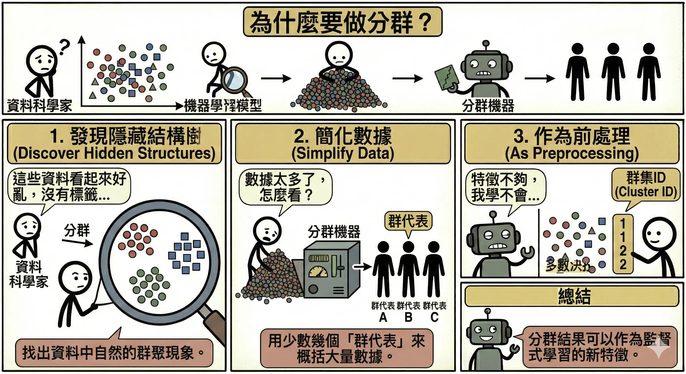

#### 常見應用場景 (Applications)

*   **客戶分群 (Customer Segmentation)**：
    *   根據消費行為（如 RFM 模型）將客戶分為「高價值」、「沈睡」、「新客」等群體，進行精準行銷。
*   **圖像分割 (Image Segmentation)**：
    *   將顏色相似的像素歸為一群，用於物體識別或影像壓縮。
*   **異常偵測 (Anomaly Detection)**：
    *   那些「不屬於任何一群」或「距離群中心很遠」的點，往往就是異常（如信用卡盜刷、產線瑕疵）。
*   **文件分群 (Document Clustering)**：
    *   將大量新聞或文章自動歸類為「體育」、「財經」、「政治」等主題。

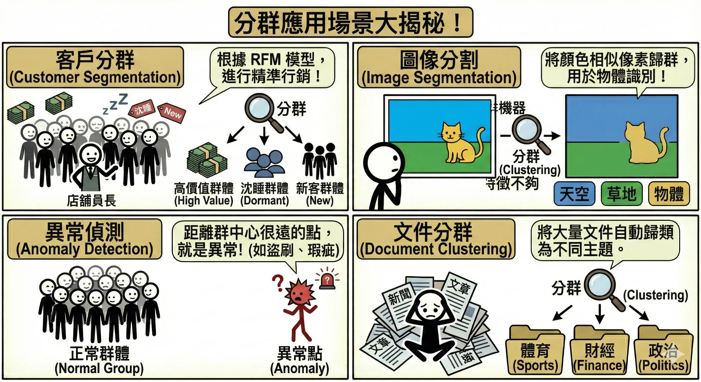

### K-means 演算法 {#sec-kmeans}

這是最簡單也最常用的分群方法。

*   **運作步驟**：
    1.  **初始化**：隨機選定 **K** 個點作為初始中心（質心）。
    2.  **分配**：將每個資料點分配給距離最近的中心。
    3.  **更新**：計算每一群的新平均位置，移動中心點到新位置。
    4.  **重複**：重複步驟 2-3，直到中心點不再移動或收斂。
*   **如何決定 K 值？**
    *   **手肘法 (Elbow Method)**：畫出 K 值與誤差平方和 (SSE) 的圖。當 K 增加時，誤差會下降，但在某個點下降幅度會變緩（像手肘彎曲處），那個點通常就是最佳的 K。
*   **優缺點**：
    *   *優點*：速度快，適合大數據。
    *   *缺點*：必須事先指定 K；對**離群值**敏感；只能分出圓形/球形的群聚。

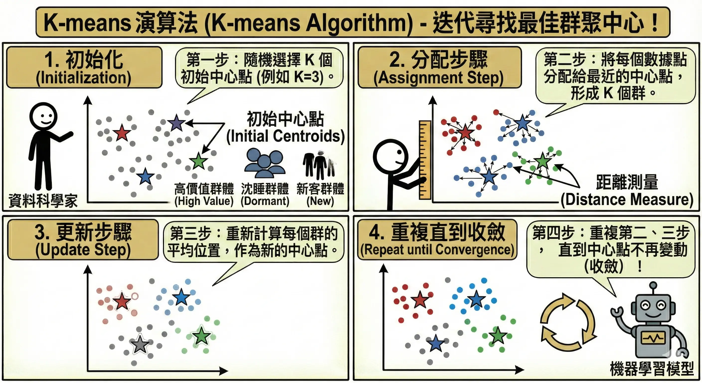

### 階層式分群 (Hierarchical Clustering) {#sec-hierarchical-clustering}

*   **核心概念**：建立一個樹狀結構（樹狀圖 Dendrogram），不需要事先決定 K 值。
*   **做法**：
    *   **聚合式 (Agglomerative)**：由下而上。一開始每個點都是一群，然後慢慢把最近的兩群合併，直到剩下一大群。
    *   **分裂式 (Divisive)**：由上而下。一開始所有點是一大群，然後慢慢切分。
*   **優缺點**：
    *   *優點*：不需要指定 K，樹狀圖能完整呈現資料的層次結構。
    *   *缺點*：計算量大，不適合大數據。

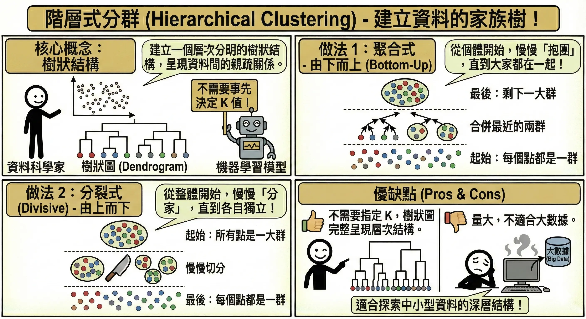

### DBSCAN (Density-Based Spatial Clustering) {#sec-dbscan}

*   **核心概念**：基於**密度**的分群。只要點夠密集（在半徑 **𝞮** 內有超過 MinPts 個點）就算同一群，如果不夠密集就被視為雜訊。
*   **優勢**：
    1.  可以找出**任意形狀**的群聚（如彎月形、包圍形），不像 K-means 只能找圓形。
    2.  能自動識別並排除**離群值 (Outliers)**，不會硬要把雜訊歸類。

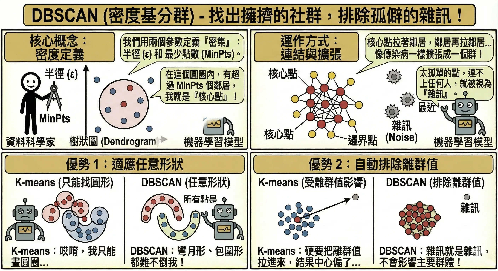

## 關聯規則與降維 {#sec-association-rules}

### Apriori 演算法 (購物籃分析) {#sec-apriori}

*   **經典案例**：「啤酒與尿布」。沃爾瑪透過分析發現，週五晚上買尿布的爸爸，通常也會順便買啤酒。
*   **目的 (What is this for?)**：
    *   找出資料庫中隱藏的**關聯模式** (Pattern Discovery)。
    *   回答「如果發生 X，是否通常也會發生 Y？」的問題。
    *   **應用**：商品陳列優化（把相關商品擺一起）、推薦系統（買了這本書的人也買了...）、醫療診斷（症狀 A 通常伴隨症狀 B）。

*   **三大指標與計算範例**：
    假設總共有 100 筆訂單。
    
    *   買牛奶 (A) 的有 50 筆。 (**P(A) = 0.5**)
    *   買麵包 (B) 的有 40 筆。 (**P(B) = 0.4**)
    *   **同時買**牛奶與麵包 的有 30 筆。 P(A ∩ B) = 0.3

    1.  **支持度 (Support)**：組合出現的頻率。
        *   $Support(A, B) = P(A \cap B) = \mathbf{0.3}$ (30%)
        *   *意義*：這個組合夠不夠普遍？如果太低（如 0.001%），可能只是偶然，不值得分析。
    2.  **信心度 (Confidence)**：買了 A 的人，有多大概率也會買 B。
        *   $Confidence(A \to B) = P(B|A) = \frac{0.3}{0.5} = \mathbf{0.6}$ (60%)
        *   *意義*：關聯夠不夠強？買牛奶的人有 60% 會順便買麵包。
    3.  **提升度 (Lift)**：A 的出現是否有助於 B 的出現（比較基準是 B 的自然發生率）。
        *   $Lift(A \to B) = \frac{Confidence(A \to B)}{P(B)} = \frac{0.6}{0.4} = \mathbf{1.5}$
        *   *判讀*：
            *   **Lift > 1**：**正相關** (1.5)。買牛奶會**提升**買麵包的機率（提升了 1.5 倍）。
            *   **Lift = 1**：無關。
            *   **Lift < 1**：負相關。

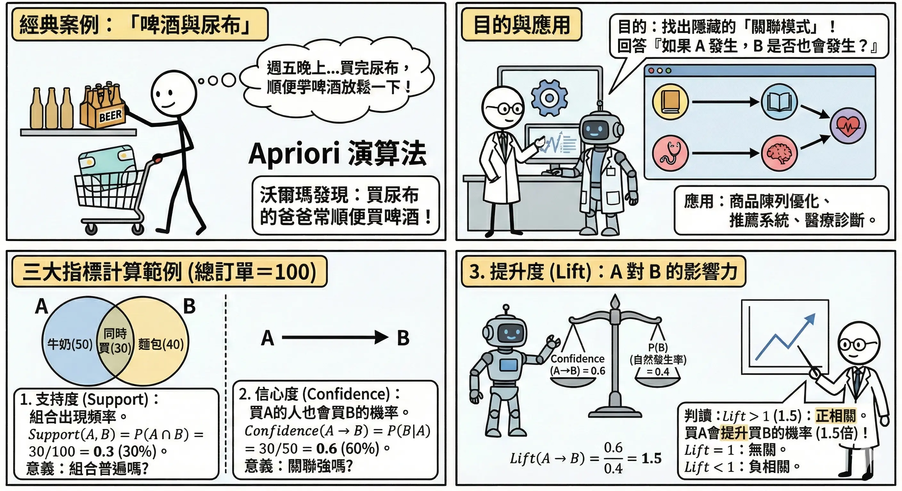

### 降維技術 (Dimensionality Reduction)

當特徵太多時，我們需要「降維」來簡化問題。

*   **主成分分析 (PCA, Principal Component Analysis)**：
    *   **核心概念**：這是一種**線性降維**技術。它的目標是找到一個新的視角（投影方向），讓資料在這個方向上的**變異量 (Variance)** 最大。
    *   **類比**：想像一個懸浮在空中的茶壺。
        *   如果你從上方看（投影），可能只看到一個圓圈（資訊遺失多）。
        *   如果你從側面看，能清楚看到壺嘴和把手（資訊保留多）。
        *   PCA 就是要找出這個「資訊保留最多」的最佳視角。
    *   **缺點**：只能處理線性關係，無法展開捲曲的結構（如瑞士捲資料）。

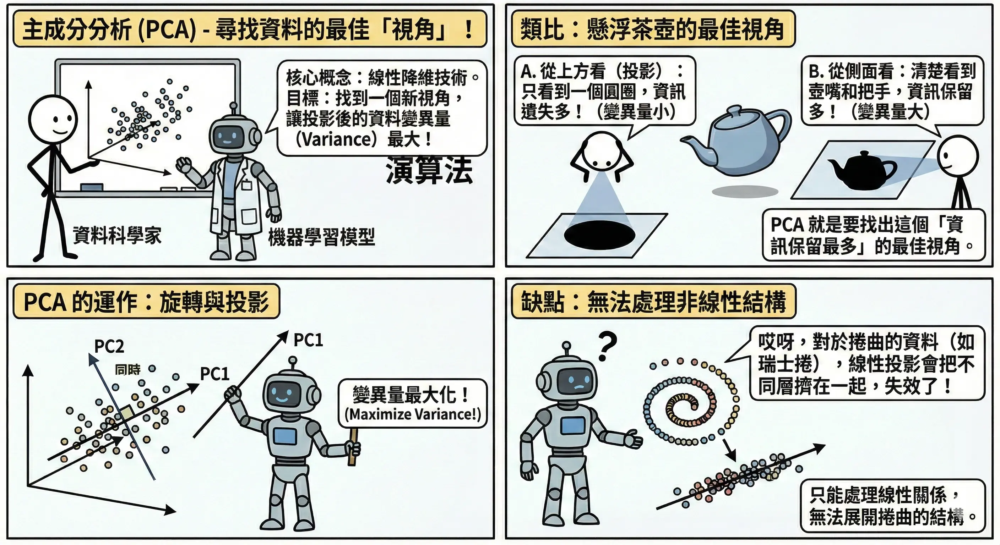

*   **t-SNE 與 UMAP**：
    *   **用途**：專門用於**資料視覺化**（將高維資料壓到 2D 或 3D）。
    *   **特點**：非線性降維，能很好地保留資料的**局部結構**（相似的點在低維空間依然靠很近）。

*   **自動編碼器 (Autoencoder)**：
    *   **核心概念**：一種基於神經網路的非線性降維。利用「壓縮」強迫模型學會資料的精髓。
    *   **架構**：
        1.  **編碼器 (Encoder)**：將輸入 **X** 壓縮成低維度的向量 **Z**（稱為瓶頸層 Bottleneck）。
        2.  **解碼器 (Decoder)**：嘗試從 **Z** 還原回原始輸入 $\hat{X}$。
    *   **關鍵**：訓練目標是讓還原誤差 $X - \hat{X}$ 越小越好。
    *   **應用**：
        *   **去噪 (Denoising)**：輸入雜訊圖，要求輸出乾淨圖。AI 會學會忽略雜訊，只還原物體結構。
        *   **異常偵測 (Anomaly Detection)**：只用「正常資料」訓練。當遇到「異常資料」時，模型會因為沒看過而無法還原，導致**還原誤差極大**，藉此抓出異常。

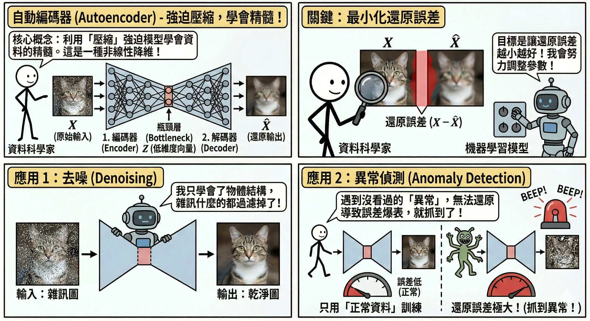

## 強化學習 (Reinforcement Learning) {#sec-reinforcement-learning-detail}

強化學習是 AI 邁向自主決策的關鍵，目標是訓練一個 Agent 在環境中採取行動，以最大化累積獎勵。

### 核心要素 (RL Elements) {#sec-rl-elements}

以「超級瑪利歐」遊戲為例：

1.  **代理人 (Agent)**：瑪利歐（學習的主角）。
2.  **環境 (Environment)**：遊戲關卡（充滿水管、磚塊、敵人）。
3.  **狀態 (State)**：當前的畫面（瑪利歐的位置、敵人的位置）。
4.  **行動 (Action)**：手把的操作（左、右、跳、發射火球）。
5.  **獎勵 (Reward)**：環境給的回饋。
    *   正獎勵：吃到金幣 (+10)、過關 (+100)。
    *   負獎勵 (Penalty)：碰到烏龜 (-10)、掉進洞裡 (-100)、時間流逝 (-1)。

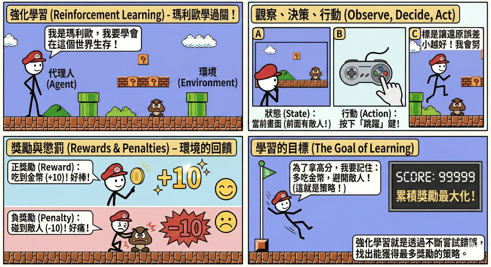

### 關鍵挑戰：探索與利用 (Exploration vs. Exploitation)

*   **探索 (Exploration)**：嘗試新的、未知的路徑。
    *   *目的*：尋找潛在的更好策略（但也可能踩雷）。
*   **利用 (Exploitation)**：堅持目前已知最好的策略。
    *   *目的*：確保獲得穩定的高分。
*   **𝞮-Greedy 策略**：
    *   設定一個機率 **𝞮**（例如 10%）。
    *   10% 的時間隨機亂試（探索）。
    *   90% 的時間選擇目前認為最好的動作（利用）。

### 常見演算法 {#sec-rl-algorithms}

*   **Q-Learning (基於表格的方法)**：
    *   **核心概念**：建立一張巨大的查閱表 **(Q-Table)**。
        *   **列 (Row)**：代表所有的「狀態」(State)。
        *   **行 (Column)**：代表所有的「動作」(Action)。
        *   **值 (Q-Value)**：代表在該狀態下，採取該動作後，預期未來能拿到的總獎勵。
    *   **運作**：AI 查表找 Q 值最大的動作去做。做完後，根據拿到的獎勵更新表格。
    *   **缺點**：**維度災難**。當狀態太多（如圍棋棋盤有 10170 種狀態，比宇宙原子還多）時，表格根本存不下，也查不完。

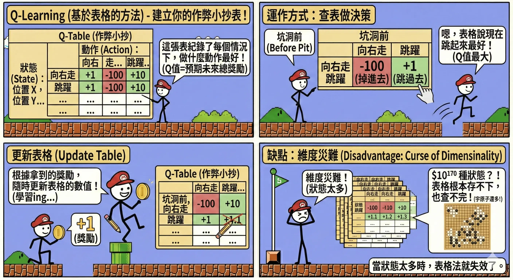

*   **Deep Q-Network (DQN, 深度強化學習)**：
    *   **核心概念**：結合深度學習。用一個**神經網路 (Brain)** 來取代 Q-Table (Cheat Sheet)。
    *   **運作**：輸入「畫面 (State)」，神經網路直接輸出每個動作的 Q 值。
    *   **兩大創新 (讓訓練穩定的關鍵)**：
        1.  **經驗重播 (Experience Replay)**：
            *   **問題**：玩遊戲是連續的，前後畫面高度相關。如果 AI 只學剛發生的事，容易「鑽牛角尖」忘記以前的經驗。
            *   **解法**：將玩過的過程存進「記憶庫」。訓練時**隨機抽取**片段來學習。
            *   *類比*：就像準備考試不能只看最後一章，要**隨機抽背**整本書的單字卡，才能學得全面。
        2.  **目標網路 (Target Network)**：
            *   **問題**：DQN 在更新時，目標值 (Target) 是由同一個網路算出來的。這就像「球員兼裁判」，導致目標一直變動，訓練很難收斂。
            *   **解法**：複製一個**固定不動**的網路專門算目標值，每隔一段時間（如 1000 步）才更新一次。
            *   *類比*：就像射箭練習。如果靶心一直亂動（目標變動），很難射準。Target Network 就是把**靶心固定住**，讓你練一陣子後，再把靶心移到新位置。
    *   *成就*：DeepMind 用 DQN 讓 AI 學會玩 Atari 遊戲（如打磚塊），表現超越人類。

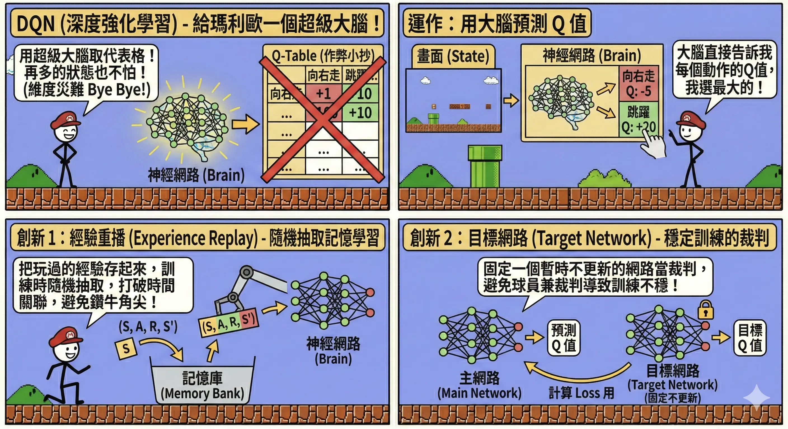

### 核心概念回顧

本章涵蓋了沒有標準答案的學習方式。

*   **分群 (Clustering)**：
    *   **K-means**：找圓形群聚，需指定 K。
    *   **DBSCAN**：找高密度群聚，能抗雜訊，免指定 K。
    *   **階層式**：畫樹狀圖，層次分明。
*   **關聯規則**：
    *   **Apriori**：啤酒與尿布。指標：Support, Confidence, Lift。
*   **降維**：
    *   **PCA**：找變異最大的投影方向。
    *   **Autoencoder**：壓縮再還原。
*   **強化學習 (RL)**：
    *   **要素**：Agent, Environment, Reward, Action, State.
    *   **核心**：最大化累積獎勵。探索 vs 利用。

### AI 應用規劃師認證考點

**常考題型與解題策略**：

1.  **分群演算法比較**：
    *   *例題*：「資料形狀不規則（如彎月形），且有許多雜訊，應選哪個分群法？」
    *   **解答**：DBSCAN。K-means 做不到。
    *   *例題*：「不知道要分幾群，想看資料的層次結構？」
    *   **解答**：階層式分群。

2.  **關聯規則指標**：
    *   *例題*：「Lift > 1 代表什麼？」
    *   **解答**：正相關（買 A 會促進買 B）。
    *   *例題*：「Lift < 1 代表什麼？」
    *   **解答**：負相關（買 A 的人反而不買 B）。

3.  **強化學習應用**：
    *   *例題*：「訓練 AI 玩瑪利歐賽車，屬於哪種學習範式？」
    *   **解答**：強化學習。因為有明確的獎勵（名次、金幣）與懲罰（撞牆）。

### 記憶口訣

*   **K-means**：「物以類聚，人以群分」（算距離）。
*   **DBSCAN**：「人多的地方不要去」（算密度）。
*   **Apriori**：「啤酒尿布」（關聯）。
*   **RL**：「糖果與鞭子」（獎勵與懲罰）。

### 延伸思考

*   為什麼 K-means 對離群值很敏感？（因為平均數會被拉走，導致中心點偏移）。

## 歷屆考題 {#sec-past-exam}

請做測驗看歷屆考題。

