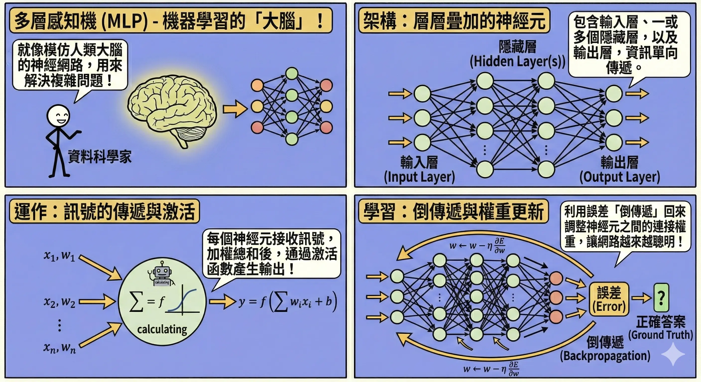
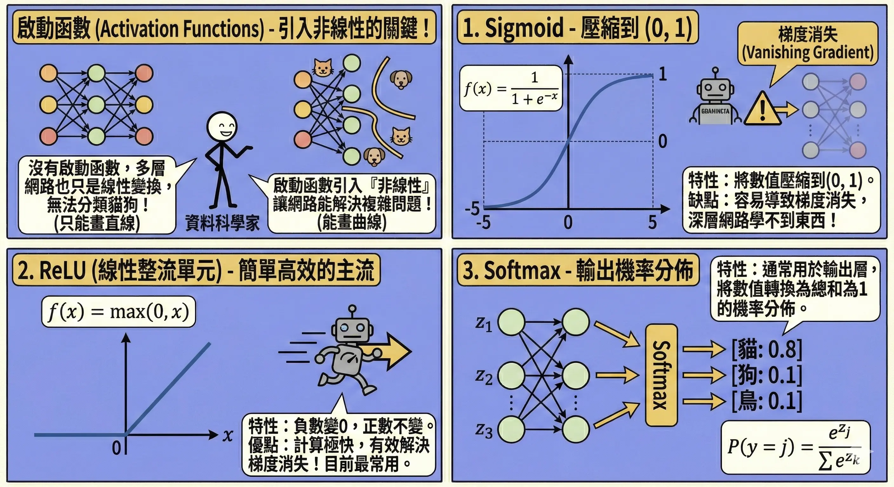
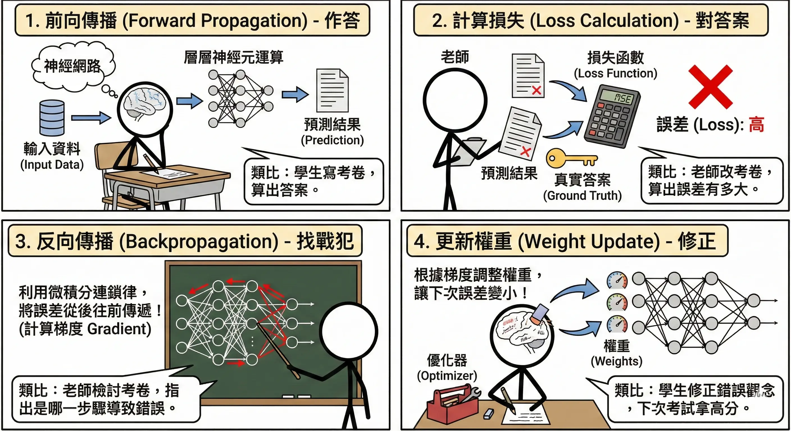
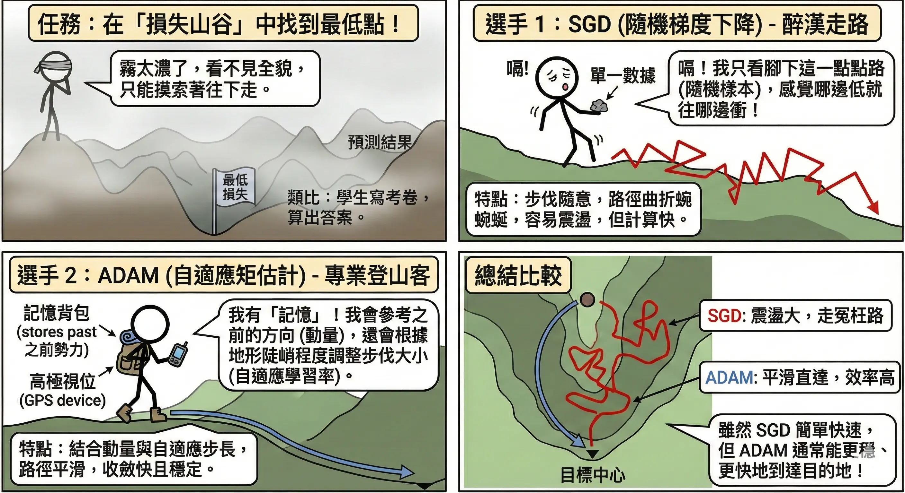
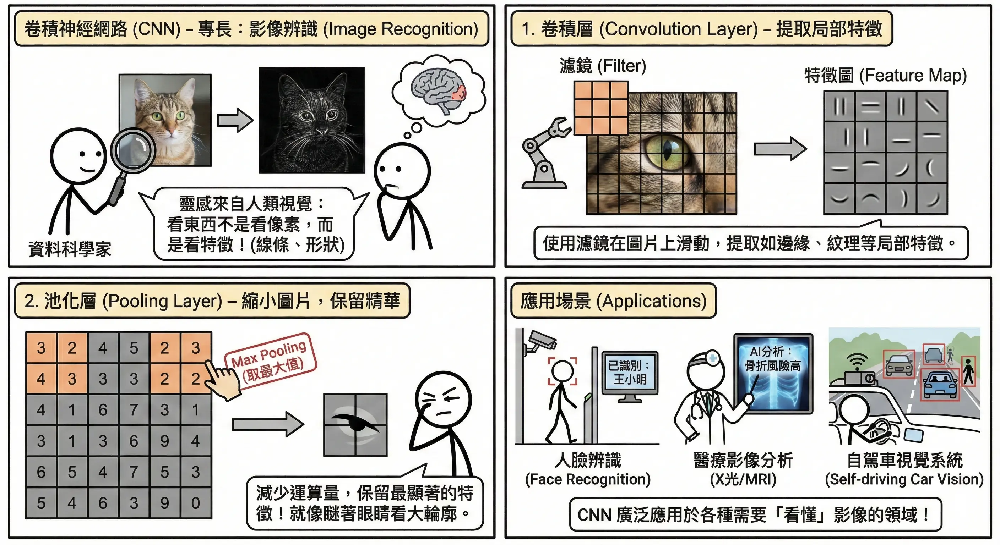
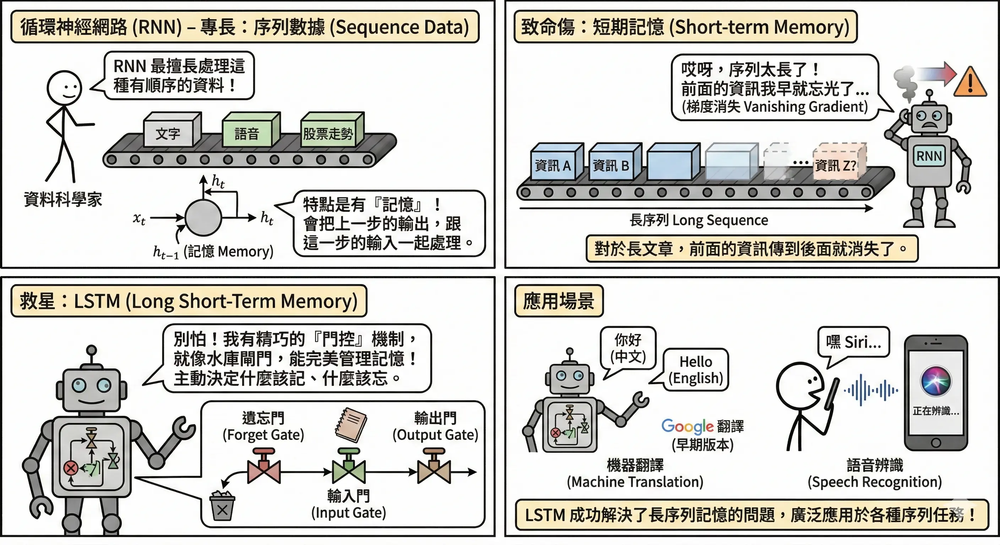
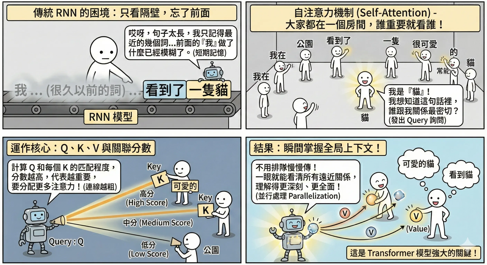
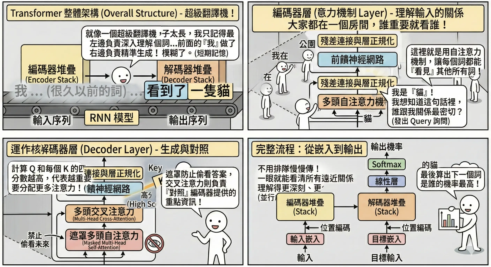
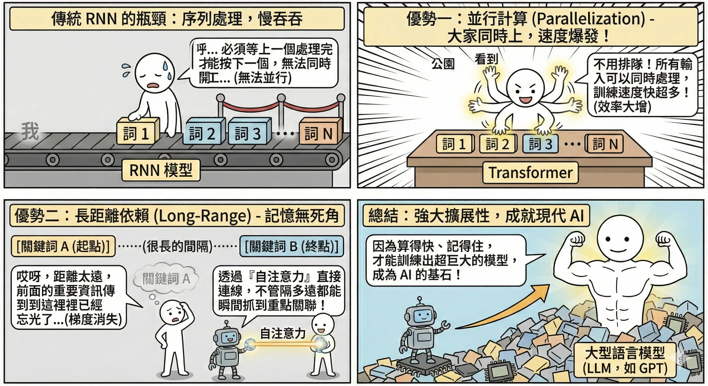

<!-- # 神經網路架構演進 (Neural Network Architecture Evolution) -->

深度學習 (Deep Learning) 是機器學習的一個分支，靈感來自人類大腦的神經元運作方式。從簡單的感知機到如今強大的 Transformer，神經網路架構經歷了數十年的演進，每一次的突破都帶來了 AI 能力的飛躍。

## 基礎神經網路 {#sec-basic-nn}

### 多層感知機 (MLP, Multi-Layer Perceptron) {#sec-mlp}

這是最基礎的深度學習架構，也稱為全連接網路 (Fully Connected Network)。

*   **結構**：
    1.  **輸入層 (Input Layer)**：接收原始資料（如圖片的像素值）。
    2.  **隱藏層 (Hidden Layers)**：中間的黑盒子，負責提取特徵。層數越多，能學到的特徵越抽象、越複雜。
    3.  **輸出層 (Output Layer)**：給出最終預測（如分類機率）。
*   **運作原理**：每個神經元接收上一層的訊號，乘上**權重 (Weight)**，加上**偏差 (Bias)**，最後通過**啟動函數**輸出給下一層。
    *   **公式**：$$ y = \sigma(\sum_{i=1}^{n} w_i x_i + b) $$
        *   $x_i$: 輸入訊號
        *   $w_i$: 權重 (Weight)，代表該輸入的重要性
        *   $b$: 偏差 (Bias)，調整啟動門檻
        *   $\sigma$: 啟動函數 (Activation Function)

### 啟動函數 (Activation Functions) {#sec-activation-functions}

如果沒有啟動函數，神經網路不管有幾層，本質上都只是線性變換（矩陣相乘），無法解決複雜的非線性問題（如分類貓和狗）。啟動函數引入了**非線性**。

*   **Sigmoid**：
    *   **公式**：$$ f(x) = \frac{1}{1 + e^{-x}} $$
    *   **特性**：將數值壓縮到 $(0, 1)$ 之間。
    *   **缺點**：容易導致**梯度消失 (Vanishing Gradient)**，即在深層網路中，誤差訊號傳不回去，導致前面的層學不到東西。
*   **ReLU (Rectified Linear Unit)**：
    *   **公式**：$$ f(x) = \max(0, x) $$
    *   **特性**：負數變 0，正數不變。
    *   **優點**：計算極快，且有效解決了梯度消失問題。是目前最常用的啟動函數。
*   **Softmax**：
    *   **公式**：$$ P(y=j) = \frac{e^{z_j}}{\sum_{k=1}^{K} e^{z_k}} $$
    *   **特性**：通常用於**輸出層**。將一組數值轉換為**機率分佈**（總和為 1）。例如：[貓: 0.8, 狗: 0.1, 鳥: 0.1]。

### 反向傳播 (Backpropagation) 與優化器(Optimizer) {#sec-backpropagation}

神經網路是如何「學習」的？這是一個**試誤 (Trial and Error)** 的過程。

1.  **前向傳播 (Forward Propagation)**：
    *   **作答**：資料從輸入層進入，經過層層神經元運算，最後輸出一個預測結果。
    *   *類比*：學生寫考卷，算出答案。
2.  **計算損失 (Loss Calculation)**：
    *   **對答案**：使用**損失函數 (Loss Function)**（如 MSE 或 Cross-Entropy）比較「預測值」與「真實答案」的差距。
    *   *類比*：老師改考卷，算出考了幾分（誤差有多大）。
3.  **反向傳播 (Backpropagation)**：
    *   **找戰犯**：利用微積分的**連鎖律 (Chain Rule)**，將誤差**從後往前**傳遞，計算每個神經元的權重對這個誤差「貢獻」了多少（計算梯度 Gradient）。
    *   *類比*：老師檢討考卷，指出是哪一個步驟算錯導致最後答案錯誤。
4.  **更新權重 (Weight Update)**：
    *   **修正**：利用**優化器 (Optimizer)** 根據梯度調整權重，讓下次誤差變小。
    *   *類比*：學生修正錯誤觀念，下次考試就能拿高分。

**常見優化器 (Optimizer)**：
負責決定「如何調整權重」的演算法。

*   **SGD (Stochastic Gradient Descent, 隨機梯度下降)**：
    *   **機制**：每次只看一小批資料就調整方向。
    *   *類比*：**盲人下山**。他看不見全貌，只能用腳探測四周，哪邊最陡就往哪邊走一步。路徑可能會彎彎曲曲，震盪較大。
*   **ADAM (Adaptive Moment Estimation)**：
    *   **機制**：結合了**動量 (Momentum)** 與**自適應學習率**。
    *   *類比*：**滾下山的重球**。
        *   **動量**：球有慣性，如果之前一直往某個方向滾，即使遇到小坑洞（局部最佳解）也會衝過去，不會卡住。
        *   **自適應**：在平坦的地方滾快一點，在陡峭的地方滾慢一點。
    *   **地位**：目前最常用的預設優化器。

## 經典深度架構 {#sec-deep-architectures}

### 卷積神經網路 (CNN, Convolutional Neural Networks) {#sec-cnn}

*   **專長**：**影像辨識**、電腦視覺 (CV)。
*   **靈感**：人類視覺皮層對邊緣、形狀的反應。我們看東西不是一個像素一個像素看，而是看特徵（線條、圓圈、眼睛、鼻子）。
*   **關鍵元件與運作流程**：
    1.  **卷積層 (Convolution Layer) - 提取特徵**：
        *   **運作**：使用一個小的**濾鏡 (Filter/Kernel)**（例如 3x3 的矩陣）在圖片上滑動掃描。
        *   **功能**：每個濾鏡負責抓一種特徵（如垂直線、水平線、圓弧）。掃描後的結果稱為**特徵圖 (Feature Map)**。
        *   *類比*：拿著**手電筒**在黑暗的房間掃描，照到的地方才看得到細節。或者像用「篩子」，把符合特定形狀的特徵篩出來。
    2.  **池化層 (Pooling Layer) - 重點濃縮**：
        *   **運作**：將圖片分區（例如 2x2），只保留區內最重要的數值（**Max Pooling** 取最大值）。
        *   **功能**：
            *   **降維**：讓圖片變小，減少運算量。
            *   **抗雜訊**：保留最顯著的特徵，忽略不重要的細節（平移不變性）。
        *   *類比*：把高畫質照片轉成**馬賽克**風格，雖然模糊了，但還是看得出是貓還是狗（只看大輪廓）。
    3.  **攤平 (Flatten) 與 全連接層 (Fully Connected Layer)**：
        *   **運作**：將處理好的二維特徵圖「拉直」成一維向量，丟進傳統的神經網路 (MLP) 進行最終分類。
        *   *類比*：把拼圖的碎片（特徵）全部蒐集起來，拼出最後的結論。
*   **應用**：人臉辨識、醫療影像分析 (X光/MRI)、自駕車視覺系統。

### 循環神經網路 (RNN, Recurrent Neural Networks) {#sec-rnn}

*   **專長**：**序列數據**（文字、語音、股票走勢）。
*   **運作機制**：
    *   具有**記憶 (Memory)** 功能。神經元會有一個「迴圈」，把上一步的輸出 ($h_{t-1}$) 傳給自己，跟這一步的輸入 ($x_t$) 一起處理。
    *   *類比*：像**閱讀文章**。你讀到第五個字時，腦中還記得前四個字的含義，這樣才能理解整句話的意思。
*   **致命傷：梯度消失 (Vanishing Gradient)**：
    *   **問題**：對於太長的序列（如長篇小說），前面的資訊傳到後面會越來越弱，最後完全消失。
    *   *例子*：「我出生在**法國**......（過了 500 字）......所以我會說流利的**法語**。」傳統 RNN 讀到最後時，早就忘了前面的「法國」，填不出「法語」。

*   **救星：LSTM (Long Short-Term Memory, 長短期記憶網路)**：
    *   **核心概念**：設計了一條專屬的「高速公路」（Cell State）來傳遞長期記憶，並透過三個「閘門」來控制資訊流。
    *   **三大閘門 (Gates)**：
        1.  **遺忘門 (Forget Gate)**：決定要**丟掉**什麼舊資訊。
            *   *例子*：看到新的主詞「她」，就把舊主詞「他」的性別資訊忘掉。
        2.  **輸入門 (Input Gate)**：決定要**存入**什麼新資訊。
            *   *例子*：把「她」的性別資訊存進記憶。
        3.  **輸出門 (Output Gate)**：決定當下要**輸出**什麼。
            *   *例子*：因為主詞是單數「她」，所以動詞要輸出單數型態 (is)。
    *   *類比*：像一位**精明的秘書**管理老闆的行程表。
        *   (遺忘) 刪除已取消的會議。
        *   (輸入) 寫入新的預約。
        *   (輸出) 在適當的時間提醒老闆該開會了。

## Transformer 與注意力機制 {#sec-transformer}

2017 年 Google 發表論文《Attention Is All You Need》，徹底改變了 NLP 領域，也開啟了大型語言模型 (LLM) 的時代。

### 自注意力機制 (Self-Attention) {#sec-self-attention}

這是 Transformer 的靈魂，讓模型能理解字與字之間的關係。

*   **核心概念**：**雞尾酒會效應 (Cocktail Party Effect)**。
    *   在吵雜的派對中，你的耳朵會自動過濾背景雜音，**聚焦 (Attend)** 在你想聽的那個人說話。
    *   同樣地，當模型讀到一個字時，它會去「關注」句子中其他相關的字，而忽略不相關的字。

*   **運作機制 (Q, K, V)**：
    每個字都會被轉換成三個向量：
    *   **Query (Q, 查詢)**：我想找什麼？（像拿著麥克風問問題）
    *   **Key (Key, 索引)**：你是什麼？（像每個人身上掛的名牌）
    *   **Value (Value, 內容)**：你的實質內容是什麼？（像這個人腦中的知識）
    *   **流程**：
        1.  拿我的 **Q** 去跟所有人的 **K** 算相似度（點積 Dot Product）。
        2.  相似度越高，代表我們關係越密切（Attention Score 越高）。
        3.  根據相似度，把對方的 **V** 加權總合起來，變成我對這個字的理解。
    *   *類比*：**圖書館找書**。
        *   **Q**：你想找的主題（如「人工智慧」）。
        *   **K**：書背上的分類標籤。
        *   **V**：書裡的內容。
        *   你會把 K 跟 Q 符合的書挑出來，閱讀裡面的 V。

*   **多頭注意力 (Multi-Head Attention)**：
    *   **概念**：不只用一種觀點看事情，而是用多個「頭」（濾鏡）同時看。
    *   *例子*：讀一句話時，Head 1 關注「文法結構」，Head 2 關注「代名詞指涉」，Head 3 關注「情緒」。最後把大家的看法綜合起來，理解就更全面。

*   **實例**："The animal didn't cross the street because **it** was too tired."
    *   當模型讀到 "**it**" 時，Attention 機制會算出它跟 "**animal**" 的關聯度最高（因為 tired 通常形容動物），而不是 "street"。這讓模型真正「讀懂」了代名詞。

### Transformer 架構優勢 {#sec-transformer-arch}

1.  **並行計算 (Parallelization)**：
    *   RNN 必須一個字一個字讀（讀完第一個字才能讀第二個），無法平行化。
    *   Transformer 可以**一次讀入整篇文章**，利用 GPU 的強大平行運算能力，訓練速度大幅提升。這使得訓練像 GPT-4 這種超巨大模型成為可能。
2.  **長距離依賴 (Long-range Dependency)**：
    *   透過 Attention，無論兩個字距離多遠，都能直接建立關聯，不再有 LSTM 的記憶長度限制。

### Encoder 與 Decoder 家族

Transformer 由 Encoder（編碼器）和 Decoder（解碼器）組成，後來衍生出三大流派：

1.  **Encoder-only (如 BERT)**：
    *   擅長「理解」文本。
    *   *應用*：情感分析、分類、問答系統。
2.  **Decoder-only (如 GPT 系列)**：
    *   擅長「生成」文本。像接龍一樣，預測下一個字。
    *   *應用*：聊天機器人、文章寫作、程式碼生成。
3.  **Encoder-Decoder (如 T5, Bart)**：
    *   同時具備理解與生成能力。
    *   *應用*：機器翻譯（英文入 $\to$ 理解 $\to$ 生成 $\to$ 中文出）、摘要生成。

## 本章總結與考點提示 {#sec-chapter7-summary}

### 核心概念回顧

深度學習是 AI 的核心引擎。

*   **基礎元件**：
    *   **MLP**：全連接，基礎結構。
    *   **Activation**：ReLU (防梯度消失)、Sigmoid (二元分類)、Softmax (多類別)。
    *   **Backpropagation**：誤差反向傳播，更新權重。
*   **三大架構**：
    *   **CNN**：影像霸主。卷積 (特徵) + 池化 (降維)。
    *   **RNN/LSTM**：序列專家。有記憶，但怕長序列 (梯度消失)。
    *   **Transformer**：NLP 新皇。Self-Attention (平行運算、長距離依賴)。

### AI 應用規劃師認證考點

**常考題型與解題策略**：

1.  **架構對應題**：
    *   *例題*：「人臉辨識系統通常使用哪種架構？」
    *   **解答**：CNN。
    *   *例題*：「股價預測或語音辨識通常使用哪種架構？」
    *   **解答**：RNN 或 LSTM。
    *   *例題*：「ChatGPT 是基於哪種架構？」
    *   **解答**：Transformer。

2.  **功能題**：
    *   *例題*：「CNN 中池化層 (Pooling) 的主要功能是什麼？」
    *   **解答**：降低維度（減少運算量）並保留重要特徵。
    *   *例題*：「為什麼 LSTM 比傳統 RNN 好？」
    *   **解答**：解決了梯度消失問題，能記住更長的序列。

3.  **啟動函數題**：
    *   *例題*：「目前最常用的隱藏層啟動函數是什麼？」
    *   **解答**：ReLU。因為計算快且無梯度消失問題。

### 記憶口訣

*   **CNN**：「看圖」（卷積）。
*   **RNN**：「讀書」（序列）。
*   **Transformer**：「劃重點」（Attention）。

### 延伸思考

*   為什麼 Transformer 可以取代 RNN？（因為它可以平行運算，速度快很多，且 Attention 機制解決了長距離記憶問題）。

