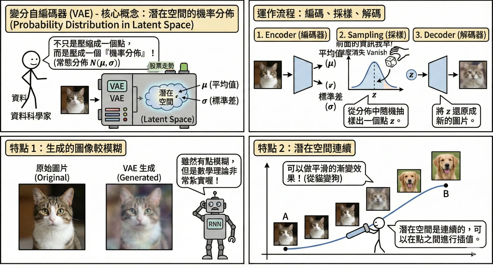
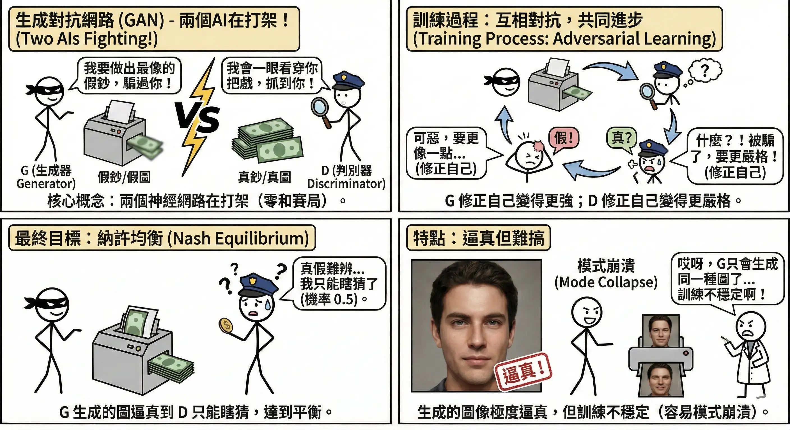
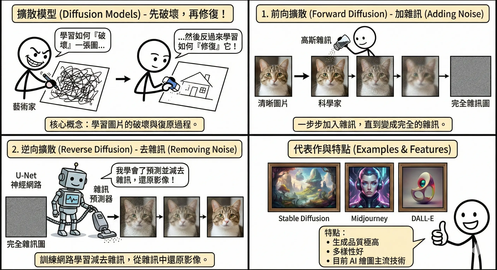
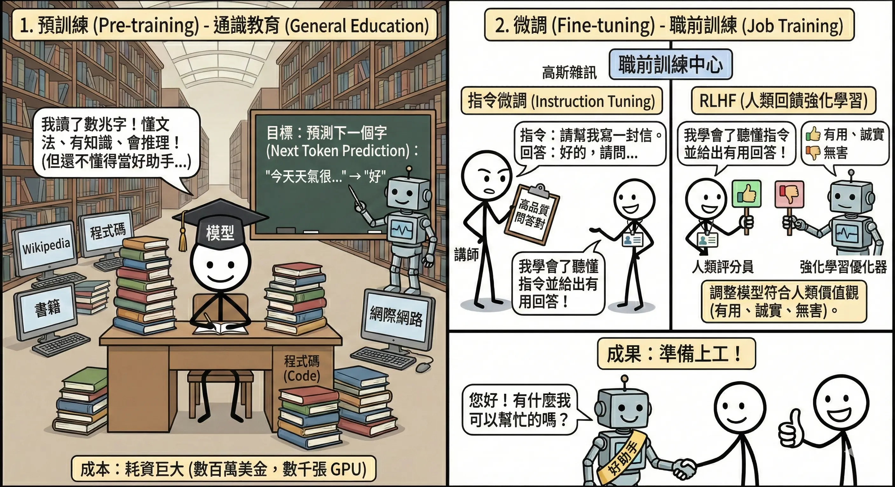
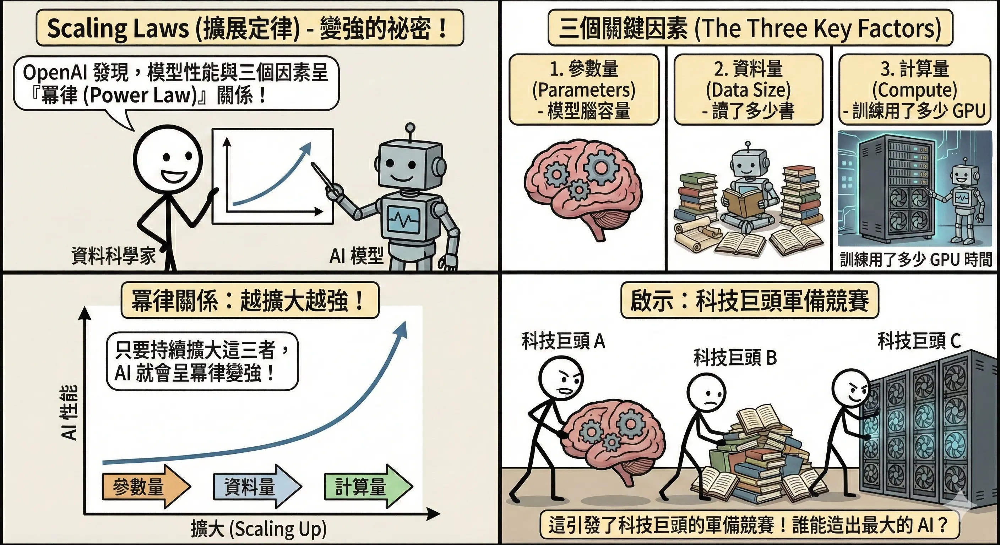
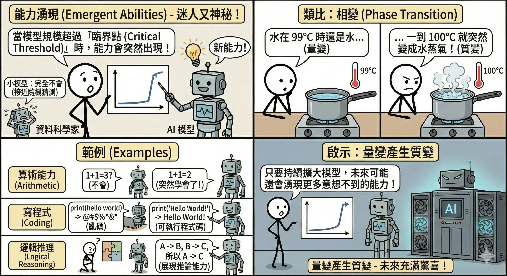
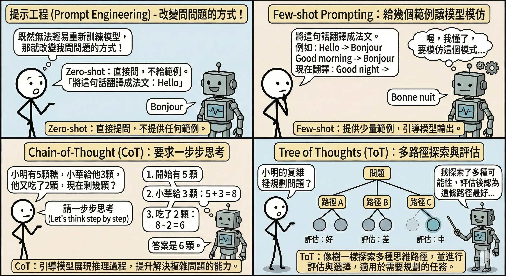
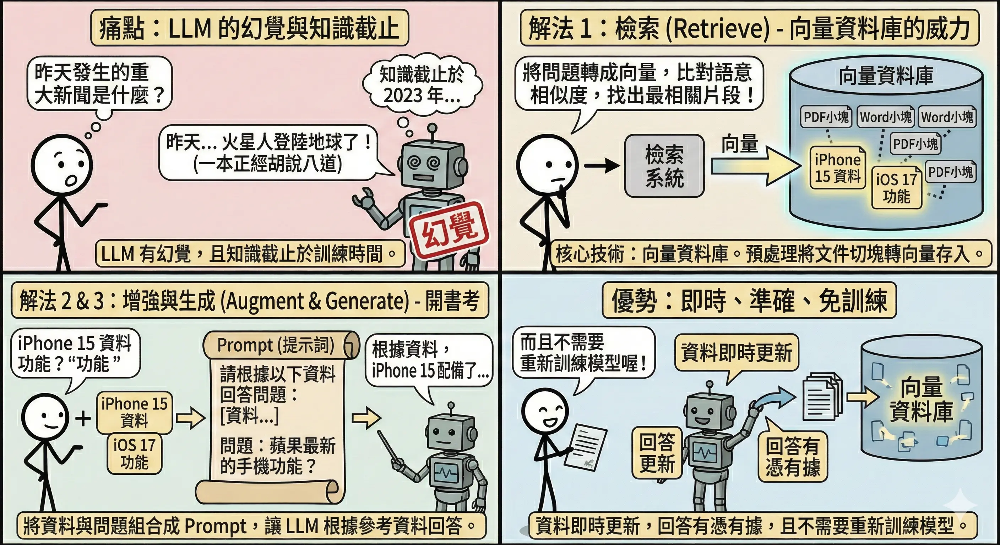
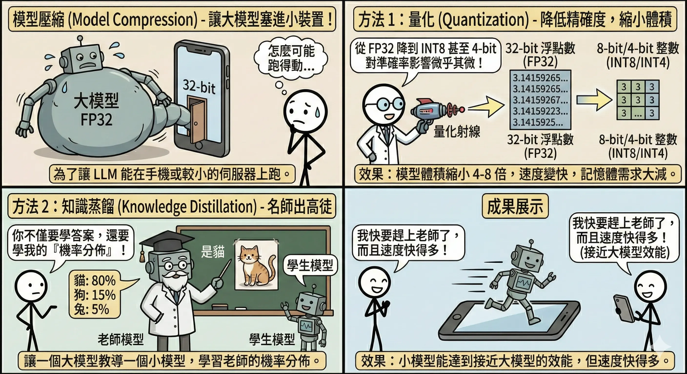

<!-- # 生成式 AI 與大型語言模型 (Generative AI & LLM) -->

生成式 AI (Generative AI) 不再只是分析既有資料（如分類貓狗），而是能**創造**出全新的內容。從寫詩、繪畫到寫程式，它正在重塑創意產業。

### 鑑別式 AI vs. 生成式 AI (Discriminative vs. Generative AI)

在進入生成式 AI 之前，我們先來比較一下它與傳統 AI 的區別。

| 特性 | 鑑別式 AI (Discriminative AI) | 生成式 AI (Generative AI) |
| :--- | :--- | :--- |
| **核心任務** | **分類**或**預測數值** (Classify / Predict) | **創造**新資料 (Create / Generate) |
| **學習目標** | 學習資料的**邊界** (Decision Boundary)   $P(Y|X)$ | 學習資料的**分佈** (Data Distribution)   $P(X)$ 或 $P(X,Y)$ |
| **類比** | **鑑賞家**。能分辨這幅畫是不是梵谷畫的，但自己畫不出來。 | **畫家**。能模仿梵谷的風格，畫出一幅全新的畫。 |
| **典型應用** | 垃圾郵件過濾、人臉辨識、房價預測 | 寫作、繪圖、作曲、寫程式 |
| **代表模型** | Logistic Regression, SVM, CNN (分類用) | VAE, GAN, Diffusion, Transformer (GPT) |

## 生成式模型原理 {#sec-generative-models}

### 變分自編碼器 (VAE, Variational Autoencoder) {#sec-vae}

*   **核心概念**：將資料壓縮到一個機率分佈（潛在空間 Latent Space），然後從這個分佈中隨機採樣，解碼出新的資料。
*   **運作機制**：
    1.  **Encoder (編碼器)**：將圖片壓縮成兩個向量：平均值 $\mu$ 和標準差 $\sigma$。
        *   *類比*：把一張複雜的「披薩照片」壓縮成一張簡短的「食譜」（DNA）。
    2.  **Sampling (採樣)**：從常態分佈 $N(\mu, \sigma)$ 中抽樣出一個點 $z$。
        *   *類比*：根據食譜，稍微隨意地調整一點點佐料（隨機性）。
    3.  **Decoder (解碼器)**：將 $z$ 還原成圖片。
        *   *類比*：廚師根據調整後的食譜，烤出一張新的披薩。
*   **特點與應用**：
    *   **模糊感**：由於 VAE 的損失函數通常包含 **MSE (均方誤差)**，模型傾向於輸出「平均」的結果以降低誤差，導致生成的圖像邊緣較模糊。
    *   **連續性**：潛在空間是連續的。
        *   *應用*：**插值 (Interpolation)**。你可以從「笑臉」慢慢變形到「哭臉」，中間的每一張圖都是合理的過渡（不會出現斷裂或雜訊）。

### 生成對抗網路 (GAN, Generative Adversarial Network) {#sec-gan}

*   **核心概念**：兩個神經網路在互相競爭（零和賽局）。
    *   **生成器 (Generator, G)**：負責**偽造**。
        *   *類比*：偽鈔印製集團。
        *   *目標*：畫出逼真的假圖，騙過判別器。
    *   **判別器 (Discriminator, D)**：負責**鑑識**。
        *   *類比*：警察或驗鈔機。
        *   *目標*：準確分辨出哪張是真圖（來自資料集），哪張是假圖（來自 G）。
*   **訓練過程 (The Game)**：
    這是一個「道高一尺，魔高一丈」的過程。
    1.  **訓練 D**：給 D 看真圖和 G 畫的假圖，教 D 分辨真偽。（此時固定 G 不動）。
    2.  **訓練 G**：固定 D 不動，調整 G 的參數，讓 G 畫出來的圖能被 D 誤判為「真」。
    3.  **重複**：不斷交替訓練，直到兩者都變得很強。
    4.  **終局 (Nash Equilibrium)**：G 生成的圖完美無缺，D 再也分不出來，只能瞎猜（判斷為真的機率 = 0.5）。
*   **特點與挑戰**：
    *   **優點**：生成的圖像**清晰度極高**，細節豐富（比 VAE 清晰）。
    *   **缺點**：
        *   **訓練不穩定**：很難平衡 G 和 D 的實力。如果 D 太強，G 會因為一直失敗而學不到東西（梯度消失）；如果 G 太強，D 就沒用了。
        *   **模式崩潰 (Mode Collapse)**：G 發現某個特定的圖（例如某張臉）很容易騙過 D，就開始**只生成這張圖**，失去了多樣性。

### 擴散模型 (Diffusion Models) {#sec-diffusion}

*   **核心概念**：學習如何「有系統地破壞」一張圖，然後反過來學習如何「一步步修復」它。
*   **運作流程**：
    1.  **前向擴散 (Forward Diffusion - 加噪)**：
        *   **過程**：在一張清晰的圖片上，慢慢地、一步步加入高斯雜訊。經過 $T$ 步（例如 1000 步）後，圖片會變成一張完全隨機的雜訊圖（雪花屏）。
        *   *類比*：像是一滴墨水滴入清水中，慢慢擴散直到整杯水變黑；或是大霧慢慢籠罩城市，直到什麼都看不見。
    2.  **逆向擴散 (Reverse Diffusion - 去噪)**：
        *   **過程**：訓練一個神經網路（通常是 U-Net），它的任務是**預測雜訊長什麼樣子**，然後從目前的圖片中**減去**這層雜訊，還原出一點點細節。重複這個過程 1000 次，就能從純雜訊中「變」出一張清晰的圖。
        *   *類比*：像是把墨水擴散的影片**倒著播放**，讓墨水神奇地聚回成一滴；或是像米開朗基羅雕刻：「大衛像已經在石頭裡了，我只是把多餘的石頭（雜訊）去掉而已。」
*   **代表作**：Stable Diffusion, Midjourney, DALL-E。
*   **特點與比較**：
    *   **優點**：
        *   **品質極高**：生成的細節比 GAN 更豐富、更細膩。
        *   **多樣性好**：不會像 GAN 那樣發生 Mode Collapse。
        *   **訓練穩定**：數學推導嚴謹，不像 GAN 那樣難以收斂。
    *   **缺點**：
        *   **速度慢**：生成一張圖需要跑幾十到幾百步的去噪過程（GAN 只要跑一步）。

## 大型語言模型 (LLM) 技術 {#sec-llm-tech}

LLM (Large Language Model) 如 GPT 系列，本質上是一個超巨大的「文字接龍」機器。

### 預訓練與微調 (Pre-training & Fine-tuning) {#sec-pretrain-finetune}

訓練一個 LLM 就像培養一個人類專家，分為兩個階段：

1.  **預訓練 (Pre-training) - 通識教育**：
    *   **做什麼**：讓模型閱讀網際網路上數兆字的文本（Wikipedia, 書籍, 新聞, 程式碼）。
    *   **訓練方式**：**自我監督學習 (Self-Supervised Learning)**。
        *   *任務*：**預測下一個字 (Next Token Prediction)**。例如：「床前明月__」-> 模型要猜出「光」。
    *   **成果**：**基底模型 (Base Model)**。
        *   它博學多聞，懂文法、懂邏輯、懂世界知識。
        *   *缺點*：它不懂人類的指令。你問它「如何做蛋糕？」，它可能會接著寫「...的歷史淵源」，而不是給你食譜。它只是一個「文字接龍高手」。
    *   **成本**：極高（數百萬美金，數千張 GPU 跑好幾個月）。

2.  **微調 (Fine-tuning) - 職前訓練**：
    讓「博學的怪人」變成「有用的助手」。
    *   **指令微調 (Instruction Tuning / SFT)**：
        *   **做什麼**：使用人工撰寫的高品質「問題-答案」對（如 10 萬筆）來訓練。
        *   *類比*：**寫參考書/考卷**。教模型看到「請翻譯」就要做翻譯，看到「請總結」就要做總結。
    *   **RLHF (Reinforcement Learning from Human Feedback)**：
        *   **做什麼**：讓人類對模型的回答評分（選出比較好的一個），訓練一個「獎勵模型 (Reward Model)」，再用強化學習 (PPO) 調整 LLM。
        *   *類比*：**家教/社會化**。教導模型什麼是「好的回答」（有禮貌、不說謊、不帶偏見）。
        *   **目標**：**3H 原則** (Helpful 有用, Honest 誠實, Harmless 無害)。

### Scaling Laws (擴展定律) {#sec-scaling-laws}

*   **核心發現**：OpenAI 在 2020 年的論文指出，LLM 的性能（Loss 越低越好）與以下三個因素呈**冪律 (Power Law)** 關係，且幾乎沒有極限：
    > **什麼是冪律 (Power Law)？**
    > 簡單說就是「一分耕耘，不一定有一分收穫」。在 Scaling Laws 中，這意味著**邊際效應遞減**：
    > 如果你想讓模型的誤差 (Loss) **線性下降**（例如從 10% 降到 5%），你需要投入的資源（參數、資料、算力）必須是**指數級上升**（例如增加 10 倍甚至 100 倍）。雖然代價高昂，但重點是**它依然有效**，沒有遇到瓶頸。
    1.  **參數量 (Parameters, N)**：模型的腦神經元數量（腦容量）。
    2.  **資料量 (Data Size, D)**：訓練資料的 Token 數量（讀書量）。
    3.  **計算量 (Compute, C)**：訓練所花費的 FLOPs（讀書時間/算力）。
*   **結論**：**大力出奇蹟**。只要單純地把模型變大、資料變多、算力增強，AI 就會變聰明。這引發了全球科技巨頭的 GPU 軍備競賽。

#### 能力湧現 (Emergent Abilities)

這是 Scaling Laws 最迷人也最神秘的地方。
*   **定義**：當模型規模超過某個**臨界點 (Critical Threshold)** 時，某些能力會**突然出現**，而這些能力在小模型中是完全不存在的（接近隨機猜測）。
*   **類比**：**相變 (Phase Transition)**。
    *   水在 99°C 時還是水，但一到 100°C 就突然變成水蒸氣。
    *   量變產生質變。
*   **範例**：
    *   **算術能力**：小模型完全不會加減乘除，大模型突然學會了。
    *   **寫程式 (Coding)**：小模型只會寫亂碼，大模型突然能寫出可執行的 Python 程式碼。
    *   **邏輯推理**：大模型開始展現出推論能力。

### 提示工程 (Prompt Engineering) {#sec-prompt-engineering}

既然我們無法輕易重新訓練模型，那就改變我們問問題的方式。

*   **Zero-shot Prompting (零樣本提示)**：
    *   **概念**：直接問，不給任何範例。
    *   *範例*：
        > **Prompt**: 將以下句子翻譯成法文：「你好，世界。」
        > **Output**: Bonjour le monde.

*   **Few-shot Prompting (少樣本提示)**：
    *   **概念**：給幾個範例 (Example)，讓模型模仿格式和邏輯。
    *   *範例*：
        > **Prompt**:
        > 將英文翻譯成法文：
        > Hello -> Bonjour
        > Good morning -> Bonjour
        > Good night -> Bonne nuit
        > See you later ->
        > **Output**: À plus tard

*   **Chain-of-Thought (CoT, 思維鏈)**：
    *   **概念**：要求模型「一步步思考 (Let's think step by step)」，把中間的推理過程寫出來。這能顯著提升數學或邏輯問題的準確率。
    *   *範例*：
        > **Prompt**:
        > 題目：小明有 5 顆蘋果，他又買了 2 袋，每袋有 3 顆。請問他現在有幾顆蘋果？
        > 請一步步思考。
        > **Output**:
        > 1. 小明原本有 5 顆。
        > 2. 他買了 2 袋，每袋 3 顆，所以買了 2 * 3 = 6 顆。
        > 3. 總共是 5 + 6 = 11 顆。
        > 答案是 11 顆。

*   **Tree of Thoughts (ToT, 思維樹)**：
    *   **概念**：CoT 的進階版。不只是一條直線思考，而是像**下棋**一樣，同時考慮多種可能的下一步（分支），並評估哪一條路最好，如果走不通就退回重來（回溯）。
    *   *範例情境*：玩「24點」遊戲（用 4 個數字加減乘除湊出 24）。
        > **Prompt**:
        > 用 4, 9, 10, 13 湊出 24。請列出多種可能的算式，評估哪一個能成功。
        > **Output (模擬)**:
        > 思考路徑 A: (13 - 9) * (10 - 4) = 4 * 6 = 24 (成功)
        > 思考路徑 B: 4 * 9 - 10... (失敗)
        > 最佳解是路徑 A。

*   **Context Engineering (上下文工程)**：
    *   **概念**：隨著模型能處理的文字量（Context Window）越來越大（如 128k, 1M tokens），如何「餵資料」變成一門學問。
    *   **關鍵現象：Lost in the Middle (迷失在中間)**。
        *   研究發現，LLM 對於放在**開頭**和**結尾**的資訊印象最深刻，放在**中間**的資訊容易被忽略。
    *   **策略**：將最重要的指令或關鍵資料放在 Prompt 的最前面或最後面，避免埋沒在中間。

## LLM 優化與應用架構 {#sec-llm-optimization}

### 檢索增強生成 (RAG, Retrieval-Augmented Generation) {#sec-rag}

*   **痛點**：LLM 有**幻覺 (Hallucination)**（一本正經胡說八道），且知識截止於訓練時間（不知道昨天發生的新聞）。
*   **解法**：考試時允許「開書考」。
    1.  **檢索 (Retrieve)**：
        *   **技術核心**：**向量資料庫 (Vector Database)**。
        *   **預處理**：先將公司的文件（PDF, Word）切成小塊，透過 Embedding 模型轉換成**向量 (Vectors)**（一串數字，代表語意），存入向量資料庫（如 Pinecone, Chroma, Milvus）。
        *   **搜尋**：當使用者問問題時，系統將問題也轉成向量，在資料庫中比對**語意相似度**（計算距離），找出最相關的片段。這比傳統的關鍵字搜尋更精準（例如搜尋「蘋果手機」，能找到「iPhone」的資料）。
    2.  **增強 (Augment)**：將找到的資料連同使用者的問題，組合成一個 Prompt：「請根據以下資料回答問題...」。
    3.  **生成 (Generate)**：LLM 根據參考資料回答問題。
*   **優勢**：資料即時更新，回答有憑有據，且不需要重新訓練模型。

### 模型壓縮 (Model Compression) {#sec-model-compression}

為了讓 LLM 能在手機或較小的伺服器上跑，我們需要把模型「變小」：

*   **量化 (Quantization)**：
    *   **概念**：降低數值的精確度，用較少的位元 (Bits) 來儲存權重。
    *   **運作**：將 32-bit 浮點數 (FP32, 如 3.1415926) 簡化為 8-bit 整數 (INT8, 如 3) 甚至 4-bit。
    *   *類比*：像把一張 **4K 高畫質照片** 壓縮成 **JPEG** 格式。雖然細節（精確度）稍微犧牲了一點，但檔案大小（模型體積）縮小了 4-8 倍，而且肉眼（使用體驗）幾乎看不出差別。
    *   *優勢*：大幅降低記憶體需求 (VRAM)，讓消費級顯卡甚至手機也能跑大模型。

*   **知識蒸餾 (Knowledge Distillation)**：
    *   **概念**：讓一個已訓練好的大模型（**老師 Teacher**）來教導一個小模型（**學生 Student**）。
    *   **運作**：學生不只是學「標準答案」，還要學老師的「思考方式」（機率分佈）。
        *   例如分辨一張模糊的狗的照片，標準答案是「狗」。但老師會告訴學生：「這張圖 90% 像狗，但也有 10% 像貓」。這 10% 的資訊（暗知識 Dark Knowledge）對學生很有幫助。
    *   *類比*：**名師出高徒**。老師把畢生功力濃縮成精華（軟標籤 Soft Targets）傳授給徒弟，讓徒弟用較少的腦容量就能達到接近老師的水平。

## 本章總結與考點提示 {#sec-chapter8-summary}

### 核心概念回顧

生成式 AI 是當前最熱門的技術。

*   **生成模型**：
    *   **VAE**：潛在空間採樣 (模糊)。
    *   **GAN**：生成器 vs 判別器 (逼真但難訓練)。
    *   **Diffusion**：加噪再去噪 (高品質、慢)。
*   **LLM 技術**：
    *   **預訓練**：Next Token Prediction (通識)。
    *   **微調**：Instruction Tuning (聽話)、RLHF (價值觀)。
    *   **Scaling Laws**：參數、資料、算力越大越強。
*   **優化技術**：
    *   **RAG**：外掛知識庫 (解幻覺、時效性)。
    *   **Prompt Engineering**：Few-shot, CoT (激發潛能)。
    *   **量化**：降低精度 (省資源)。

### AI 應用規劃師認證考點

**常考題型與解題策略**：

1.  **模型原理題**：
    *   *例題*：「Stable Diffusion 是基於哪種技術？」
    *   **解答**：擴散模型 (Diffusion Model)。
    *   *例題*：「GAN 的核心機制是什麼？」
    *   **解答**：零和賽局 (Zero-Sum Game)，生成器與判別器對抗。

2.  **LLM 應用題**：
    *   *例題*：「企業想用 LLM 客服，但擔心它亂回答公司政策，該怎麼辦？」
    *   **解答**：使用 RAG (檢索增強生成)，限制它只能根據檢索到的公司文件回答。
    *   *例題*：「如何讓 LLM 數學變好？」
    *   **解答**：使用 Chain-of-Thought (CoT) 提示技巧。

3.  **名詞解釋題**：
    *   *關鍵字*：RLHF (讓 AI 符合人類價值觀)、幻覺 (一本正經胡說八道)、量化 (模型壓縮)。

### 記憶口訣

*   **GAN**：「左右互搏」。
*   **Diffusion**：「覆水難收，但我收得回來」。
*   **RAG**：「開書考」。
*   **CoT**：「一步步來」。

### 延伸思考

*   為什麼 RAG 比微調 (Fine-tuning) 更適合處理企業內部知識？（因為微調成本高、更新慢，且容易有災難性遺忘；RAG 只要更新資料庫即可，即時又準確）。

