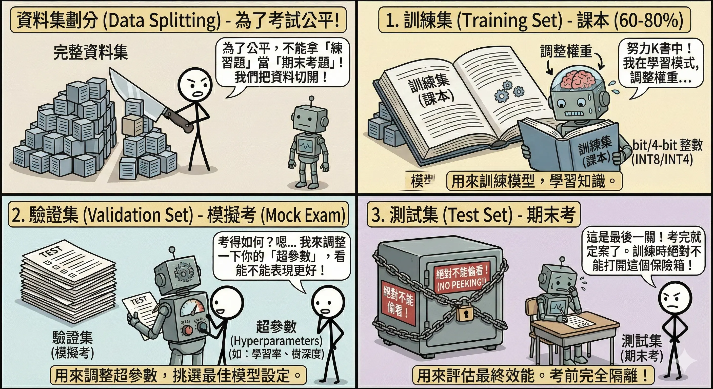
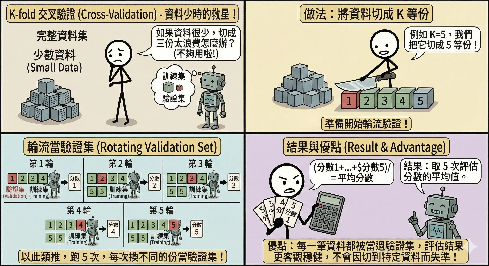
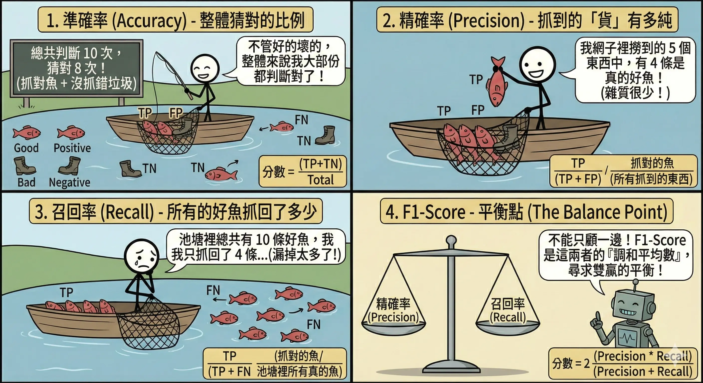
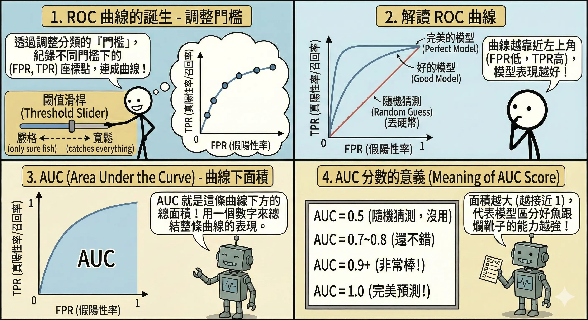
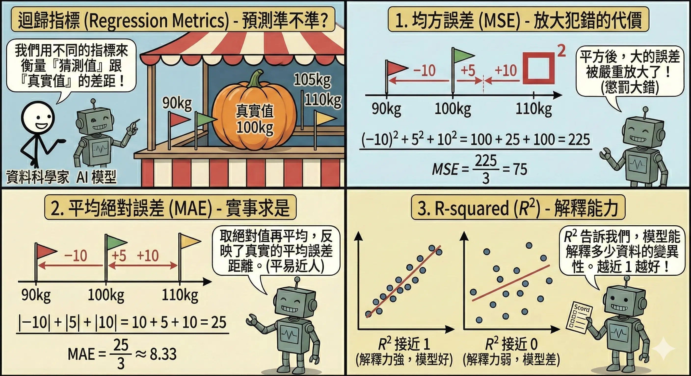
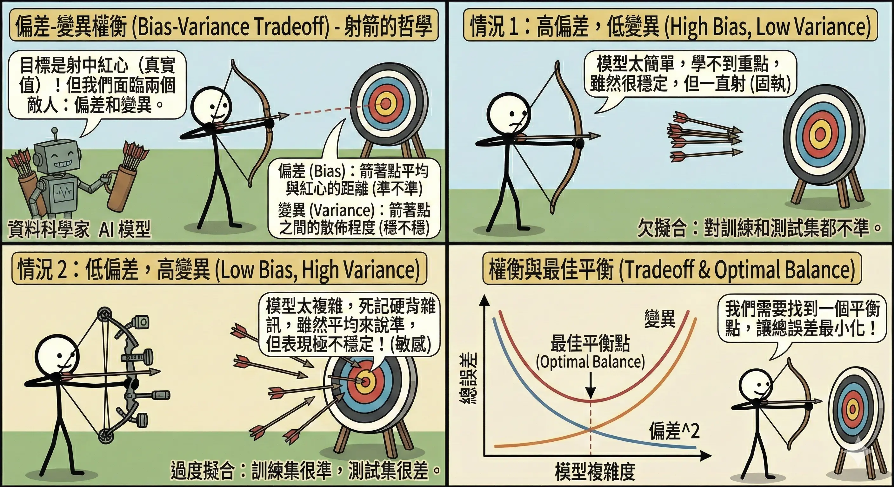
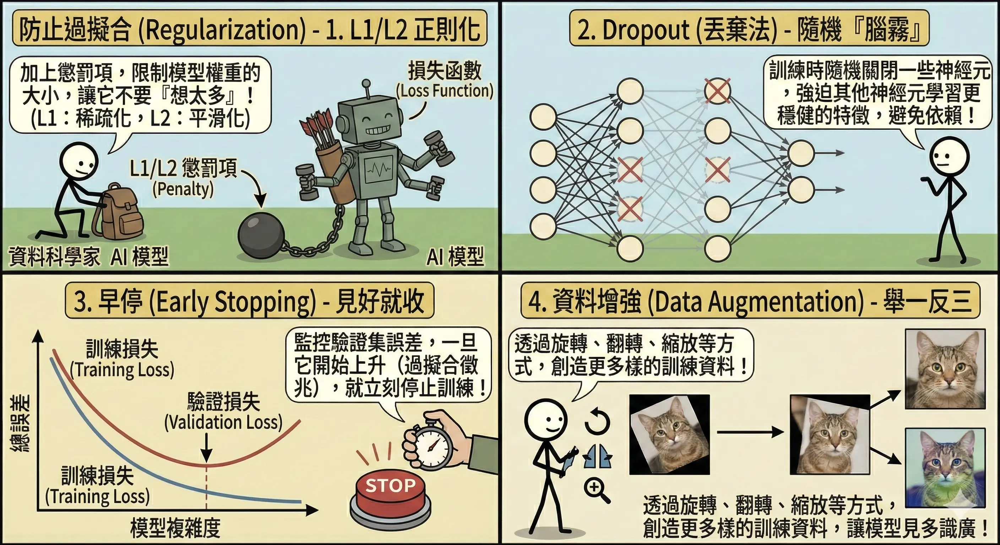

<!-- # 模型評估與效能優化 (Model Evaluation & Optimization) -->

訓練完模型只是第一步，更重要的是知道它「好不好用」。如果沒有正確的評估，你可能會把一個只會死記硬背的模型誤認為天才。

## 評估流程與指標 {#sec-evaluation-metrics}

### 資料集劃分 (Data Splitting) {#sec-data-split}

為了考試公平，我們不能拿「練習題」來當「期末考題」。

1.  **訓練集 (Training Set)**：**課本**。用來訓練模型，調整權重。通常佔 60-80%。
2.  **驗證集 (Validation Set)**：**模擬考**。用來調整**超參數 (Hyperparameters)**（如學習率、樹的深度），挑選最佳模型。
3.  **測試集 (Test Set)**：**期末考**。考完就定案了，用來評估最終效能。**絕對不能偷看**（不能用於訓練或調整參數）！

### K-fold 交叉驗證 (Cross-Validation) {#sec-cross-validation}

如果資料很少，切成三份（訓練/驗證/測試）太浪費怎麼辦？或者我們擔心切出來的驗證集剛好特別簡單或特別難？

*   **核心概念**：**輪流當驗證集**。
*   **運作流程 (**K=5** 為例)**：
    1.  **切分**：將全部資料隨機切成 5 等份 (Fold 1 ~ Fold 5)。
    2.  **輪替訓練**：進行 5 輪實驗。
        *   **第 1 輪**：拿 Fold 1 當驗證集，Fold 2-5 當訓練集。
        *   **第 2 輪**：拿 Fold 2 當驗證集，Fold 1, 3, 4, 5 當訓練集。
        *   ...以此類推，直到每一份都當過一次驗證集。
    3.  **平均**：將 5 次的評估分數加起來除以 5，得到最終成績。
*   **類比**：**輪流模擬考**。
    *   為了客觀評估實力，不能只考一張考卷（可能剛好都會寫）。
    *   要考 5 張不同的考卷，然後算平均分，這樣才能反映真實水平。
*   **優點**：
    *   **不浪費資料**：每一筆資料都有機會被用來訓練，也有機會被用來驗證。
    *   **穩健 (Robust)**：評估結果更客觀，不會因為運氣好切到簡單的資料就以為模型很強。

### 分類指標 (Classification Metrics) {#sec-classification-metrics}

對於二元分類問題（如：有病/沒病），我們使用**混淆矩陣 (Confusion Matrix)**：

| | 預測：有病 (Positive) | 預測：沒病 (Negative) |
|---|---|---|
| **實際：有病 (True)** | **TP** (True Positive)   抓到了！(真陽性) | **FN** (False Negative)   漏報！(假陰性) |
| **實際：沒病 (False)** | **FP** (False Positive)   誤報！(假陽性) | **TN** (True Negative)   沒事！(真陰性) |

*   **準確率 (Accuracy)**：答對的比例。
    *   $$ Accuracy = \frac{TP + TN}{TP + TN + FP + FN} $$
    *   **陷阱**：如果 99% 的人沒病，模型全部猜「沒病」，準確率也有 99%，但完全沒用（抓不到病人）。**資料不平衡時別用 Accuracy**。
*   **精確率 (Precision)**：在所有**被判斷為有病**的人中，真的有病的比例。
    *   $$ Precision = \frac{TP}{TP + FP} $$
    *   **應用**：垃圾郵件過濾（寧可漏抓，也不要誤把重要信件當垃圾信）。希望 FP 越低越好。
*   **召回率 (Recall)**：在所有**真的有病**的人中，被成功抓出來的比例。
    *   $$ Recall = \frac{TP}{TP + FN} $$
    *   **應用**：癌症篩檢、地震預警（寧可誤判複檢，也不能漏掉任何一個病人）。希望 FN 越低越好。
*   **F1-Score**：Precision 和 Recall 的調和平均數。
    *   $$ F1 = 2 \times \frac{Precision \times Recall}{Precision + Recall} $$
    *   當需要兼顧兩者時使用。

*   **AUC-ROC 曲線**：
    *   **概念**：評估模型在**所有可能的分類門檻 (Threshold)** 下的表現。
        *   模型輸出的通常是機率（如 0.8）。我們可以設定門檻為 0.5（大於 0.5 算有病），也可以設為 0.9（非常確定才算有病）。
    *   **ROC 曲線**：X 軸是 FPR (誤報率)，Y 軸是 TPR (召回率)。我們希望 FPR 越低越好，TPR 越高越好（曲線越往左上角靠越好）。
    *   **AUC (Area Under Curve)**：曲線下的面積，用來量化模型的好壞。
        *   **AUC = 0.5**：跟丟銅板一樣（亂猜）。
        *   **AUC = 0.7~0.8**：還不錯。
        *   **AUC > 0.9**：非常準確。
        *   **AUC = 1.0**：完美神人（但通常是資料洩漏）。
    *   *類比*：**排隊能力**。AUC 越高，代表模型越能把「有病的人」排在「沒病的人」前面（機率值較高）。

### 迴歸指標 (Regression Metrics) {#sec-regression-metrics}

*   **均方誤差 (MSE, Mean Squared Error)**：
    *   $$ MSE = \frac{1}{n} \sum (y_{true} - y_{pred})^2 $$
    *   **特點**：會放大極端誤差（因為平方）。如果很在意大錯，就看這個。
*   **平均絕對誤差 (MAE, Mean Absolute Error)**：
    *   $$ MAE = \frac{1}{n} \sum |y_{true} - y_{pred}| $$
    *   **特點**：對離群值較不敏感，解釋直觀（平均差幾分）。
*   **R-squared (R2, 決定係數)**：
    *   $$ R^2 = 1 - \frac{SS_{res}}{SS_{tot}} = 1 - \frac{\sum (y_{true} - y_{pred})^2}{\sum (y_{true} - y_{mean})^2} $$
    *   **意義**：衡量模型解釋了資料多少變異。
        *   R2 = 1：完美擬合（誤差為 0）。
        *   R2 = 0：跟「直接猜平均值」一樣爛。
        *   R2 < 0：比亂猜還爛（模型完全錯了）。

## 誤差分析與正則化 {#sec-error-analysis}

### 偏差-變異權衡 (Bias-Variance Tradeoff) {#sec-bias-variance}

*   **偏差 (Bias)**：模型準不準？（訓練集誤差）
    *   **高偏差 (High Bias)**：模型太簡單，學不會資料的規律。稱為**欠擬合 (Underfitting)**。
    *   *解法*：增加模型複雜度（加層數、加特徵）、減少正則化。
*   **變異 (Variance)**：模型穩不穩？（訓練集 vs 驗證集誤差差距）
    *   **高變異 (High Variance)**：模型太複雜，把雜訊也學進去了，導致在訓練集考 100 分，驗證集不及格。稱為**過擬合 (Overfitting)**。
    *   *解法*：增加資料量、正則化、簡化模型。    

### 防止過擬合技術 (Regularization) {#sec-prevent-overfitting}

1.  **L1/L2 正則化 (Regularization)**：
    *   **概念**：在損失函數後面加一個「懲罰項」，如果權重太複雜（數值太大），就罰分。
    *   **L1 (Lasso)**：會讓不重要的權重變成 0（具有**特徵選擇**的效果）。
    *   **L2 (Ridge)**：會讓權重變得很小但不為 0（防止單一特徵獨大）。
2.  **Dropout (隨機拋棄)**：
    *   **運作**：在訓練時，隨機「關掉」一部分神經元（例如 50%）。
    *   *類比*：**軍隊演習**。隨機抽走指揮官，強迫部隊不能依賴特定的人，必須每個人都學會作戰。
    *   *效果*：每次訓練的網路結構都不一樣，最後預測時等於是多個網路的**集成 (Ensemble)**，效果更穩健。
3.  **早停 (Early Stopping)**：
    *   **運作**：在訓練過程中監控驗證集 (Validation Set) 的誤差。
    *   **機制**：如果訓練集的誤差還在降（還在背答案），但驗證集的誤差開始上升（考試考不好），代表開始過擬合了。此時啟動**耐心機制 (Patience)**（例如再觀察 5 輪），如果沒改善就立刻停止訓練，並回溯到表現最好的那個時間點。
4.  **資料增強 (Data Augmentation)**：
    *   **概念**：如果資料不夠，就自己造！
    *   **影像**：旋轉、裁切、調亮、水平翻轉、加雜訊。
    *   **文字**：同義詞替換、隨機刪除、回譯 (Back Translation, 中→英→中)。
    *   **聲音**：調整音調、改變速度、加入背景噪音。

## 本章總結與考點提示 {#chap-ai-foundation-chapter9-summary}

### 核心概念回顧

評估是優化的基礎。

*   **資料劃分**：Train (課本) / Validation (模擬考) / Test (期末考)。
*   **分類指標**：
    *   **Accuracy**：整體答對率 (小心不平衡資料)。
    *   **Precision**：抓到的有多少是真的 (寧缺勿濫)。
    *   **Recall**：真的有多少被抓到 (寧濫勿缺)。
    *   **F1-Score**：P 和 R 的平衡。
*   **迴歸指標**：MSE (怕大錯)、MAE (直觀)。
*   **誤差分析**：
    *   **Bias**：準不準 (Underfitting)。
    *   **Variance**：穩不穩 (Overfitting)。
*   **抗過擬合**：L1/L2 正則化、Dropout、Early Stopping、Data Augmentation。

### AI 應用規劃師認證考點

**常考題型與解題策略**：

1.  **指標選擇題**：
    *   *例題*：「癌症篩檢模型應最重視哪個指標？」
    *   **解答**：Recall (召回率)。因為漏診後果嚴重。
    *   *例題*：「垃圾郵件過濾應最重視哪個指標？」
    *   **解答**：Precision (精確率)。因為不想把重要信件誤判為垃圾信。

2.  **過擬合判斷題**：
    *   *例題*：「訓練集準確率 99%，測試集準確率 60%，這是什麼情況？」
    *   **解答**：過度擬合 (Overfitting) / 高變異 (High Variance)。
    *   *例題*：「訓練集準確率 60%，測試集準確率 59%，這是什麼情況？」
    *   **解答**：欠擬合 (Underfitting) / 高偏差 (High Bias)。

3.  **解決方案題**：
    *   *例題*：「遇到過度擬合該怎麼辦？」
    *   **解答**：增加資料、使用 Dropout、L2 正則化、早停。

### 記憶口訣

*   **Precision**：「貴精不貴多」（抓得準）。
*   **Recall**：「一網打盡」（抓得全）。
*   **Overfitting**：「死讀書」（只會考題，不會應用）。
*   **Underfitting**：「書沒讀好」（連考題都不會）。

### 延伸思考

*   為什麼 Accuracy 在資料不平衡時會騙人？（因為模型只要全部猜多數類別，分數就會很高，但完全沒有鑑別力）。

