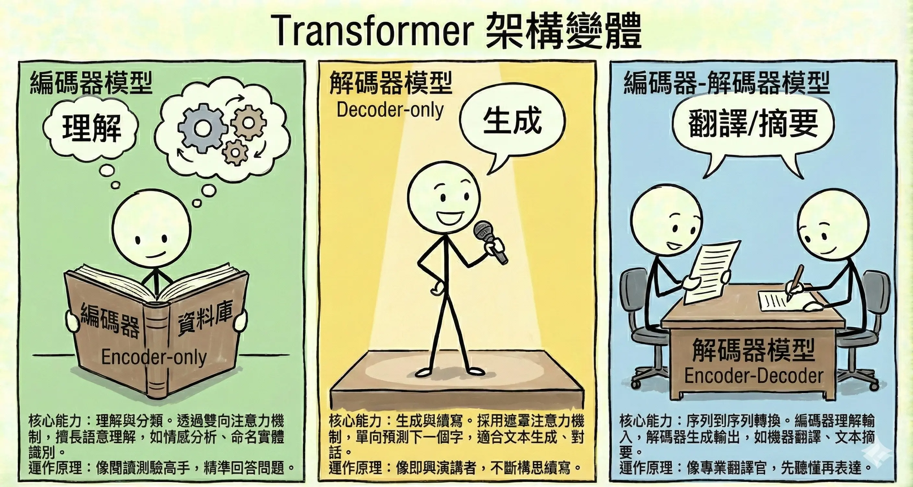
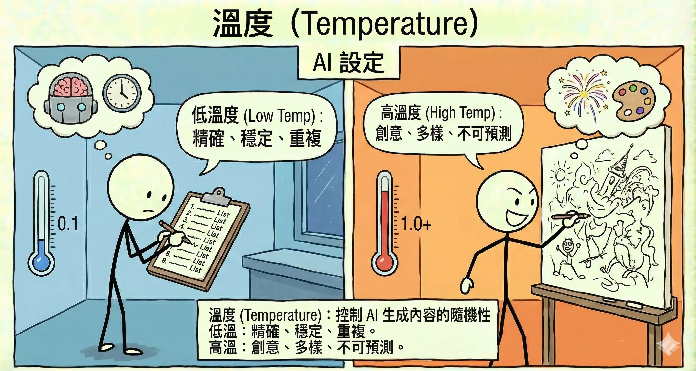
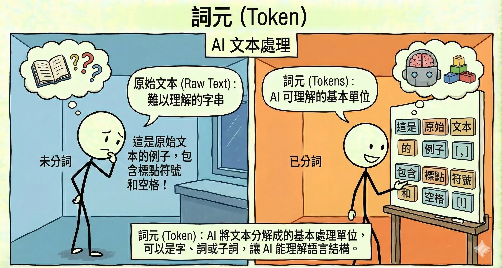
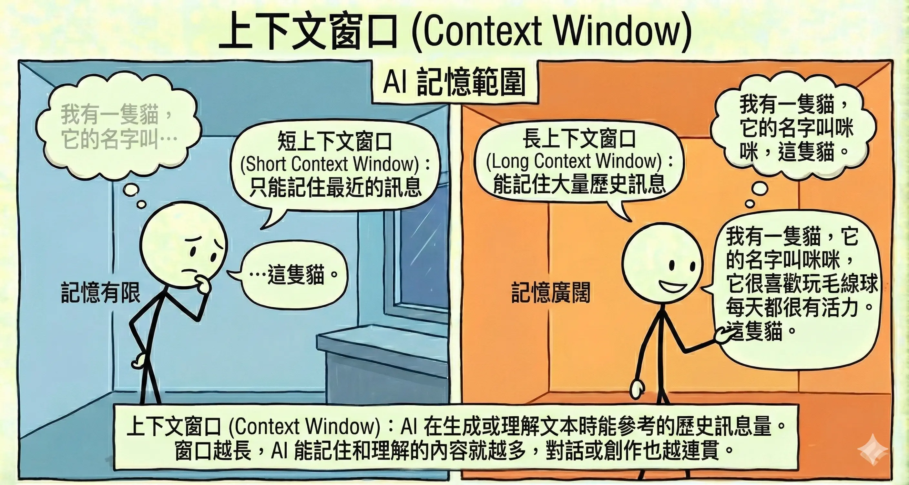

<!-- # 生成式 AI 模型架構與機制 (Generative Models & Mechanisms) {#sec-gen-ai-models} -->

> **考點摘要**：不同於基礎 AI 概論，本科聚焦於「生成」技術的特點、Transformer 變體應用以及推論參數的控制。

## Transformer 核心機制 {#sec-transformer-core}

Transformer 的強大來自於其獨特的設計，摒棄了傳統 RNN 的循環處理方式，改用並行運算。

### 1. 自注意力機制 (Self-Attention) {.unnumbered}
這是 Transformer 的靈魂。它讓模型在處理一個字時，能同時「關注」句子中的其他字，從而理解上下文關係。
*   **例子**：「**蘋果**因為太貴了，所以我沒買**它**。」
    *   當模型處理「它」這個字時，Self-Attention 機制會告訴模型，「它」指代的是前面的「蘋果」，而不是「我」。
*   **優勢**：解決了長距離依賴問題 (Long-term Dependency)，即使句子很長，開頭和結尾的關係也能被捕捉。

<!-- Image Prompt: Title: "Self-Attention Mechanism". Style: Stick figures with color. Content: A sentence "The animal didn't cross the street because it was too tired." The word "it" has glowing lines connecting it strongly to "animal" and weakly to "street". A stick figure is holding a magnifying glass looking at the connections. Label: "Understanding Context". Note: dialogs and all texts/labels should be in Traditional Chinese. -->

### 2. 位置編碼 (Positional Encoding) {.unnumbered}
由於 Transformer 是並行處理所有字（不像 RNN 一個字一個字讀），它本身不知道「順序」。
*   **功能**：給每個字加上一個「位置標籤」，讓模型知道哪個字在前面，哪個字在後面。
*   **意義**：確保「貓追狗」和「狗追貓」能被區分為不同的語意。

<!-- Image Prompt: Title: "Positional Encoding". Style: Stick figures with color. Content: Two identical twin stick figures (representing the word "Dog"). One is wearing a shirt with number "1", the other with number "3". A sentence "Dog(1) chases Cat(2) chases Dog(3)". The numbers show that position matters. Label: "Order Matters". Note: dialogs and all texts/labels should be in Traditional Chinese. -->

## Transformer 架構變體 {#sec-transformer-variants}

Transformer 模型自 2017 年問世以來，已成為自然語言處理 (NLP) 的基石。根據其架構的不同部分，主要可以分為三大類：

### 1. Encoder-only (編碼器模型) {.unnumbered}
這類模型只使用了 Transformer 的編碼器部分。它們透過**雙向注意力機制 (Bidirectional Attention)** 同時關注上下文，因此非常擅長理解語意。

*   **代表模型**：BERT (Bidirectional Encoder Representations from Transformers), RoBERTa。
*   **核心能力**：**理解與分類**。
    *   情感分析 (Sentiment Analysis)：判斷這句話是正評還是負評。
    *   命名實體識別 (NER)：找出句子中的人名、地名、機構名。
    *   文本分類 (Text Classification)：將新聞歸類為體育、財經或政治。
*   **運作原理**：像是一個閱讀測驗的高手，讀完文章後能精準回答關於文章內容的問題，但不太會自己寫作文。

### 2. Decoder-only (解碼器模型) {.unnumbered}
這類模型只使用了 Transformer 的解碼器部分。它們採用**遮罩注意力機制 (Masked Self-Attention)**，只能看到前面的字，無法看到後面的字（單向），因此非常適合預測下一個字。

*   **代表模型**：GPT (Generative Pre-trained Transformer) 系列, LLaMA, Claude。
*   **核心能力**：**生成與續寫**。
    *   文本生成 (Text Generation)：寫故事、寫信、寫程式碼。
    *   對話系統 (Chatbot)：與使用者進行流暢的對話。
*   **運作原理**：像是一個即興演講者或小說家，根據已經講過的內容，不斷構思並說出下一個字，創造出流暢的篇章。

### 3. Encoder-Decoder (編碼器-解碼器模型) {.unnumbered}
這類模型完整保留了 Transformer 的架構。編碼器負責理解輸入，解碼器負責生成輸出。

*   **代表模型**：T5 (Text-to-Text Transfer Transformer), BART。
*   **核心能力**：**序列到序列 (Seq2Seq) 的轉換**。
    *   機器翻譯 (Machine Translation)：將英文句子轉換為中文句子。
    *   文本摘要 (Summarization)：將長篇文章轉換為短摘要。
*   **運作原理**：像是一個專業的翻譯官，先聽懂（Encode）整段話的意思，再用另一種語言或形式表達（Decode）出來。

| 架構類型 | 代表模型 | 核心機制 | 擅長任務 | 類比 |
| :--- | :--- | :--- | :--- | :--- |
| **Encoder-only** | BERT | 雙向注意力 | 理解、分類、標註 | 閱讀測驗高手 |
| **Decoder-only** | GPT | 單向 (遮罩) 注意力 | 生成、創作、續寫 | 小說家 |
| **Encoder-Decoder** | T5 | 完整 Transformer | 翻譯、摘要、轉換 | 翻譯官 |

## LLM 訓練生命週期 (The Lifecycle of LLM Training) {#sec-llm-lifecycle}

一個成熟的生成式 AI 模型（如 ChatGPT）通常經歷三個階段的訓練：

### 1. 預訓練 (Pre-training) {.unnumbered}
*   **目標**：讓模型學會「說人話」並具備廣泛的世界知識。
*   **資料**：海量的網際網路文本 (Wikipedia, 書籍, 網頁)。
*   **方法**：**自監督學習 (Self-Supervised Learning)**。遮住下一個字，讓模型去猜。
*   **產出**：基底模型 (Base Model)。它懂很多知識，但不懂如何遵循指令（你問它問題，它可能會反問你）。

### 2. 監督式微調 (Supervised Fine-Tuning, SFT) {.unnumbered}
*   **目標**：教會模型「聽懂指令」並以對話方式回應。
*   **資料**：人類精心撰寫的「指令-回答」對 (Instruction-Response Pairs)。
*   **產出**：指令微調模型 (Instruction Tuned Model)。此時模型已經可以當 Chatbot 用了。

### 3. 人類回饋強化學習 (RLHF) {.unnumbered}
*   **目標**：讓模型的回答更符合人類的價值觀（有用、誠實、無害）。
*   **方法**：
    *   讓模型生成多個回答。
    *   人類標註員對回答進行排名 (Ranking)。
    *   訓練一個獎勵模型 (Reward Model) 來模擬人類喜好。
    *   用強化學習 (PPO) 優化模型。
*   **產出**：對齊模型 (Aligned Model)。這是我們最終使用的版本 (如 GPT-4)。

<!-- Image Prompt: Title: "LLM Training Lifecycle". Style: Stick figures with color. Content: Three stages. Stage 1 (Pre-training): A robot reading a mountain of books (Base Model). Stage 2 (SFT): A teacher showing the robot Q&A flashcards (Instruction Tuned). Stage 3 (RLHF): A human giving a thumbs up/down to the robot's answers (Aligned Model). Label: "From Reading to Chatting". Note: dialogs and all texts/labels should be in Traditional Chinese. -->

## 模型參數與控制 {#sec-model-params}

在使用生成式 AI (特別是 LLM) 進行推論 (Inference) 時，我們可以透過調整參數來控制輸出的風格與品質。

### 1. 溫度 (Temperature) {.unnumbered}
溫度參數控制了模型在選擇下一個 Token 時的**隨機性 (Randomness)**。

*   **低溫 (0.1 - 0.3)**：
    *   **效果**：模型會傾向選擇機率最高的 Token。輸出非常穩定、確定性高，幾乎每次跑結果都一樣。
    *   **適用場景**：事實問答、程式碼生成、數學解題、資料萃取。
    *   *例子*：問「中華民國的首都是哪？」，我們希望它回答「台北」，而不是發揮創意說「可能是高雄」。
*   **高溫 (0.7 - 1.0+)**：
    *   **效果**：模型有機會選擇機率較低（但仍合理）的 Token。輸出變化多端，充滿創造力，但有時會胡言亂語。
    *   **適用場景**：創意寫作、腦力激盪、寫詩、聊天。
    *   *例子*：請它「寫一首關於秋天的詩」，高溫可以讓用詞更豐富、意境更獨特。

### 2. Top-K Sampling {.unnumbered}
*   **原理**：限制模型只能從機率最高的 **K** 個 Token 中選擇 (例如 K=50)。
*   **效果**：強迫模型忽略那些機率極低的冷門字，避免生成離題或不通順的內容。

### 3. Top-P (Nucleus Sampling) {.unnumbered}
這是另一種控制隨機性的方法，通常與 Temperature 二擇一使用。

*   **原理**：模型只從累積機率達到 P (例如 0.9) 的前幾個候選 Token 中進行抽樣。
*   **效果**：截斷了機率極低的尾端選項（那些完全不通順的字），確保生成的內容在「有創意」的同時，依然保持「通順合理」。

### 4. Token (詞元) 與 Context (上下文) {.unnumbered}

*   **Token (詞元)**：
    *   LLM 看不懂中文字或英文字母，它看的是 Token。
    *   **計算方式**：
        *   英文：通常 1 個單字 $\approx$ 1.3 個 Token (或是 1000 Tokens $\approx$ 750 單字)。
        *   中文：通常 1 個中文字 $\approx$ 1.5 ~ 2 個 Token (取決於分詞器)。
    *   *考點*：API 計費通常是以 Token 數計算，包含輸入 (Prompt) 和輸出 (Completion)。

*   **Context Window (上下文窗口)**：
    *   **定義**：模型一次能「記住」的最大 Token 數量 (包含輸入 + 輸出)。
    *   **限制**：
        *   早期模型 (如 GPT-3) 只有 4k Tokens。
        *   現代模型 (如 GPT-4, Claude 3) 可達 128k 甚至 1M Tokens。
    *   **影響**：如果對話長度超過 Context Window，最早的訊息就會被「擠出」記憶，模型會忘記你一開始說過的話。
    *   **解決策略**：使用 RAG (檢索增強生成) 或摘要技術來管理上下文。

### 5. 頻率懲罰 (Frequency Penalty) 與 存在懲罰 (Presence Penalty) {.unnumbered}
*   **Frequency Penalty**：根據一個字**已經出現的次數**來懲罰它。出現越多次，懲罰越重。
    *   *用途*：減少「跳針」、重複同一句話的情況。
*   **Presence Penalty**：只要一個字**出現過**（不管幾次），就給予懲罰。
    *   *用途*：鼓勵模型談論新的話題，增加多樣性。

### 6. 生成策略 (Generation Strategies) {.unnumbered}
除了上述參數，模型在生成時的搜尋策略也很重要：

*   **Greedy Search (貪婪搜尋)**：
    *   每次都只選機率最高的那個字。
    *   *優點*：速度快、穩定。
    *   *缺點*：容易陷入局部最佳解，生成的句子可能缺乏創意或重複。
*   **Beam Search (束搜尋)**：
    *   每次保留前 N 個 (Beam Width) 可能性最高的「路徑」，走到最後再選總分最高的。
    *   *優點*：生成的句子通常比 Greedy Search 更通順、品質更好。
    *   *缺點*：運算量大，速度較慢。
    *   *注意*：在現代 LLM (如 GPT-4) 中，通常預設使用 Sampling (Temperature/Top-P) 而非 Beam Search，因為 Sampling 更能產生多樣化的內容。
