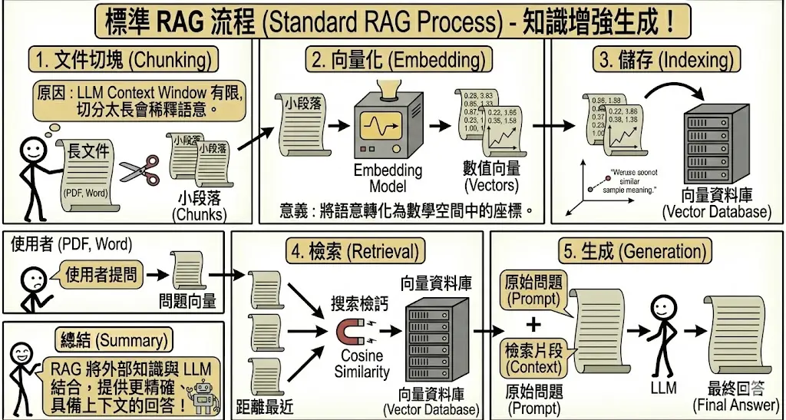
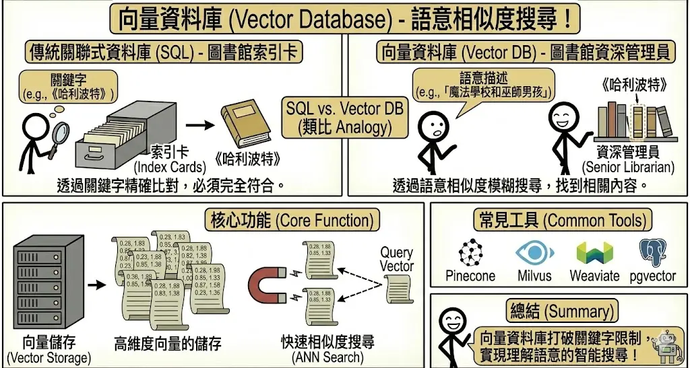
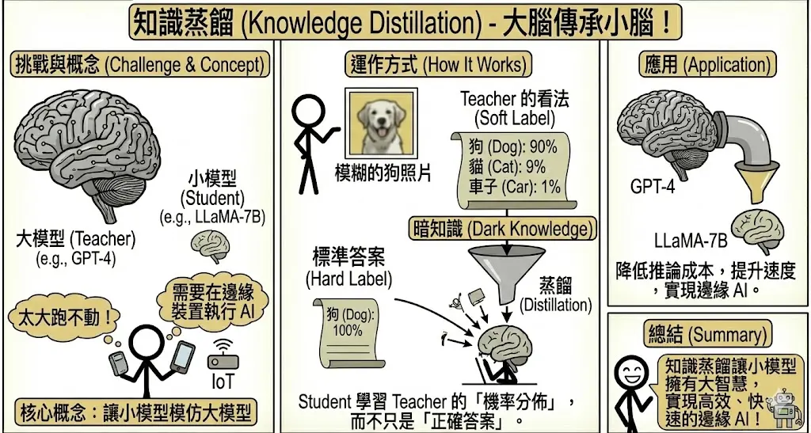
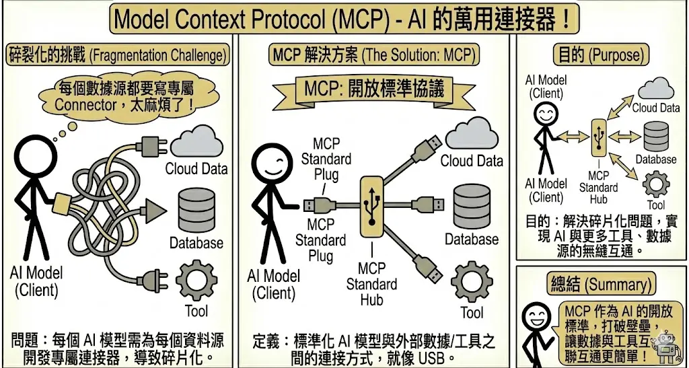

<!-- # 第三章：進階 RAG 與系統架構 (Advanced RAG & Architecture) {#sec-advanced-rag} -->

> **考點摘要**：解決 AI 幻覺與時效性問題的主流架構，考題常涉及 RAG 與 Fine-tuning 的選擇決策。

## RAG 運作原理與架構 {#sec-rag-architecture}

檢索增強生成 (Retrieval-Augmented Generation, RAG) 是目前企業落地生成式 AI 最關鍵的技術架構。

### 1. 標準 RAG 流程 {.unnumbered}
RAG 的運作可以分為五個標準步驟：

1.  **文件切塊 (Chunking)**：將長文件（PDF, Word）切成小的段落 (Chunks)。
    *   *原因*：LLM 的 Context Window 有限，且切分太長會稀釋語意。
2.  **向量化 (Embedding)**：使用 Embedding Model 將文字轉換為數值向量 (Vectors)。
    *   *意義*：將語意轉化為數學空間中的座標。意思相近的句子，座標會靠得很近。
3.  **儲存 (Indexing)**：將向量存入向量資料庫 (Vector Database)。
4.  **檢索 (Retrieval)**：
    *   當使用者提問時，將問題也轉換為向量。
    *   在資料庫中搜尋與問題向量「距離最近」的片段 (Cosine Similarity)。
5.  **生成 (Generation)**：將檢索到的片段 (Context) 與原始問題 (Prompt) 一起餵給 LLM，生成最終回答。

### 2. 向量資料庫 (Vector Database) {.unnumbered}
不同於傳統關聯式資料庫 (SQL) 透過關鍵字精確比對，向量資料庫透過「語意相似度」進行模糊搜尋。

*   **核心功能**：高維度向量的儲存與快速相似度搜尋 (ANN Search)。
*   **常見工具**：Pinecone, Milvus, Chroma, Weaviate, pgvector。
*   **類比**：
    *   **SQL**：圖書館的索引卡系統。你要找《哈利波特》，必須輸入精確書名。
    *   **Vector DB**：圖書館的資深管理員。你說「我想找一本關於魔法學校和巫師男孩的書」，他就能帶你找到《哈利波特》，即使你沒提到書名。

## 模型微調 (Fine-tuning) 與優化 {#sec-fine-tuning-optimization}

在企業導入生成式 AI 時，最常面臨的抉擇就是：**該用 RAG 還是 Fine-tuning？**

### 1. RAG vs. Fine-tuning 決策矩陣 {.unnumbered}

這兩者並非互斥，而是互補。我們可以將它們比喻為：
*   **RAG (檢索增強生成)**：像是**開書考**。模型本身不需要背誦知識，考試時翻閱教科書（向量資料庫）即可。
*   **Fine-tuning (微調)**：像是**考前衝刺班**。透過大量練習，將知識內化到大腦（權重）中，並學習特定的答題技巧。

| 比較項目 | RAG (檢索增強生成) | Fine-tuning (模型微調) |
| :--- | :--- | :--- |
| **知識時效性** | **高**。資料庫更新，AI 就知道新知識（即時）。 | **低**。需要重新訓練才能學到新知識（週期長）。 |
| **幻覺風險** | **低**。回答有憑有據 (Grounded)，可附上引用來源。 | **中**。模型仍可能一本正經胡說八道，且難以查證來源。 |
| **資料隱私** | **高**。可透過權限控管 (ACL) 決定誰能檢索到什麼文件。 | **低**。一旦寫入模型權重，就很難限制特定人存取特定知識。 |
| **適用場景** | 企業知識庫、法規查詢、即時新聞分析。 | 學習特定語氣/風格、醫療/法律專有名詞理解、固定格式輸出 (JSON/SQL)。 |
| **成本** | 建置向量資料庫、檢索運算成本。 | 訓練算力成本、資料標註成本。 |

> **最佳實務**：通常建議**先 RAG，後 Fine-tuning**。先用 RAG 解決知識獲取問題，如果發現模型聽不懂專業術語或語氣不對，再考慮 Fine-tuning。

### 2. 進階 RAG 技術 (Advanced RAG) {.unnumbered}
為了提升檢索的準確度，除了標準流程外，還有許多優化技巧：

*   **混合搜尋 (Hybrid Search)**：
    *   同時使用 **關鍵字搜尋 (Keyword Search/BM25)** 與 **向量搜尋 (Vector Search)**。
    *   *優點*：結合了關鍵字的精準度（如專有名詞、型號）與向量的語意理解能力。
*   **重排序 (Re-ranking)**：
    *   先檢索出較多候選片段 (Top-50)，再用一個精準的 Cross-Encoder 模型對這 50 個片段進行詳細評分與排序，最後只取 Top-5 給 LLM。
    *   *類比*：海選 (Retrieval) 先撈一堆人，決賽 (Re-ranking) 再由評審仔細打分。
*   **查詢轉換 (Query Transformation)**：
    *   LLM 在檢索前先改寫使用者的問題。
    *   *例子*：使用者問「它好用嗎？」，LLM 改寫為「iPhone 15 Pro 的電池續航力與相機效能評價如何？」，再進行檢索。

### 3. 知識蒸餾 (Knowledge Distillation) {.unnumbered}
當我們希望在邊緣裝置（手機、IoT）上執行 AI，但大模型 (Teacher) 太大跑不動時，就需要用到知識蒸餾。

*   **核心概念**：讓一個參數少、運算快的小模型 (**Student**)，去模仿大模型 (**Teacher**) 的行為。

*   **運作方式**：
    *   Student 不只是學習「正確答案」(Hard Label)，更要學習 Teacher 的「機率分佈」(Soft Label)。
    *   *例子*：分辨一張模糊的狗照片。
        *   標準答案：狗 (100%)。
        *   Teacher 看法：狗 (90%)、貓 (9%)、車子 (1%)。
        *   Teacher 傳遞出的「這張圖有點像貓」的資訊 (Dark Knowledge)，能幫助 Student 學得更好。
*   **應用**：將 GPT-4 的能力蒸餾到 LLaMA-7B 或更小的模型中，以降低推論成本並提升速度。

## Model Context Protocol (MCP) {#sec-mcp}

隨著 AI 應用越來越複雜，我們需要讓 AI 連接更多的工具與資料源。MCP 應運而生。

### 1. 定義與目的 {.unnumbered}
*   **定義**：MCP 是一個開放標準協議，旨在標準化 AI 模型 (Client) 與外部數據/工具 (Server) 之間的連接方式。
*   **目的**：解決「每個 AI 模型都要為每個資料源寫一個專屬 Connector」的碎片化問題。
*   **類比**：
    *   **USB-C**：以前手機、電腦、相機各有各的充電線。現在一條 USB-C 線就能連接所有裝置。MCP 就是 AI 界的 USB-C。
    *   **驅動程式 (Driver)**：作業系統不需要知道每台印表機的硬體細節，只要安裝對應的驅動程式即可溝通。MCP Server 就是資料源的驅動程式。

### 2. 核心架構 (Architecture) {.unnumbered}
MCP 採用 **Client-Host-Server** 架構：

*   **MCP Host (主機)**：執行 AI 模型的應用程式，例如 Claude Desktop App, IDE (VS Code, Cursor), 或 AI Agent 平台。它負責管理連線與權限。
*   **MCP Client (客戶端)**：在 Host 內部運作的元件，負責與 Server 溝通（通常是一對一或一對多）。
*   **MCP Server (伺服器)**：提供特定功能的輕量級服務。它不執行 LLM，而是專注於提供**上下文 (Context)** 或 **能力 (Capabilities)**。
    *   *例子*：Google Drive Server (讀取檔案)、PostgreSQL Server (查詢資料)、Slack Server (發送訊息)。

### 3. 三大核心原語 (Primitives) {.unnumbered}
MCP 定義了三種主要的互動模式：

1.  **資源 (Resources)**：
    *   **概念**：類似檔案讀取。Server 提供被動的數據供 Client 讀取。
    *   *例子*：讀取日誌檔 (Logs)、查看資料庫 Schema、獲取 API 文件。
    *   *特性*：唯讀 (Read-only)、可訂閱 (Subscribable)（當資源更新時通知 Client）。
2.  **提示 (Prompts)**：
    *   **概念**：Server 提供預先寫好的 Prompt Template，讓使用者或 Client 直接調用。
    *   *例子*：`git-commit-prompt` (自動生成 commit message)、`explain-code-prompt` (解釋程式碼)。
    *   *優點*：將 Prompt Engineering 的專業知識封裝在 Server 中，使用者無需從頭下指令。
3.  **工具 (Tools)**：
    *   **概念**：類似函數呼叫 (Function Calling)。Client 可以要求 Server 執行某個動作。
    *   *例子*：`execute_sql_query` (執行 SQL)、`send_email` (寄信)、`create_jira_ticket` (開票)。
    *   *特性*：可執行 (Executable)、通常需要使用者授權 (Human-in-the-loop)。

### 4. MCP 與 RAG 的差異 {.unnumbered}
| 特性 | RAG (檢索增強生成) | MCP (模型上下文協議) |
| :--- | :--- | :--- |
| **主要目標** | **獲取知識**。解決 AI 知識不足與幻覺問題。 | **連接萬物**。解決 AI 與外部系統整合的標準化問題。 |
| **運作方式** | 切塊 -> 向量化 -> 檢索 -> 生成。 | Client <-> Server 透過標準協議溝通 (JSON-RPC)。 |
| **資料型態** | 主要是**非結構化文字** (PDF, Wiki)。 | 包含**結構化資料** (DB)、**即時狀態** (Logs)、**操作能力** (Tools)。 |
| **關係** | RAG 是 AI 的一種**能力**。 | MCP 是實現 RAG 的一種**管道** (例如透過 MCP 連接向量資料庫)。 |
