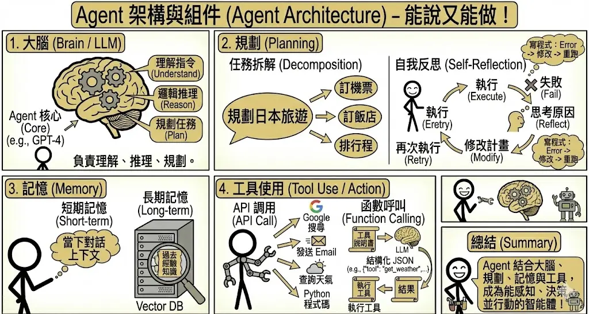
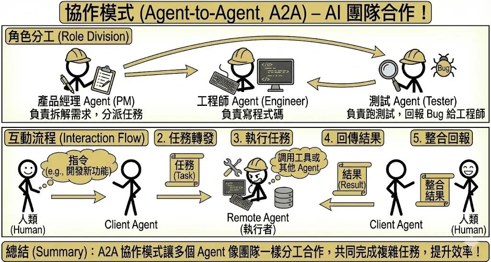

<!-- # 第四章：AI 代理人 (Agentic AI) 與自動化 {#sec-agentic-ai} -->

> **考點摘要**：從對話走向行動，Agent 的規劃、工具使用與多代理協作是進階考點。

## Agent 架構與組件 {#sec-agent-architecture}

傳統的 Chatbot 只能「說」，而 Agent (代理人) 能夠「做」。Agent 具備感知環境、進行決策並執行行動的能力。

### 1. 核心模組 {.unnumbered}
一個完整的 Agent 通常包含以下四大組件：

1.  **大腦 (Brain / LLM)**：
    *   負責理解指令、進行邏輯推理、規劃任務步驟。
    *   這是 Agent 的核心，通常由強大的 LLM (如 GPT-4) 擔任。
2.  **規劃 (Planning)**：
    *   **任務拆解**：將一個大目標（如「幫我規劃日本旅遊」）拆解成多個小步驟（訂機票、訂飯店、排行程）。
    *   **任務拆解**：將一個大目標（如「幫我規劃日本旅遊」）拆解成多個小步驟（訂機票、訂飯店、排行程）。
    *   **自我反思 (Self-Reflection / Reflexion)**：
        *   Agent 不只是執行，還會「回頭看」。
        *   *流程*：執行 -> 失敗 -> 思考原因 -> 修改計畫 -> 再次執行。
        *   *類比*：寫程式時遇到 Error，你會看錯誤訊息，修改程式碼，再跑一次，而不是直接放棄。
3.  **記憶 (Memory)**：
    *   **短期記憶**：當下的對話上下文。
    *   **長期記憶**：透過向量資料庫 (Vector DB) 儲存過去的經驗或知識，隨時調用。
4.  **工具使用 (Tool Use / Action)**：
    *   Agent 需要手腳才能與世界互動。
    *   **API 調用**：搜尋 Google、發送 Email、查詢天氣、執行 Python 程式碼。
    *   **函數呼叫 (Function Calling)**：
        *   這是 LLM 使用工具的標準機制。
        *   開發者提供工具的「說明書」(JSON Schema)，告訴 LLM 這個工具有什麼功能、需要什麼參數。
        *   LLM 讀懂後，會輸出一個結構化的 JSON (如 `{"tool": "get_weather", "location": "Taipei"}`)。
        *   程式執行該工具，並將結果回傳給 LLM。

### 2. 解決方案圖譜 (Solution Graph) {.unnumbered}
在處理複雜問題時，單線性的思考往往不夠。Solution Graph 提供了一個更結構化的框架。

*   **定義**：將解決問題的過程建模為一個圖 (Graph)。
    *   **節點 (Node)**：代表某個狀態或中間結果。
    *   **邊 (Edge)**：代表採取的行動或轉換。
*   **功能**：它作為 Agent 的導航地圖，組織決策步驟。Agent 不是盲目地走，而是在圖上進行搜尋。
*   **搜尋策略**：
    *   **廣度優先搜尋 (BFS)**：先探索所有可能的下一步，再往深處走。適合尋找最短路徑。
    *   **深度優先搜尋 (DFS)**：選定一條路一直走到底，如果不通再回頭。適合需要深入挖掘的任務。
    *   **最佳優先搜尋 (Best-First Search)**：評估哪條路看起來最有希望 (Heuristic)，優先走那條。

## 多代理系統 (Multi-Agent Systems, MAS) {#sec-multi-agent-systems}

當任務太複雜，一個 Agent 做不來時，我們就需要一個團隊。

### 1. 協作模式 (Agent-to-Agent, A2A) {.unnumbered}
*   **角色分工**：就像人類公司一樣，不同的 Agent 扮演不同的角色。
    *   *產品經理 Agent*：負責拆解需求，分派任務。
    *   *工程師 Agent*：負責寫程式碼。
    *   *測試 Agent*：負責跑測試，回報 Bug 給工程師。
*   **互動流程**：
    1.  **Client Agent (發起者)** 接收人類指令。
    2.  Client Agent 將任務轉發給 **Remote Agent (執行者)**。
    3.  Remote Agent 執行任務（可能需要調用工具或其他 Agent）。
    4.  Remote Agent 將結果回傳給 Client Agent。
    5.  Client Agent 整合結果回報給人類。

### 2. 常見挑戰 {.unnumbered}
多個 Agent 合作雖然強大，但也帶來了新的問題：

*   **無限循環 (Infinite Loops)**：
    *   Agent A 問 Agent B，Agent B 又問 Agent A，兩人互相踢皮球，任務永遠無法完成。
    *   *解法*：設定最大對話輪數 (Max Turns) 或引入一個「監督者 Agent」來強制終止。
*   **角色定義不清**：
    *   如果職責重疊，兩個 Agent 可能會搶著做同一件事，或者以為對方會做結果沒人做。
    *   *解法*：在 System Prompt 中極度明確地定義每個 Agent 的職責邊界。
*   **答案衝突**：
    *   Agent A 說要用 Python，Agent B 說要用 Node.js。
    *   *解法*：引入「決策者 Agent」或投票機制來解決歧見。

### 3. 常見 Agent 開發框架 {.unnumbered}
工欲善其事，必先利其器。開發 Agent 不需從頭造輪子。

*   **LangChain / LangGraph**：
    *   最流行的框架，提供豐富的工具整合與 Chain/Graph 的抽象層。
    *   *特色*：高度靈活，適合建構複雜的單體或多體 Agent。
*   **LlamaIndex**：
    *   最初專注於 RAG，現已發展出強大的 Agentic RAG 能力。
    *   *特色*：擅長處理**資料密集型 (Data-Centric)** 的 Agent，能將複雜的資料檢索策略轉化為 Agent 的工具。
*   **Microsoft AutoGen**：
    *   專注於**多代理協作 (Multi-Agent Collaboration)**。
    *   *特色*：透過「對話」來解決問題。你可以定義多個 Agent (如 UserProxy, Assistant)，讓它們互相聊天來完成任務。
*   **Microsoft Semantic Kernel**：
    *   微軟推出的輕量級 SDK，強調將 LLM 與現有程式碼 (C#, Python, Java) 整合。
    *   *特色*：企業級整合首選，特別是 .NET 生態系。強調 **Plugins** 與 **Planners** 的概念。
*   **CrewAI**：
    *   基於 LangChain，強調**角色扮演 (Role-Playing)** 與**任務指派**。
    *   *特色*：讓 Agent 像一個團隊 (Crew) 一樣運作，每個 Agent 有明確的角色 (Role)、目標 (Goal) 與背景故事 (Backstory)。
*   **OpenAI Swarm (Experimental)**：
    *   OpenAI 推出的教育性質框架，展示輕量級的多代理編排。
    *   *特色*：強調 **Handoffs (交接)** 機制，讓 Agent 能將對話控制權轉交給另一個更適合的 Agent。
