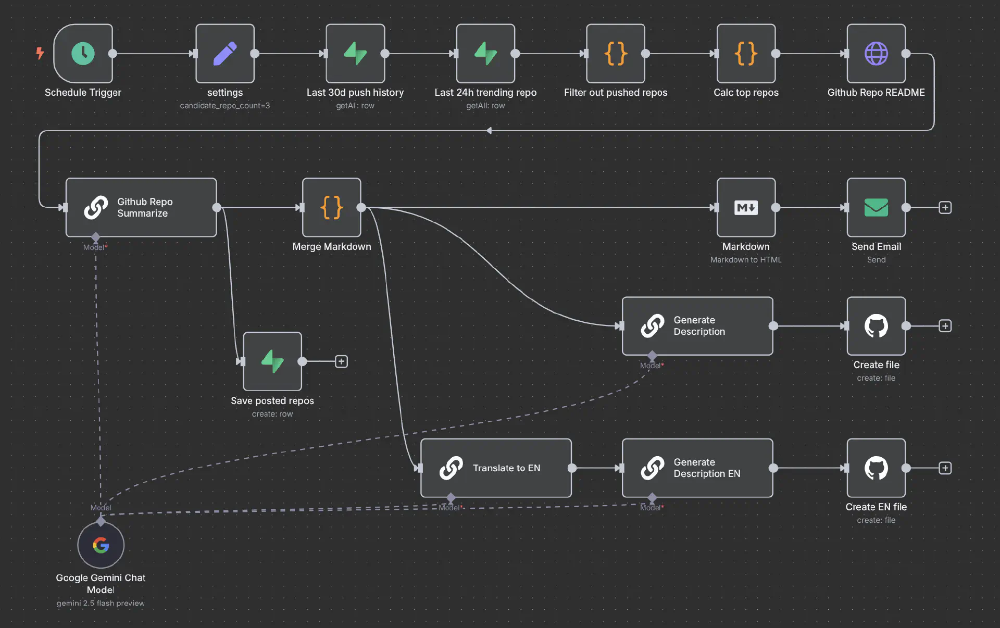
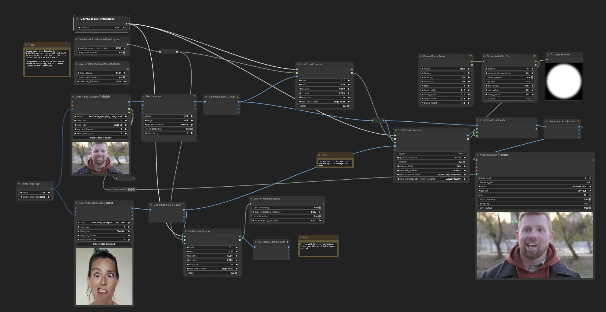
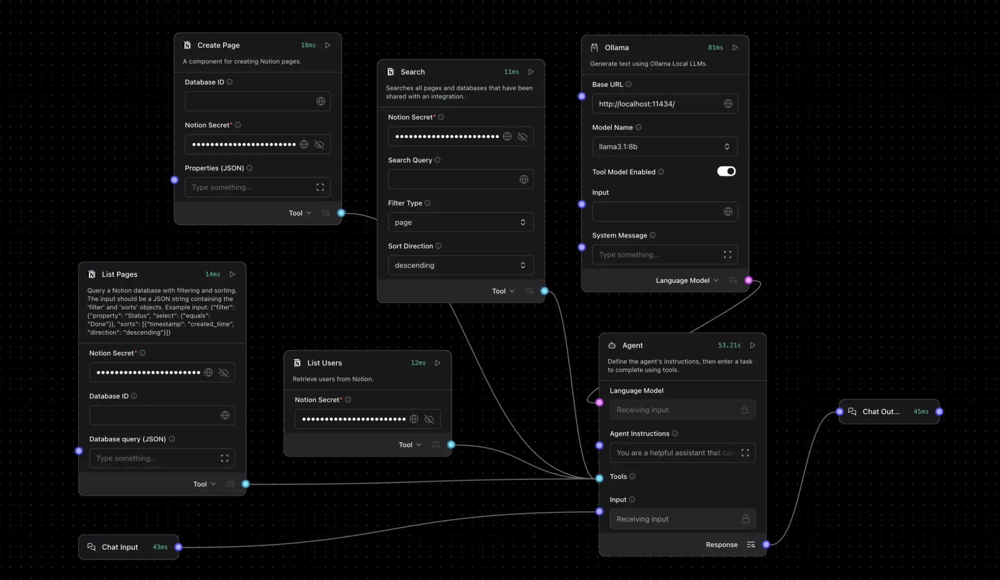

<!-- # No Code / Low Code 平台與 AI 開發工具 {#sec-no-code-low-code} -->

> **考點摘要**：結合傳統 Low Code 概念與新一代 AI Native 開發工具，強調非技術人員的賦能與開發效率。

## 平台特性與選擇 (理論基礎) {#sec-platform-characteristics}

選擇適合的生成式 AI 平台時，企業需要評估多項維度：

1. **開源 (Open-Source) vs. 閉源 (Closed-Source)**：開源模型（如 LLaMA）提供完全的控制權與資料隱私，但需要自建基礎設施；閉源 API（如 OpenAI）則提供頂尖效能與易用性，但資料需傳輸至雲端。
2. **邊緣運算 (Edge AI) vs. 雲端運算 (Cloud AI)**：對於延遲敏感或隱私要求極高的場景，將模型部署於終端設備（Edge）是較佳選擇；而需要強大算力的大型模型則依賴雲端。
3. **生態系支援**：平台是否具備豐富的開發工具（如 LangChain 支援）、社群資源與技術文件，是決定開發效率的關鍵。

### 1. No Code vs. Low Code {.unnumbered}
這兩者都是為了加速開發，但目標客群與適用場景不同。

*   **No Code (無程式碼)**：
    *   **核心**：完全圖形化介面 (GUI)，拖拉元件 (Drag-and-Drop) 即可完成。
    *   **目標客群**：非技術人員 (Citizen Developers)、行銷、PM。
    *   **適用場景**：標準化應用、簡單的表單流程、個人網站、內部儀表板。
    *   **限制**：靈活性低，只能做平台允許的功能，很難客製化複雜邏輯。

*   **Low Code (低程式碼)**：
    *   **核心**：大部分功能用拖拉，但關鍵邏輯允許（或需要）寫少量程式碼。
    *   **目標客群**：專業開發者 (加速開發)、具有基本程式概念的 IT 人員。
    *   **適用場景**：企業級應用 (ERP/CRM)、需串接多個舊系統、需高度客製化的邏輯。
    *   **優勢**：兼具開發速度與擴展性 (Scalability)。

### 2. 模型 (Model) 的定義 {.unnumbered}
在 Low Code 平台的語境中，「Model」通常**不是**指 AI 模型，而是指**資料模型 (Data Model)**。

*   它抽象地描述了資料結構（如客戶資料表包含姓名、電話）、業務流程（訂單審核流程）與介面邏輯。
*   這讓開發者可以專注於業務邏輯，而不用管底層的資料庫語法。

## 熱門 AI 開發與 No/Low Code 工具 (實務趨勢) {#sec-ai-tools}

新一代的開發工具深度整合了生成式 AI，模糊了 Coding 與 No Code 的界線。

### 1. AI 原生編輯器 (AI-Native IDEs) {.unnumbered}
這些編輯器從底層就整合了 AI，而不僅僅是外掛。

*   **運作原理**：
    *   傳統 IDE 只是把 AI 當外掛 (Plugin)，只能看到當前檔案。
    *   AI-Native IDE 會建立專案的 **AST (抽象語法樹)** 與 **向量索引 (Vector Index)**。
    *   當你提問時，它不只看游標位置，還會檢索相關的函式定義、型別宣告，甚至專案文件。

*   **Cursor**：
    *   基於 VS Code 修改。
    *   **Codebase RAG**：它會索引你整個專案的程式碼。當你問「如何新增一個 API？」時，它會參考你現有的程式碼風格與架構來回答，而不是給出通用的範例。
    *   **Composer**：可以同時編輯多個檔案，一次完成跨檔案的修改。

*   **Windsurf**：
    *   強調 "Flow" 範式。Agent 能持續監控你的開發行為，預測你下一步想做什麼，並主動提供協助。

*   **Google Antigravity**：
    *   **核心**：Google 推出的 "Agent-first" IDE，基於 VS Code 修改。
    *   **特色**：內建 Gemini 3 Pro 模型。採用雙視圖設計 (Editor & Manager)，允許使用者同時指揮多個 AI Agent 進行自主規劃、寫程式、執行終端機指令甚至瀏覽網頁。
    *   **優勢**：強調「可驗證性 (Verifiability)」，Agent 會產出實作計畫、螢幕截圖等 Artifacts，適合處理高度複雜的系統級任務。
    *   **安全注意**：由於 Agent 權限極大（可讀檔、上網），需注意間接提示注入風險。例如 [PromptArmor 發現](https://www.promptarmor.com/resources/google-antigravity-exfiltrates-data) 惡意網頁可誘導 Agent 外洩 `.env` 金鑰。使用時應保持 Human-in-the-loop 審查。

### 2. 雲端與 Agentic 平台 {.unnumbered}
*   **Replit**：
    *   雲端 IDE。其 **Replit Agent** 允許使用者用自然語言描述需求（如「做一個貪食蛇遊戲」），Agent 會自動規劃、寫程式、除錯並部署，使用者完全不用看程式碼。

*   **Lovable / v0**：
    *   專注於 UI 生成。使用者上傳一張手繪草圖或截圖，AI 直接生成可用的前端程式碼 (React/Tailwind)。

### 3. 模型引擎與 CLI {.unnumbered}
*   **GitHub Copilot**：
    *   最普及的 AI 助手。提供即時的程式碼補全 (Autocomplete) 和單元測試建議。

*   **Claude Code**：
    *   Anthropic 推出的 CLI 工具，具備強大的邏輯推理能力，能在終端機中直接操作檔案系統、執行指令並修改程式碼。

*   **[OpenAI Codex](https://openai.com/codex/)**：
    *   **核心**：最初是 GitHub Copilot 背後的模型，現已演化為全方位的雲端軟體工程 Agent。
    *   **特色**：可透過 CLI 或 IDE 擴充功能使用。具備在隔離沙箱 (Sandbox) 中導航程式碼庫、執行測試與修復 Bug 的能力。
    *   **模型**：由 `codex-1` (基於 o3 微調) 等專用模型驅動，擅長精確的程式碼生成與除錯。

### 4. 工作流自動化與視覺化編排 (Workflow Automation & Visual Orchestration) {.unnumbered}
這類工具專注於將 AI 模型與其他應用程式串接，或是提供視覺化的介面來設計複雜的 AI 處理流程。

*   **n8n**：
    *   **定位**：強大的工作流自動化工具 (Workflow Automation Tool)，強調可自託管與高度客製化。
    *   **AI 整合**：內建 AI Agent 節點，可以輕鬆將 LLM (如 GPT-4, Claude) 與超過 400 種外部服務 (如 Google Sheets, Slack, Email) 串接。
    *   **應用場景**：自動化辦公流程，例如「收到客戶 Email → 用 AI 分析情緒與摘要 → 寫入 Notion 資料庫 → 自動草擬回信」。
    

*   **ComfyUI**：
    *   **定位**：專為 [Stable Diffusion](https://en.wikipedia.org/wiki/Stable_Diffusion) 設計的節點式圖形介面 (Node-based GUI)。
    *   **核心**：將圖像生成的各個步驟 (如 Checkpoint 載入、CLIP 編碼、採樣器 Sampler、VAE 解碼) 拆解成獨立的節點，讓使用者能精細控制生成流程。
    *   **應用場景**：進階圖像生成、影片製作、建立複雜的圖像處理工作流 (Workflow)。
    

*   **LangFlow / Flowise**：
    *   **定位**：專為構建 LLM 應用設計的視覺化平台，通常基於 [LangChain](https://www.langchain.com/) 框架。
    *   **核心**：提供拖拉介面來組裝 RAG (檢索增強生成) 系統、聊天機器人 (Chatbot) 或 Agent。
    *   **應用場景**：快速原型開發 (Prototyping)，無需寫程式即可測試不同的 Prompt 策略或知識庫檢索效果。
    

### 5. 生成式 AI 產業應用案例 (Industry Applications) {.unnumbered} {#sec-industry-applications}
生成式 AI 與 No Code / Low Code 工具的結合，正推動各行各業的數位轉型。以下是主要領域的應用場景：

#### (1) 醫療與生物科技 (Healthcare & Biotech)
*   **藥物開發**：分析大量生物醫學數據，預測分子結構，縮短新藥研發週期。
*   **精準醫療**：依據患者基因組數據與病歷，生成個人化治療計畫。
*   **醫學影像**：生成合成影像數據以優化模型訓練，或輔助醫生進行影像診斷。
*   **病歷摘要**：自動整理醫生口述或雜亂的病歷資料，生成結構化報告。

#### (2) 製造與產品設計 (Manufacturing & Design)
*   **生成式設計 (Generative Design)**：輸入功能需求與材料限制，AI 自動生成數百種最佳化的產品結構設計（如輕量化零件）。
*   **預測性維護**：分析設備感測器數據，生成維護建議報告，預防無預警停機。
*   **供應鏈優化**：預測市場需求波動，自動調整生產計畫與庫存策略。

#### (3) 金融服務 (Finance)
*   **風險評估**：模擬各種市場情境 (Scenario Analysis)，生成壓力測試報告。
*   **投資顧問**：結合即時財經新聞與個股數據，為客戶生成個人化的投資組合建議。
*   **合規監控**：自動監控交易紀錄，生成可疑活動報告 (SAR) 以防範洗錢。

#### (4) 零售與行銷 (Retail & Marketing)
*   **個人化行銷**：分析消費者行為，自動生成專屬的 EDM、廣告文案與產品推薦。
*   **虛擬試穿/試妝**：利用圖像生成技術，讓消費者在線上預覽穿戴效果。
*   **庫存管理**：預測特定商品的銷售趨勢，優化補貨策略。

#### (5) 教育與培訓 (Education)
*   **教材生成**：根據課程大綱，自動生成講義、測驗題與教學投影片。
*   **個人化家教**：針對學生的弱點，生成客製化的練習題與解釋。
*   **語言學習**：模擬真實對話情境，提供即時的口說與寫作回饋。

#### (6) 娛樂與媒體 (Entertainment)
*   **內容創作**：輔助劇本撰寫、分鏡腳本 (Storyboard) 生成、背景音樂創作。
*   **遊戲開發**：自動生成無限變化的遊戲地圖 (Procedural Generation)、NPC 對話與任務支線。
*   **虛擬角色**：驅動虛擬偶像 (VTuber) 進行即時互動與直播。

### 6. 工具比較總結 (Summary Table) {.unnumbered}

| 工具名稱 (Tool) | 類別 (Category) | 核心特色 (Key Features) | 適用場景 (Use Case) |
| :--- | :--- | :--- | :--- |
| **Cursor** | AI-Native IDE | Codebase RAG, Composer (跨檔案編輯) | 專業開發者日常 Coding |
| **Windsurf** | AI-Native IDE | Flow 範式, 主動預測開發行為 | 追求流暢開發體驗的工程師 |
| **Google Antigravity** | AI-Native IDE | Agent-first, 雙視圖, 可驗證 Artifacts | 複雜系統開發, 需高度自主 Agent |
| **Replit** | Cloud / Agentic | 雲端 IDE, 自然語言生成 App (Replit Agent) | 快速構建 MVP, 非專業開發者 |
| **Lovable / v0** | UI Generation | 圖像/草圖轉前端程式碼 (React/Tailwind) | 前端介面設計, 快速 UI 原型 |
| **GitHub Copilot** | CLI / Extension | 程式碼補全, 單元測試建議 | 輔助 Coding, 提升寫碼速度 |
| **Claude Code** | CLI | 終端機操作, 邏輯推理, 檔案系統控制 | 腳本自動化, 複雜重構任務 |
| **OpenAI Codex** | Model / Agent | 雲端軟體工程 Agent, 沙箱執行 | 程式碼生成, Bug 修復, 測試 |
| **n8n** | Workflow Automation | 串接 LLM 與 400+ 外部服務, 辦公自動化 | 企業流程自動化, 資料串接 |
| **ComfyUI** | Visual Orchestration | 節點式 Stable Diffusion 工作流 | 進階 AI 圖像/影片生成 |
| **LangFlow / Flowise** | Visual Orchestration | 視覺化 LLM/RAG 應用構建 (LangChain) | 快速打造 Chatbot, RAG 原型 |

## 整合策略與風險 {#sec-integration-risks}

企業在將生成式 AI 整合至現有系統時，面臨著策略與風險的雙重考量：

* **整合策略**：可採用 API 串接、自建微型模型或部署混合雲架構。建議從小規模的 PoC (概念驗證) 開始，逐步擴展至核心業務。
* **資料外洩風險**：員工若不慎將公司機密輸入至公共 AI 平台，可能導致資料外洩。企業應建立內部專用的 AI 入口並簽署企業級隱私協議。
* **幻覺與責任風險**：若 AI 在客服或醫療建議中產生幻覺（給出錯誤資訊），企業需承擔法律責任。因此，必須建立「人機協同 (Human-in-the-loop)」的審核機制。

### 1. 影子 IT (Shadow IT) {.unnumbered}
*   **定義**：員工在未經 IT 部門核准的情況下，擅自使用外部的 No Code/AI 工具來處理公務。
*   **風險**：
    *   **資安漏洞**：資料可能被上傳到不安全的雲端（如將客戶個資貼到免費版 ChatGPT）。
    *   **缺乏維護**：員工離職後，他用 No Code 做的系統沒人會維護，變成孤兒系統。
    *   **資料孤島**：數據散落在各個小應用中，無法整合。
    *   *類比*：就像辦公室裡的員工覺得插座不夠，自己亂拉延長線 (DIY Wiring)。雖然暫時解決了問題，但可能導致跳電甚至火災 (資安風險)，且水電工 (IT 部門) 根本不知道這些線路的存在。

*   **實例**：
    *   行銷部門為了方便，自己用 Airtable 建立客戶名單，結果該服務被駭客入侵，導致公司資料外洩。
    *   業務為了省事，用個人的 Gmail 帳號註冊了某個 AI 摘要工具，並上傳了機密的會議記錄。

### 2. 開發輔助策略 (AI-Assisted Development) {.unnumbered}
如何安全有效地利用 AI 輔助開發？

*   **Boilerplate Code (樣板程式碼)**：
    *   利用 AI 生成重複性高的程式碼，如 API 串接、資料庫連線設定、單元測試框架。
    *   *例子*：「幫我寫一個 Python Flask 的 Hello World 範例，並包含 Swagger 文件設定。」

*   **測試數據生成 (Mock Data)**：
    *   利用 AI 生成逼真的測試資料，避免使用真實客戶個資。
    *   *例子*：「生成 100 筆包含姓名、Email、台灣手機號碼的 JSON 測試資料。」

*   **Code Review 與重構**：
    *   讓 AI 擔任 Reviewer，檢查程式碼的潛在 Bug 或優化空間。
    *   *例子*：「請檢查這段程式碼是否有 SQL Injection 的風險，並建議如何優化效能。」

*   **關鍵原則**：
    *   **Human-in-the-loop**：AI 只是副駕駛 (Copilot)，人類機長 (Pilot) 必須對最終結果負責。
    *   **Zero Trust**：預設 AI 生成的程式碼是不可信的，必須經過測試與審查。

## 官方學習指引補充：No code / Low code 概念

隨著人工智慧 (Artificial Intelligence, AI) 的迅速普及與應用，No Code 與 Low Code 平台已成為推動 [AI 民主化 (AI Democratization)](#sec-ai-democratization) 的重要力量。這些平台透過簡化開發流程，使更多非技術背景的人員能夠參與 AI 的創建與部署。

近年來，No Code 與 Low Code 平台快速演進，整合更多元的技術與功能，如機器學習 (Machine Learning, ML)。例如 TensorFlow 及 Keras 等工具已推出視覺化介面，讓無程式設計經驗的使用者也能輕鬆建立機器學習模型。

生成式 AI (Generative AI) 技術的興起，進一步加速了該概念在各行各業中的應用，打破了開發應用軟體與系統必須透過軟體工程師完成的關卡，縮短開發時間並降低技術門檻。

### 1. 核心概念差異

*   **No Code 平台**：透過視覺化介面和拖放操作，讓使用者無需編寫程式碼即可快速開發應用，特別適合非技術背景者用於快速原型設計或小型應用開發。
*   **Low Code 平台**：結合視覺化開發工具與程式碼擴充功能，讓具有技術背景的開發者能在視覺化設計的基礎上，透過少量程式碼實現深度整合、客製化與複雜邏輯，特別適合中大型企業及高彈性功能的應用開發。

### 2. 生成式 AI 結合 No Code / Low Code 的優勢

生成式 AI（如 ChatGPT、DALL-E 等）進一步提升 No Code 和 Low Code 平台的效能，實現自動化、智慧化開發與應用：

*   **自動生成程式碼**：AI 協助開發客製化功能，節省開發時間。
*   **模板設計優化**：AI 提供設計建議，快速完成介面設計與互動流程。
*   **數據分析與決策**：AI 基於專案數據進行分析，提供決策建議並自動化操作。
*   **AI 驅動的 UI/UX 設計**：根據文字描述自動生成多樣化 UI 設計方案。
*   **自動化行銷文案生成**：輸入產品資訊，AI 即時產出吸引人的行銷內容。
*   **個人化 App 快速開發**：透過用戶數據分析，生成符合需求的應用。

### 3. 在各產業的應用與價值

生成式 AI 結合 No Code / Low Code 平台，為各產業帶來嶄新發展契機：

*   **醫療保健**：分析大量生物醫學數據，預測分子結構協助新藥開發；自動整理病歷並提供初步診斷建議。
*   **製造業**：自動生成創新且高效的產品設計；透過數據分析優化生產流程。
*   **金融業**：模擬市場情境進行風險評估與管理；結合市場數據提供投資組合優化；自動監控法規變化。
*   **零售業**：分析消費者行為生成專屬行銷內容；預測產品需求優化補貨與庫存策略。
*   **教育領域**：自動生成教學材料；依據學習進度設計個人化學習計畫；自動批改作業並即時回饋。
*   **客戶服務**：模擬真人對話提供虛擬智慧客服；自動化生成回應；分析客訴並提出改善建議。

### 4. No Code / Low Code 平台的評估與選擇

選擇合適的平台對於提升開發效率至關重要。以下是 6 個關鍵因素：

1.  **目標用戶與技術需求**：No Code 面向非技術使用者，Low Code 面向具一定技術背景的開發者。
2.  **功能與擴展性**：評估與現有系統 (如 CRM、ERP) 的整合能力與高度自訂性。
3.  **安全性與合規性**：確認平台符合資料保護法規 (如 GDPR、CCPA)，具備資料加密與權限管理。
4.  **成本與效益**：考量總擁有成本 (Total Cost of Ownership, TCO) 與投資回報率 (Return On Investment, ROI)。
5.  **技術支援與社群資源**：評估技術文件、線上論壇與用戶社群活躍度。
6.  **市場評價與案例**：參考其他企業的用戶評價與成功案例。

### 5. 整合生成式 AI 的挑戰與風險管理

將生成式 AI 與 No Code / Low Code 平台結合雖具高度潛力，卻也伴隨多重挑戰：

*   **模型準確性與可靠性**：生成式 AI 可能產生不準確的內容。需建立多層次驗證機制與人工審核。
*   **資料隱私與安全性**：敏感資料洩漏與合規風險。需採用資料加密、匿名化與權限控管機制。
*   **道德與倫理風險**：生成虛假資訊或模型偏見。需建立倫理準則，導入公平性檢測工具。
*   **技術整合與平台適配性**：效能優化挑戰。選擇具備 API 擴充能力的平台並採用雲端運算分散負載。

**風險管理策略**：

*   **數據品質管理**：確保訓練數據多樣性與高品質。
*   **模型效能評估**：採用多維度評估指標，定期進行壓力測試。
*   **人機協作機制**：在關鍵應用場景設置人工干預機制 (Human-in-the-loop)。
*   **安全防護與風險控管**：建立防護措施，定期進行資安檢測與弱點掃描。

### 6. 企業效益與市場發展潛力

*   **降低開發成本**：簡化開發流程，減少依賴專業程式設計師。
*   **縮短上市時間**：快速部署與更新，敏捷開發並快速調整產品功能。
*   **加速數位轉型**：促進跨部門協作，快速構建數位解決方案。
*   **自動化與智慧化升級**：結合 AI 技術，自動化程式碼生成與流程設計。

### 7. AI 民主化 (AI Democratization) {#sec-ai-democratization}

[AI 民主化](#sec-ai-democratization)是指將 AI 技術的使用從少數專家和大型企業擴展到廣泛的社會層面。No Code / Low Code 平台使「市民開發者 (Citizen Developer)」能夠利用這些工具自動化日常工作，促進「創意民主化」。

**對 AI 民主化的影響**：

*   **降低技術門檻**：直觀界面讓非技術背景的人也能開發 AI 應用。
*   **擴大可訪問性**：減少成本，讓中小型企業甚至非營利組織能夠使用 AI。
*   **推動跨領域創新**：促進業務與技術部門協作。
*   **普及化應用**：AI 的學習曲線變得平緩，使 AI 在教育、行銷等領域普及。
*   **啟動全球性影響**：讓技術資源匱乏地區也有機會接觸 AI，促進技術平權。

## 常見生成式 AI 應用 {#sec-genai-applications}

生成式 AI 已廣泛應用於多種企業場景，大幅提升生產力：

1. **內容生成 (Content Generation)**：自動撰寫行銷文案、新聞稿、社群貼文，或生成商業簡報與圖片素材。
2. **知識管理與問答 (Knowledge Management)**：結合 RAG 技術，將企業內部的龐大文件庫轉化為可即時查詢的智慧問答系統。
3. **智慧客服 (Smart Customer Service)**：提供 24 小時無休的多輪對話客服，處理常見問題並進行情感分析，提升顧客滿意度。
4. **程式碼生成 (Code Generation)**：協助工程師自動生成程式碼片段、撰寫測試案例、尋找 Bug 並進行程式碼重構。

## 低程式碼與無程式碼開發 {#sec-low-code-no-code}

低程式碼 (Low-Code) 與無程式碼 (No-Code) 平台結合生成式 AI，正在改變軟體開發的生態：

* **自然語言開發**：使用者只需用自然語言描述需求（例如：「幫我做一個可以登記員工請假的系統」），AI 就能自動生成後端資料庫結構與前端 UI 介面。
* **門檻降低**：讓不具備深厚程式設計背景的業務人員（Citizen Developers）也能夠快速建立自動化工作流與應用程式。
* **加速創新**：大幅縮短了從概念到 MVP (最小可行性產品) 的開發週期，使企業能更敏捷地應對市場變化。

## AI 輔助開發 (Copilot) {#sec-ai-copilot}

AI 輔助開發工具 (如 GitHub Copilot, Cursor) 已經成為現代軟體工程師的標準配備：

* **自動補全 (Auto-Completion)**：根據上下文語境，即時預測並生成下一行程式碼或整個函式區塊。
* **註解轉程式碼 (Comment-to-Code)**：工程師寫下註解描述邏輯，AI 即可將其翻譯為可執行的程式碼。
* **程式碼解釋與重構**：對於遺留的複雜程式碼 (Legacy Code)，AI 能提供逐行解釋，並給出優化或重構的具體建議。
* **測試驅動**：AI 能快速生成覆蓋率極高的單元測試，確保程式碼的強健性。

## 歷屆考題 {#sec-past-exam}

請做測驗看歷屆考題。

