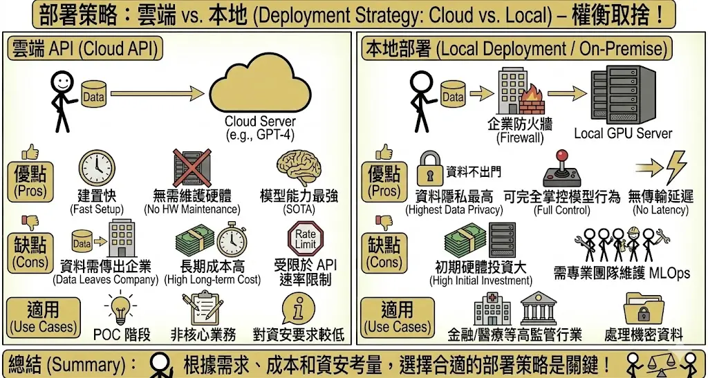
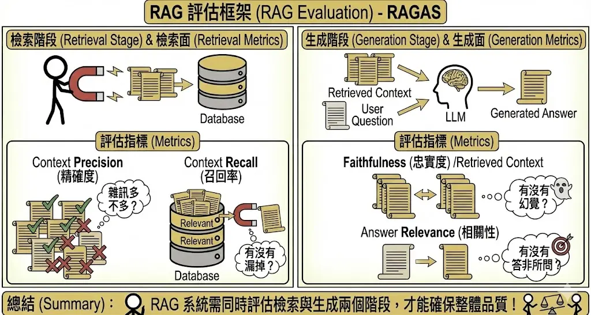
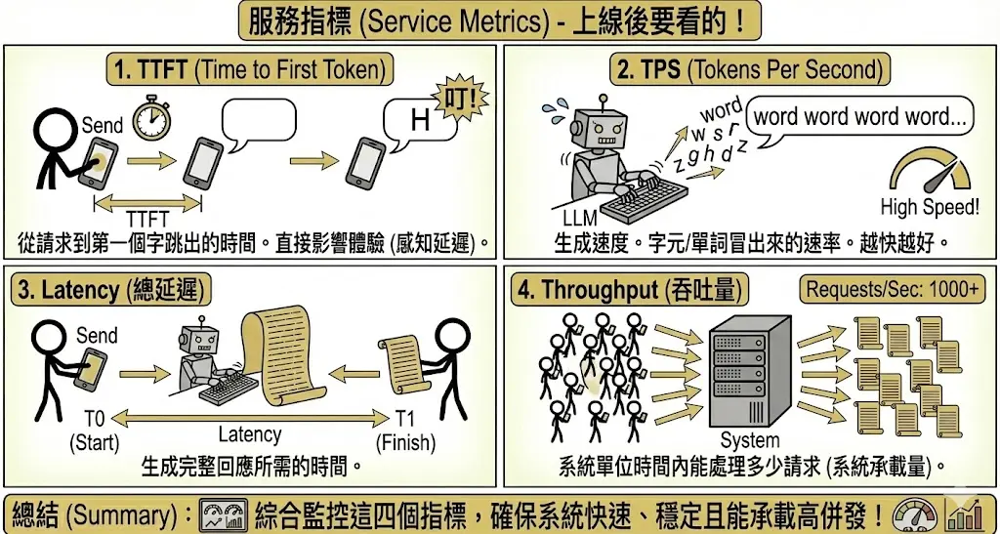
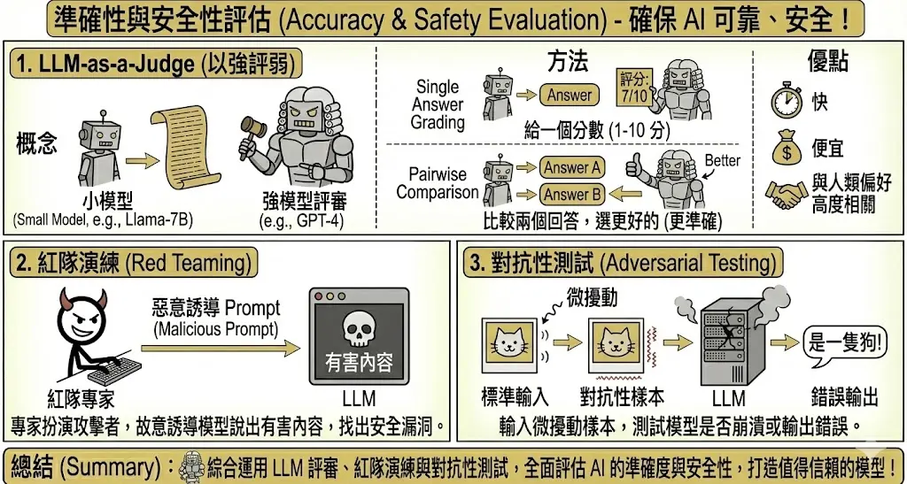

<!-- # 生成式 AI 專案管理與評估 (Project Planning & Eval) {#sec-project-planning} -->

> **考點摘要**：涵蓋從 POC 到上線的完整流程，以及如何量化評估生成模型的好壞。

## 導入流程與策略 {#sec-implementation-strategy}

### 1. 階段規劃 {.unnumbered}
導入 GenAI 專案通常遵循以下步驟：
1.  **目標設定 (Goal Setting)**：明確定義要解決什麼問題（如：減少客服 30% 工作量）。設定 KPI。
2.  **資料準備 (Data Preparation)**：清洗企業內部資料，去個資，轉換格式。這是最耗時但也最重要的步驟。
3.  **技術選型 (Model Selection)**：決定用雲端 API (GPT-4) 還是自建模型 (Llama 3)？決定用 RAG 還是 Fine-tuning？
4.  **POC (概念驗證)**：快速做出原型，驗證可行性。
5.  **部署與監控 (Deployment & Monitoring)**：上線後持續監控幻覺率與使用者滿意度。

### 2. 部署策略：雲端 vs. 本地 {.unnumbered}
*   **雲端 API (Cloud API)**：
    *   *優點*：建置快、無需維護硬體、模型能力最強 (SOTA)。
    *   *缺點*：資料需傳出企業、長期成本高（按 Token 計費）、受限於 API 速率限制 (Rate Limit)。
    *   *適用*：POC 階段、非核心業務、對資安要求較低的場景。
*   **本地部署 (Local Deployment / On-Premise)**：
    *   *優點*：**資料隱私最高**（資料不出門）、可完全掌控模型行為、無傳輸延遲。
    *   *缺點*：初期硬體投資大 (GPU Server)、需專業團隊維護 MLOps。
    *   *適用*：金融/醫療等高監管行業、處理機密資料。
    

### 3. 硬體資源優化 {.unnumbered}
*   **GPU 利用率低**：常見原因包括 Batch Size 設太小（GPU 沒吃飽）或 I/O 瓶頸（硬碟讀取太慢，GPU 在等資料）。
*   **模型量化 (Quantization)**：
    *   **原理**：降低數值精度以減少記憶體佔用與加速運算。
    *   **FP16 (半精度)**：標準訓練精度。
    *   **INT8 / INT4 (整數)**：推論常用。雖然精度降低，但對模型表現影響微乎其微 (Lossless-like)，卻能大幅降低硬體需求。
    *   *估算*：跑一個 7B 的模型 (FP16) 大約需要 14GB VRAM。若使用 INT4 量化，則只需約 5-6GB，讓消費級顯卡也能跑大模型。
*   **Flash Attention**：一種加速 Attention 計算的演算法，能顯著降低記憶體存取次數，提升長文本處理速度。

## 投資效益評估 (ROI Analysis) {#sec-roi-analysis}

企業導入生成式 AI 是一項重大投資，必須進行嚴謹的財務評估。

### 1. 成本結構 (Cost Structure) {.unnumbered}
*   **技術開發成本**：模型訓練/微調費用、軟體授權 (API Token)、雲端服務訂閱。
*   **基礎設施成本**：GPU 伺服器購置、資料儲存與傳輸費用、維運電力與冷卻。
*   **人力成本**：AI 工程師薪資、外部顧問費用、員工培訓成本。
*   **隱性成本**：資料清洗與標註的時間成本、系統整合的複雜度風險。

### 2. 效益分析 (Benefit Analysis) {.unnumbered}
*   **直接效益**：
    *   **營收增長**：透過個人化行銷提升轉換率、開發新產品線。
    *   **成本節約**：自動化客服減少人力需求、加速程式開發降低外包費用。
*   **間接效益**：
    *   **效率提升**：縮短文件處理時間、加速決策流程。
    *   **創新驅動**：激發員工創意，探索新的商業模式。

### 3. 財務指標 (Financial Metrics) {.unnumbered}
*   **投資回報率 (ROI)**：(總效益 - 總成本) / 總成本。最直觀的指標。
*   **淨現值 (NPV)**：將未來的現金流折現回當前價值，評估專案的長期價值。
*   **內部報酬率 (IRR)**：評估專案的資金效率，通常需高於企業的資金成本率 (WACC)。
*   **回收期 (Payback Period)**：計算需要多久才能回本。

## 組織與人才策略 (Organization & Talent) {#sec-org-talent}

技術只是工具，人才是成功的關鍵。

### 1. 人才培育 (Talent Development) {.unnumbered}
*   **內部培訓**：針對不同職能設計課程。
    *   *技術人員*：學習 LLM 微調、Prompt Engineering、RAG 架構。
    *   *業務人員*：學習如何使用 AI 工具優化工作流程。
*   **實務操作**：舉辦黑客松 (Hackathon) 或工作坊，鼓勵員工動手實作。

### 2. 組織文化 (Organizational Culture) {.unnumbered}
*   **跨部門協作**：AI 專案通常涉及 IT、業務、法務等多個部門，需打破穀倉效應 (Silo)。
*   **容錯文化**：AI 專案具有不確定性 (如幻覺)，應鼓勵「快速試錯 (Fail Fast)」，從失敗中學習。
*   **人機協作**：強調 AI 是「副駕駛 (Copilot)」，目標是增強人類能力而非取代人類。

## 效能評估指標 {#sec-performance-metrics}

評估生成式 AI 比評估傳統 AI 難，因為「好文筆」很難量化。

### 1. 基準測試 (Benchmarks) {.unnumbered}
學術界常用的標準考卷：
*   **MMLU (Massive Multitask Language Understanding)**：包含數學、歷史、法律、醫學等 57 個學科，測試模型的**廣度知識**與推理能力。
*   **GSM8K**：小學數學應用題。測試模型的**多步驟推理**能力。
*   **HumanEval / MBPP**：測試**寫程式**的能力。
*   **TTQA (Taiwan Truthful QA)**：針對**台灣本土文化與知識**的測試集（避免模型只懂美國文化）。

### 2. RAG 評估框架 (RAG Evaluation) {.unnumbered}
RAG 系統涉及「檢索」與「生成」兩個階段，必須分別評估。業界常用 **RAGAS** 框架。

*   **檢索面 (Retrieval Metrics)**：
    *   **Context Precision (精確度)**：檢索到的內容中，有多少是真的相關的？（雜訊多不多？）
    *   **Context Recall (召回率)**：所有相關的內容，有多少被檢索到了？（有沒有漏掉？）
*   **生成面 (Generation Metrics)**：
    *   **Faithfulness (忠實度)**：生成的回答是否完全基於檢索到的內容？（有沒有幻覺？）
    *   **Answer Relevance (相關性)**：生成的回答是否真的回答了使用者的問題？（有沒有答非所問？）
    

### 3. 服務指標 (Service Metrics) {.unnumbered}
上線後要看的指標：
*   **TTFT (Time to First Token)**：從使用者送出請求，到看到第一個字跳出來的時間。這直接影響**使用者體驗 (感知延遲)**。
*   **TPS (Tokens Per Second)**：生成速度。越快越好。
*   **Latency (總延遲)**：生成完整回應所需的時間。
*   **Throughput (吞吐量)**：系統單位時間內能處理多少請求。

### 4. 準確性與安全性評估 {.unnumbered}
*   **LLM-as-a-Judge**：
    *   **概念**：用更強的模型 (如 GPT-4) 來擔任「評審」，幫小模型 (如 Llama-7B) 的回答打分。
    *   **方法**：
        *   **Single Answer Grading**：給一個分數 (1-10 分)。
        *   **Pairwise Comparison**：給兩個回答 (A vs B)，問評審哪個更好。這通常比打分更準確。
    *   *優點*：比人類評估快且便宜，且與人類偏好高度相關。
*   **紅隊演練 (Red Teaming)**：聘請專家扮演攻擊者，故意誘導模型說出有害內容，以找出安全漏洞。
*   **對抗性測試 (Adversarial Testing)**：輸入微擾動的樣本，看模型是否會崩潰或輸出錯誤。

