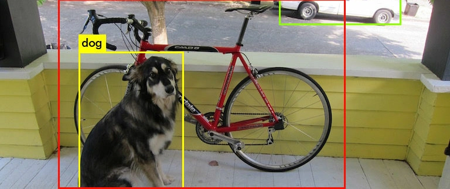
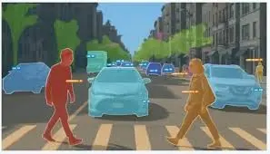

電腦視覺 (Computer Vision, CV) 賦予電腦「看」的能力，使其能從圖像或影片中提取資訊。這項技術已從學術研究走向商業化，廣泛應用於安防、醫療、製造與自駕車等領域。

## 影像處理基礎 {#sec-image-processing}

影像處理基礎 (Image Processing Basics) 是 CV 的前置步驟。影像在電腦中通常表示為像素矩陣（例如 RGB 三通道）。

**Python 範例：使用 OpenCV 讀取與處理影像**

```{python}
import cv2
import numpy as np
import matplotlib.pyplot as plt

# 創建一個簡單的圖像 (黑色背景，白色矩形)
image = np.zeros((100, 100), dtype=np.uint8)
cv2.rectangle(image, (20, 20), (80, 80), 255, -1)

# 邊緣檢測 (Canny)
edges = cv2.Canny(image, 100, 200)

# 顯示
plt.figure(figsize=(6, 8))
plt.subplot(2, 1, 1)
plt.imshow(image, cmap='gray')
plt.title('Original')
plt.subplot(2, 1, 2)
plt.imshow(edges, cmap='gray')
plt.title('Edges')
plt.tight_layout()
plt.show()
```

## 核心任務與模型 {#sec-cv-models}

深度學習模型在 CV 領域取得了巨大成功，主要涵蓋三大任務：分類、偵測與分割。

### 1. 影像分類 (Image Classification) {.unnumbered}
*   **定義**：判斷整張影像的主要內容屬於哪一類別（例如：「這是一隻貓」）。
*   **卷積神經網路 (CNN)**：
    *   **卷積層 (Convolutional Layer)**：利用卷積核 (Kernel) 滑動提取局部特徵（如邊緣、紋理）。
    *   **池化層 (Pooling Layer)**：降低維度，保留顯著特徵（Max Pooling）或平均特徵（Average Pooling）。
    *   **架構圖解**：
    ```{mermaid}
    graph LR
        Input["輸入影像"] --> Conv["卷積層<br/>(提取特徵)"]
        Conv --> Pool["池化層<br/>(降維)"]
        Pool --> Conv2["卷積層 2"]
        Conv2 --> Pool2["池化層 2"]
        Pool2 --> Flatten["攤平層"]
        Flatten --> Dense["全連接層<br/>(分類)"]
        Dense --> Output["輸出類別"]

        %% Styling
        style Input fill:#fff,stroke:#333,color:#000
        style Conv fill:#e1f5fe,stroke:#0277bd,color:#000
        style Pool fill:#fff9c4,stroke:#fbc02d,color:#000
        style Conv2 fill:#e1f5fe,stroke:#0277bd,color:#000
        style Pool2 fill:#fff9c4,stroke:#fbc02d,color:#000
        style Flatten fill:#f3e5f5,stroke:#7b1fa2,color:#000
        style Dense fill:#e0f2f1,stroke:#00695c,color:#000
        style Output fill:#fff,stroke:#333,color:#000
    ```
    
    
**Python 範例：使用 TensorFlow/Keras 建構簡單 CNN**

```{python}
import tensorflow as tf
from tensorflow.keras import layers, models

# 建立一個簡單的 CNN 模型
model = models.Sequential([
    # 卷積層 1：32 個 3x3 濾鏡，ReLU 活化函數
    layers.Conv2D(32, (3, 3), activation='relu'),
    # 池化層 1：2x2 最大池化
    layers.MaxPooling2D((2, 2)),
    
    # 卷積層 2：64 個 3x3 濾鏡
    layers.Conv2D(64, (3, 3), activation='relu'),
    # 池化層 2
    layers.MaxPooling2D((2, 2)),
    
    # 攤平層：將 2D 特徵圖轉為 1D 向量
    layers.Flatten(),
    # 全連接層：64 個神經元
    layers.Dense(64, activation='relu'),
    # 輸出層：10 個類別 (Softmax)
    layers.Dense(10, activation='softmax')
])

# 顯示模型架構摘要
model.summary()
```

*   **經典模型**：
    *   **VGG (Visual Geometry Group)**：
        *   **特點**：捨棄了早期 CNN 使用的大尺寸卷積核（如 7x7），改為全面使用小尺寸的 **3x3 卷積核**。
        *   **優勢**：
            *   **參數更少**：堆疊兩個 3x3 卷積層的感受野 (Receptive Field) 等同於一個 5x5 卷積層，但參數數量更少 2 × 3<sup>2</sup> = 18 vs 1 × 5<sup>2</sup> = 25。
            *   **非線性更強**：更多的層數意味著更多的 ReLU 活化函數，增強了模型的特徵學習能力。
        *   **代表作**：VGG16 (16層) 與 VGG19 (19層)。
    *   **ResNet (Residual Network)**：
        *   **核心創新**：引入**殘差連接 (Residual Connection)** 或稱「捷徑 (Shortcut)」。
        *   **公式解析**：$$ y = F(x) + x $$
            *   **x**：輸入訊號（原始資訊）。
            *   F(x)：經過卷積層處理後的變化量（殘差）。
            *   **y**：輸出訊號。
        *   **原理**：傳統網路試圖直接學習目標映射 H(x)，這很困難。ResNet 改為學習殘差 F(x) = H(x) - x。這就像是與其從頭學習如何畫一隻貓，不如在已有的草圖 (**x**) 上進行修改 **F(x)**。
        *   **優勢**：解決了深層網路的**梯度消失 (Vanishing Gradient)** 問題。即使網路非常深，梯度也能透過 **x** 這條「高速公路」直接傳回前面的層，讓訓練上百層的網路成為可能。

### 2. 物件偵測 (Object Detection) {.unnumbered}
*   **定義**：不僅識別物體是什麼（分類），還要找出它在哪裡（定位，Bounding Box）。
*   **代表模型**：
    *   **YOLO (You Only Look Once)**：
        *   **核心概念**：將物件偵測視為單一的**回歸問題 (Regression Problem)**，直接從影像像素預測邊界框與類別機率。這與 R-CNN 系列（兩階段：先找候選區，再分類）不同，YOLO 速度極快，實現了真正的即時偵測 (Real-time Detection)。
        *   **運作流程**：
            1.  **網格劃分 (Grid Division)**：將輸入影像劃分為 S × S 的網格。
            2.  **預測 (Prediction)**：如果一個物件的中心落入某個網格，該網格就負責偵測該物件。每個網格預測 **B** 個邊界框 (Bounding Boxes) 及其信心分數 (Confidence Score)，以及 **C** 個類別機率。
            3.  **非極大值抑制 (NMS)**：去除重疊度高且信心分數較低的框，只保留最佳結果。
        *   **流程圖解**：
        ```{mermaid}
        graph LR
            Img["輸入影像"] --> Grid["劃分 SxS 網格"]
            Grid --> CNN["CNN 特徵提取"]
            CNN --> Pred["預測張量<br/>(SxSx(B*5+C))"]
            Pred --> Box["邊界框 + 類別機率"]
            Box --> NMS["非極大值抑制<br/>(NMS)"]
            NMS --> Final["最終偵測結果"]

            style Img fill:#fff,stroke:#333,color:#000
            style Grid fill:#e1f5fe,stroke:#0277bd,color:#000
            style CNN fill:#fff9c4,stroke:#fbc02d,color:#000
            style Pred fill:#e1f5fe,stroke:#0277bd,color:#000
            style NMS fill:#f3e5f5,stroke:#7b1fa2,color:#000
            style Final fill:#fff,stroke:#333,color:#000
        ```

*   **評估指標：IoU (Intersection over Union)**
    *   衡量預測框與真實框重疊程度的指標。
    *   **公式**：        $$ IoU = \frac{\text{重疊區域 (Intersection)}}{\text{聯集區域 (Union)}} $$
    *   **計算範例**：
        *   真實框面積 = 100，預測框面積 = 80。
        *   重疊區域 (Intersection) = 40。
        *   聯集區域 (Union) = 100 + 80 - 40 = 140。
        *   IoU = 40 / 140 ≈ 0.286。
    *   通常 IoU > 0.5 視為偵測成功。
*   **mAP (mean Average Precision)**：物件偵測常用整體指標，會在不同類別與信心閾值下整合 Precision-Recall 表現。IoU 閾值越高，代表預測框必須與真實框更精準重疊才算正確。
*   **一階段與二階段偵測器**：
    *   **一階段偵測器**：如 YOLO、SSD，直接預測位置與類別，速度快，適合即時監控、車流偵測。
    *   **二階段偵測器**：如 Faster R-CNN，先產生候選區域再分類與微調框，通常精度較高但速度較慢。



### 3. 影像分割 (Segmentation) {.unnumbered}
*   **定義**：將影像中的每一個像素 (Pixel) 都分配一個類別標籤，是電腦視覺中最精細的任務。


*   **類型比較**：
    *   **語義分割 (Semantic Segmentation)**：
        *   **概念**：只管「類別」，不管「個體」。
        *   **例子**：照片中有 5 個人，所有屬於「人」的像素都塗成紅色。背景都塗成黑色。
    *   **實例分割 (Instance Segmentation)**：
        *   **概念**：既管「類別」，也管「個體」。結合了物件偵測與語義分割。
        *   **例子**：照片中有 5 個人，第 1 個人塗紅、第 2 個人塗藍...以此類推。
    *   **全景分割 (Panoptic Segmentation)**：
        *   **概念**：同時處理語義分割與實例分割，讓每個像素都有語義類別，也能區分可數物件的不同個體。
        *   **例子**：自駕車場景中，同時標示道路、天空、建築等背景類別，並區分每一台車與每一位行人。
*   **常見模型**：
    *   **FCN (Fully Convolutional Network)**：
        *   **創新**：將傳統 CNN 最後的「全連接層」替換為「卷積層」。
        *   **優勢**：這讓模型可以接受任意尺寸的輸入影像，並輸出一張與輸入等大的熱點圖 (Heatmap)，實現像素級分類。
    *   **Mask R-CNN**：
        *   **架構**：在 Faster R-CNN 的基礎上，增加了一個**全卷積分支 (FCN Branch)** 用於預測二值遮罩 (Binary Mask)。
        *   **關鍵技術**：**RoI Align**。解決了傳統 RoI Pooling 在量化時的座標誤差問題，實現了像素級的精準對齊。
    *   **U-Net**：
        *   **架構**：呈現 "U" 字型。左半部是**編碼器 (Encoder)** 負責壓縮特徵（下採樣），右半部是**解碼器 (Decoder)** 負責還原尺寸（上採樣）。
        *   **關鍵技術**：**跳躍連接 (Skip Connections)**。將編碼器的高解析度特徵直接「複製貼上」到解碼器對應層，解決了上採樣過程中細節丟失的問題。
        *   **應用**：因其對邊緣細節的精準捕捉，成為**醫療影像分割**（如細胞、腫瘤切割）的首選模型。
        *   **架構圖解**：

        ```{mermaid}
        %%| fig-cap: "U-Net 架構圖：Encoder-Decoder 與 Skip Connections"
        graph LR
            subgraph Encoder ["編碼器 (特徵提取)"]
                E1["Conv Block 1"] --> P1["Max Pool"]
                P1 --> E2["Conv Block 2"]
                E2 --> P2["Max Pool"]
                P2 --> E3["Conv Block 3"]
            end
            
            subgraph Decoder ["解碼器 (還原尺寸)"]
                U1["UpConv 1"] --> D1["Conv Block 4"]
                U2["UpConv 2"] --> D2["Conv Block 5"]
            end
            
            E3 --> U1
            D1 --> U2
            
            %% Skip Connections
            E2 -.->|"Skip Connection<br/>(複製特徵)"| D1
            E1 -.->|"Skip Connection<br/>(複製特徵)"| D2

            style Encoder fill:#e1f5fe,stroke:#0277bd
            style Decoder fill:#fff9c4,stroke:#fbc02d
        ```

### Vision Transformer 與多模態視覺模型 {.unnumbered}

近年電腦視覺不只依賴 CNN，也大量採用 Transformer 與圖文對齊模型。

*   **Vision Transformer (ViT)**：將影像切成 patch 後視為序列，使用自注意力機制建模全域關係。資料量足夠時能取得很高表現，但通常需要較多訓練資料與算力。
*   **CLIP/BLIP 類模型**：把影像與文字映射到共同嵌入空間，可支援零樣本分類、文字找圖、影像自動標註與多模態檢索。
*   **輕量化部署**：在邊緣裝置或即時攝影機場景，常選 MobileNet、YOLO Nano 等輕量模型，並搭配量化、剪枝降低延遲。


## 產業應用情境 {#sec-cv-applications}

### 1. 監控與安全 (Surveillance & Security) {.unnumbered}
*   **人臉辨識**：
    *   流程：人臉檢測 -> 特徵提取 (眼睛、鼻子位置) -> 資料庫比對。
    *   應用：門禁系統、考勤打卡。
*   **車牌辨識 (ANPR)**：
    *   流程：車牌定位 -> 字符分割 -> OCR 識別。
    *   應用：停車場管理、電子收費 (ETC)。

### 2. 醫療影像診斷 (Medical Imaging) {.unnumbered}
*   **影像分類**：輔助判讀 X 光、CT 或 MRI，例如判斷是否有肺炎特徵。
*   **影像分割**：使用 U-Net 精確勾勒腫瘤或器官輪廓，協助手術規劃。
*   **關鍵**：需專業醫師標註的高品質資料，且須嚴格遵守隱私法規 (HIPAA)。

### 3. 智慧製造與零售 (Smart Manufacturing & Retail) {.unnumbered}
*   **工業瑕疵偵測 (AOI)**：
    *   自動檢測產品表面的刮痕、裂紋或尺寸偏差，取代人工目檢，提升良率。
    *   結合邊緣運算 (Edge Computing) 實現即時回饋。
*   **零售行為分析**：
    *   **熱點圖 (Heatmap)**：分析顧客在店內的移動路徑與停留時間，優化貨架擺設。
    *   **無人商店**：追蹤顧客拿取商品的動作，實現自動結帳。

### 4. 自動駕駛 (Autonomous Driving) {.unnumbered}
*   **車道線偵測**：確保車輛行駛在正確車道。
*   **障礙物識別**：辨識行人、車輛、交通號誌。
*   **多模態融合 (Sensor Fusion)**：結合攝影機 (視覺)、LiDAR (深度) 與雷達 (速度) 數據，提供更可靠的環境感知。

## 風險與挑戰 {#sec-cv-risks}

### 1. 資料隱私與合規 (Privacy & Compliance) {.unnumbered}
電腦視覺往往涉及對「人」的監控，因此隱私風險極高。

*   **核心挑戰**：
    *   **PII 洩漏**：人臉、步態、車牌等生物特徵或個資一旦被濫用，將嚴重侵犯隱私。
    *   **法規遵循**：需符合 GDPR (歐盟)、CCPA (加州) 或當地個資法規範。
*   **治理對策**：
    *   **去識別化 (De-identification)**：在儲存或傳輸前，自動對人臉、車牌進行**模糊化 (Blurring)** 或**遮罩 (Masking)** 處理。
    *   **資料最小化 (Data Minimization)**：只收集達成目的所需的最小數據量。例如，若只需計算人流，則不應儲存清晰的人臉影像。
    *   **邊緣運算 (Edge Computing)**：將數據在本地端（攝影機）處理完畢，只上傳統計結果（如：「現在有 5 個人」），而不上傳原始影像。

### 2. 偏見與公平性 (Bias & Fairness) {.unnumbered}
*   **核心挑戰**：
    *   **資料集偏差**：若訓練資料集中某個族群（如白人男性）佔絕大多數，模型對少數族群（如深色膚色女性、長者）的辨識準確率會顯著下降。
    *   **社會衝擊**：在執法或安防領域，這種偏差可能導致錯誤逮捕或歧視性待遇。
*   **治理對策**：
    *   **多樣性採樣 (Diverse Sampling)**：主動確保訓練資料涵蓋不同的性別、種族、年齡、光照條件與場景。
    *   **偏見審計 (Bias Audit)**：在模型上線前，必須針對不同子群體 (Subgroups) 分別測試效能，確保**假陽性率 (False Positive Rate)** 與**假陰性率 (False Negative Rate)** 在各群體間是均衡的。

### 3. 部署與維運 (Deployment & Ops) {.unnumbered}
*   **核心挑戰**：
    *   **算力限制**：CV 模型通常參數量巨大，難以在資源受限的邊緣設備（如無人機、IoT 攝影機）上達到即時推論 (Real-time Inference)。
    *   **資料漂移 (Data Drift)**：訓練時的影像通常很清晰，但實際場景可能遇到雨天、夜間、鏡頭髒汙或視角改變，導致模型效能雪崩式下降。
*   **治理對策**：
    *   **模型壓縮 (Model Compression)**：
        *   **量化 (Quantization)**：將參數從 32-bit 浮點數轉為 8-bit 整數，大幅減少模型大小與記憶體佔用。
        *   **剪枝 (Pruning)**：移除神經網路中不重要的連接或神經元。
        *   **輕量化架構**：選用 MobileNet, ShuffleNet 或 YOLO-Nano 等專為行動裝置設計的模型。
    *   **持續監控 (Continuous Monitoring)**：建立 MLOps 流程，監控影像品質（如亮度、模糊度）與模型信心分數。一旦發現異常，自動觸發警報或重新訓練 (Retraining)。


## 情境題 {#sec-scenario}

電腦視覺情境題通常會描述影像任務需求，要求辨識分類、偵測或分割的差異。若只需判斷整張圖是否有瑕疵，影像分類即可；若要標出瑕疵位置，需要物件偵測；若要逐像素標記道路、腫瘤或零件邊界，則需要語義分割、實例分割或全景分割。評估時也要理解 IoU、mAP、Precision/Recall 與資料漂移。部署到產線或車載設備時，還需考慮光照變化、攝影角度、延遲、模型大小與邊緣運算限制。

## 歷屆考題 {#sec-past-exam}

請做測驗看歷屆考題。
