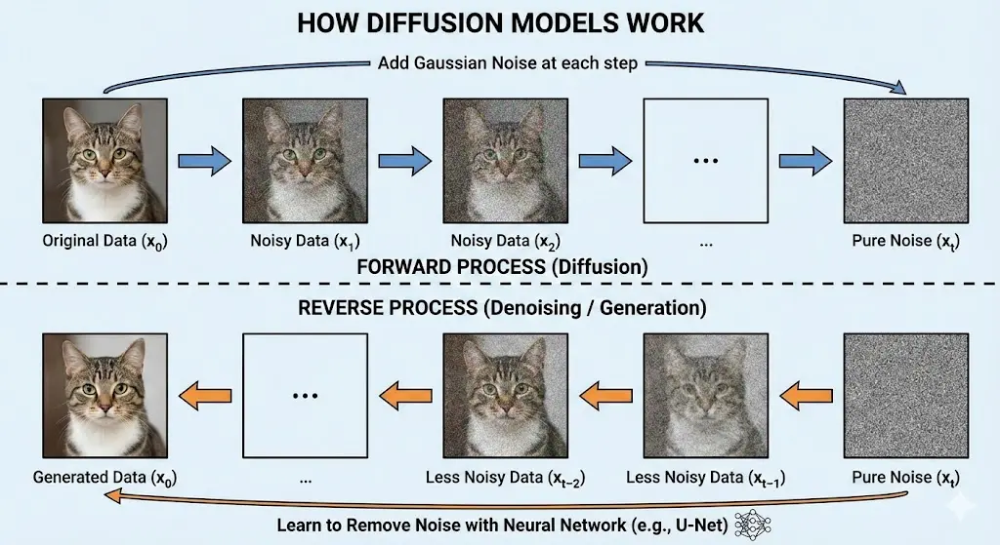
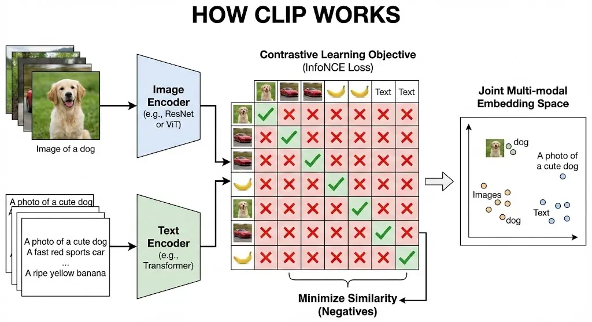

# 生成式 AI 與多模態 AI {#sec-m2-ch4}

生成式 AI (Generative AI) 與多模態 AI (Multimodal AI) 是當前 AI 發展的熱點，能夠創造全新的內容。

## AI 發展演進 (AI Evolution) {#sec-ai-evolution}

根據 NVIDIA 執行長黃仁勳的觀點，AI 的發展可以分為四個主要階段：

1.  **感知 AI (Perception AI)**：AI 能夠「看見」和「聽見」。
    *   功能：理解影像、語音、文字等資訊。
    *   例子：圖像辨識、語音轉文字。
2.  **生成式 AI (Generative AI)**：AI 能夠「創造」。
    *   功能：主動產生文本、圖像、影片、語音等多模態內容。
    *   例子：ChatGPT (文本)、Midjourney (圖像)。
3.  **代理式 AI (Agentic AI)**：AI 能夠「思考」與「行動」。
    *   功能：具備推理 (Reasoning) 與計畫 (Planning) 能力，能自動拆解並完成複雜任務。
    *   例子：AutoGPT、AI Agents。
4.  **物理 AI (Physical AI)**：AI 能夠「與實體世界互動」。
    *   功能：在真實世界中移動、操控物體並進行互動。
    *   例子：人形機器人、自動駕駛車。

## 生成模型 (Generative Models) {#sec-generative-models}

[生成模型 (Generative Models)]{#def-generative-models} 學習數據的分佈 $P(X)$，從而能夠生成新的、類似的數據。

### 生成式 vs. 鑑別式 AI (Generative vs. Discriminative AI) {.unnumbered}

| 特性 | 鑑別式 AI (Discriminative AI) | 生成式 AI (Generative AI) |
| :--- | :--- | :--- |
| **目標** | 分類、辨識或預測 | 生成新的資料樣本 |
| **工作方式** | 學習決策邊界 (Decision Boundary)，區分不同類別 | 學習資料分佈 (Data Distribution)，模擬產生新樣本 |
| **例子** | ResNet (圖像分類)、SVM、Logistic 回歸 | GPT (文本生成)、GAN、Diffusion Models |
| **輸出** | 類別標籤 (Label) 或數值 | 全新的圖像、文本、音訊等 |

### 生成對抗網路 (GANs) {.unnumbered}

[生成對抗網路 (GANs, Generative Adversarial Networks)]{#def-gans} 由兩個網路組成，它們在訓練過程中相互競爭：

*   **生成器 (Generator, G)**：試圖生成逼真的假數據 $G(z)$ 來欺騙判別器。
*   **判別器 (Discriminator, D)**：試圖區分真實數據 $x$ 和假數據 $G(z)$。

**直觀類比：偽鈔製造者 vs. 警察**

*   **生成器 (G)** 就像是**偽鈔製造者**，試圖製造出看起來像真鈔的假鈔。
*   **判別器 (D)** 就像是**警察**，試圖分辨哪些是真鈔，哪些是假鈔。
*   **博弈過程**：
    1.  一開始，偽鈔製造者的技術很差，警察很容易識破。
    2.  警察將識破的經驗反饋給偽鈔製造者（梯度下降）。
    3.  偽鈔製造者改進技術，製造出更逼真的假鈔。
    4.  警察也隨之提升鑑識能力。
    5.  這個過程不斷重複，直到偽鈔製造者的技術達到爐火純青，警察無法區分真假（$D(G(z)) \approx 0.5$），達到**納什均衡 (Nash Equilibrium)**。

::: {.callout-tip}
## 納什均衡 (Nash Equilibrium)

在 GAN 的語境下，納什均衡指的是生成器和判別器都無法通過單獨改變自己的策略來獲得更好的結果。此時，生成器生成的數據分佈 $P_g$ 完美擬合真實數據分佈 $P_{data}$，而判別器對於任何輸入（無論是真實的還是生成的）輸出的概率都是 0.5，即無法區分真假。
:::

**訓練流程圖 (Mermaid)**

```{mermaid}
graph LR
    Z["隨機雜訊 z"] --> G["生成器 G"]
    G --> Fake["假數據 G(z)"]
    Real["真實數據 x"] --> D["判別器 D"]
    Fake --> D
    D --> Loss["計算損失 V(D,G)"]
    Loss -.->|更新參數| G
    Loss -.->|更新參數| D
    style G fill:#f9f,stroke:#333,stroke-width:2px
    style D fill:#ccf,stroke:#333,stroke-width:2px
    style Fake fill:#ff9,stroke:#333,stroke-width:2px
    style Real fill:#9f9,stroke:#333,stroke-width:2px
```

**損失函數 (Min-Max Game)**：

$$ \min_G \max_D V(D, G) = \mathbb{E}_{x \sim p_{data}(x)}[\log D(x)] + \mathbb{E}_{z \sim p_z(z)}[\log(1 - D(G(z)))] $$

**公式術語解釋(看不懂沒關係)**：

*   $\min_G \max_D$：這是一個極小極大博弈。$D$ 試圖最大化目標函數 $V$（區分真假），而 $G$ 試圖最小化它（欺騙 $D$）。
*   $\mathbb{E}_{x \sim p_{data}(x)}$：表示對真實數據分佈 $p_{data}(x)$ 取期望值。即從真實數據集中採樣 $x$。
*   $D(x)$：判別器對真實數據 $x$ 的輸出概率。理想情況下，$D(x)$ 應接近 1。
*   $\log D(x)$：當 $D(x)$ 接近 1 時，$\log D(x)$ 接近 0（最大值）；當 $D(x)$ 接近 0 時，$\log D(x)$ 趨向負無窮（懲罰）。
*   $\mathbb{E}_{z \sim p_z(z)}$：表示對潛在空間雜訊分佈 $p_z(z)$ 取期望值。$z$ 通常是隨機高斯雜訊。
*   $G(z)$：生成器根據雜訊 $z$ 生成的假數據。
*   $D(G(z))$：判別器對假數據 $G(z)$ 的輸出概率。
*   $\log(1 - D(G(z)))$：
    *   對於 $G$：希望 $D(G(z))$ 接近 1（騙過 $D$），此時 $1 - D(G(z))$ 接近 0，$\log$ 值最小（負無窮）。

**白話對應解釋**：

*   **$\min_G \max_D$**：這場遊戲中，警察 ($D$) 想盡辦法抓到假鈔（最大化成功率），而偽鈔製造者 ($G$) 想盡辦法不被抓到（最小化被抓率）。
*   **$D(x)$**：警察拿到一張**真鈔** ($x$)，判斷它是真鈔的信心分數。分數越高越好。
*   **$G(z)$**：偽鈔製造者拿一張白紙 ($z$) 畫出來的**假鈔**。
*   **$D(G(z))$**：警察拿到這張**假鈔** ($G(z)$)，判斷它是真鈔的信心分數。
    *   警察希望這個分數很低（一眼看出是假的）。
    *   偽鈔製造者希望這個分數很高（成功騙過警察）。
*   **$\log(1 - D(G(z)))$**：這項指標代表「警察成功識破假鈔」的程度。
    *   警察想讓這項越大越好（識破成功）。
    *   偽鈔製造者想讓這項越小越好（識破失敗）。

**訓練步驟詳解**：

1.  **固定生成器 G，訓練判別器 D**：
    *   從真實數據集採樣 $x$。
    *   從雜訊分佈採樣 $z$，生成假數據 $G(z)$。
    *   計算 $D$ 的損失：最大化 $\log D(x) + \log(1 - D(G(z)))$。
    *   更新 $D$ 的參數，使其更擅長區分真假。
2.  **固定判別器 D，訓練生成器 G**：
    *   從雜訊分佈採樣 $z$，生成假數據 $G(z)$。
    *   將假數據輸入 $D$，計算 $D(G(z))$。
    *   計算 $G$ 的損失：最小化 $\log(1 - D(G(z)))$（實務上通常改為最大化 $\log D(G(z))$ 以避免梯度消失）。
    *   更新 $G$ 的參數，使其生成的數據更像真實數據。
3.  **重複上述步驟**，直到模型收斂。

### 變分自動編碼器 (VAEs) {.unnumbered}

[變分自動編碼器 (VAEs, Variational Autoencoders)]{#def-vaes} 學習數據的潛在分佈 (Latent Distribution)，並從中採樣生成新數據。它最大化證據下界 (ELBO)。

**損失函數 (ELBO)**：

$$ \mathcal{L} = \mathbb{E}_{q(z|x)}[\log p(x|z)] - D_{KL}(q(z|x) || p(z)) $$

**公式術語解釋**：

*   $\mathbb{E}_{q(z|x)}[\log p(x|z)]$：**重建誤差 (Reconstruction Loss)**。衡量解碼器 $p(x|z)$ 從潛在變量 $z$ 重建原始輸入 $x$ 的能力。
*   $D_{KL}(q(z|x) || p(z))$：**KL 散度 (Kullback-Leibler Divergence)**。衡量編碼器輸出的分佈 $q(z|x)$ 與先驗分佈 $p(z)$（通常是標準常態分佈）之間的差異。這作為正則化項，確保潛在空間結構良好。
*   $q(z|x)$：編碼器 (Encoder)，將輸入 $x$ 映射到潛在分佈。
*   $p(x|z)$：解碼器 (Decoder)，從潛在變量 $z$ 重建 $x$。

**白話對應解釋 (書籍摘要類比)**：

*   **Encoder ($q(z|x)$)**：像是**摘要撰寫者**。他讀了一本厚厚的書 ($x$)，然後寫出一份精簡的摘要 ($z$)。
*   **Decoder ($p(x|z)$)**：像是**故事還原者**。他沒看過原書，只能根據摘要 ($z$) 試著把原本那本書 ($x$) 寫回來。
*   **重建誤差 (Reconstruction Loss)**：比較「還原後的書」和「原書」有多像。如果差很多，誤差就很大，模型就要修正。
*   **KL 散度 (KL Divergence)**：這是**摘要格式的規範**。
    *   我們不希望摘要寫得太隨意（比如用只有自己懂的密碼寫）。
    *   我們強制要求摘要必須符合某種標準格式（例如：常態分佈）。
    *   這樣做的好處是，我們隨便從標準格式裡抽一個新的摘要，還原者也能寫出一本像樣的新書（生成新數據）。

**VAE 程式碼範例 (PyTorch)**：

```python
import torch
import torch.nn as nn
import torch.nn.functional as F

class VAE(nn.Module):
    def __init__(self, input_dim=784, hidden_dim=400, latent_dim=20):
        super(VAE, self).__init__()
        # Encoder: 輸出 Mean 和 Log Variance
        self.fc1 = nn.Linear(input_dim, hidden_dim)
        self.fc21 = nn.Linear(hidden_dim, latent_dim) # Mean (mu)
        self.fc22 = nn.Linear(hidden_dim, latent_dim) # Log Variance (logvar)

        # Decoder: 從 Latent Vector 重建輸入
        self.fc3 = nn.Linear(latent_dim, hidden_dim)
        self.fc4 = nn.Linear(hidden_dim, input_dim)

    def encode(self, x):
        h1 = F.relu(self.fc1(x))
        return self.fc21(h1), self.fc22(h1)

    def reparameterize(self, mu, logvar):
        # 重參數化技巧 (Reparameterization Trick)
        # z = mu + std * epsilon
        std = torch.exp(0.5 * logvar)
        eps = torch.randn_like(std)
        return mu + eps * std

    def decode(self, z):
        h3 = F.relu(self.fc3(z))
        return torch.sigmoid(self.fc4(h3)) # 輸出範圍 [0, 1]

    def forward(self, x):
        mu, logvar = self.encode(x.view(-1, 784))
        z = self.reparameterize(mu, logvar)
        return self.decode(z), mu, logvar

# 損失函數
def loss_function(recon_x, x, mu, logvar):
    # 1. 重建誤差 (Binary Cross Entropy)
    BCE = F.binary_cross_entropy(recon_x, x.view(-1, 784), reduction='sum')
    
    # 2. KL 散度
    # 0.5 * sum(1 + log(sigma^2) - mu^2 - sigma^2)
    KLD = -0.5 * torch.sum(1 + logvar - mu.pow(2) - logvar.exp())

    return BCE + KLD
```

### 擴散模型 (Diffusion Models) {.unnumbered}

[擴散模型 (Diffusion Models)]{#def-diffusion-models} 是目前圖像生成的主流技術（如 Stable Diffusion, DALL-E 3）。

**核心過程**：

1.  **前向過程 (Forward Process, $q$)**：
    *   這是一個**破壞**過程。
    *   逐步向真實圖像 $x_0$ 添加高斯雜訊，經過 $T$ 步後，圖像變成純雜訊 $x_T$（標準常態分佈）。
    *   公式：$x_t = \sqrt{\alpha_t} x_{t-1} + \sqrt{1-\alpha_t} \epsilon$
2.  **反向過程 (Reverse Process, $p_\theta$)**：
    *   這是一個**生成**過程。
    *   訓練一個神經網路（通常是 U-Net）來預測每一步添加的雜訊 $\epsilon_\theta(x_t, t)$。
    *   從純雜訊 $x_T$ 開始，逐步減去預測的雜訊，最終恢復出清晰圖像 $x_0$。

**公式術語解釋**：

*   $x_t$：在時間步 $t$ 的圖像（含有雜訊）。
*   $\alpha_t$：雜訊調度參數 (Noise Schedule)，控制每一步保留多少原圖訊息、加入多少雜訊。
*   $\epsilon$：從標準常態分佈採樣的隨機雜訊。
*   $\epsilon_\theta$：神經網路模型，輸入是有雜訊的圖 $x_t$ 和時間步 $t$，輸出是預測的雜訊。

**白話對應解釋 (迷霧修復類比)**：

*   **前向過程 (加噪)**：想像你有一張清晰的照片，你每隔一秒鐘就在上面噴一層薄薄的霧。噴了 1000 次後，照片完全被白霧覆蓋，變成了一張白紙（純雜訊）。這個過程很簡單，不需要學習。
*   **反向過程 (去噪)**：現在給你這張白紙，要求你把它變回原本的照片。這很難！
    *   但是，如果我們只要求你「倒退一步」，把第 1000 層霧擦掉，變回第 999 層霧的樣子，這稍微簡單一點。
    *   擴散模型就是訓練一個 AI 大師，他非常擅長**「猜測這一層霧長什麼樣子」**。
    *   AI 大師從白紙開始，一步步猜測並擦掉霧氣，重複 1000 次，最後就奇蹟般地還原（生成）出了清晰的照片。

**流程圖 (Mermaid)**

```{mermaid}
graph LR
    subgraph Forward Process [前向過程：加噪]
    I["清晰圖像 x0"] -->|加雜訊| N1["微噪圖 x1"]
    N1 -.->|...| Nt["純雜訊 xT"]
    end

    subgraph Reverse Process [反向過程：去噪]
    Nt -->|預測雜訊| Model["AI 模型 U-Net"]
    Model -->|減去雜訊| D1["去噪圖 xT-1"]
    D1 -.->|...| Final["生成圖像 x0"]
    end
    
    style I fill:#fff,stroke:#333
    style Nt fill:#fff,stroke:#333
    style Final fill:#fff,stroke:#333
    style Model fill:#fff,stroke:#333
```



## 多模態應用 (Multimodal Applications) {#sec-multimodal}

[多模態應用 (Multimodal Applications)]{#def-multimodal-apps} 結合了多種數據類型（如文本、圖像、音頻），讓 AI 能夠像人類一樣同時處理多種感官資訊。

### CLIP (Contrastive Language-Image Pre-training) {.unnumbered}

[CLIP]{#def-clip} 是由 OpenAI 開發的里程碑式模型，它成功地將**圖像**和**文本**映射到了同一個數學空間（向量空間）。

**核心原理：雙塔架構 (Two-Tower Architecture)**

CLIP 包含兩個主要的編碼器：
1.  **圖像編碼器 (Image Encoder)**：通常是 ResNet 或 Vision Transformer (ViT)，將圖像轉換成向量。
2.  **文本編碼器 (Text Encoder)**：通常是 Transformer，將文本轉換成向量。

**訓練目標：對比學習 (Contrastive Learning)**

CLIP 的訓練數據是網路上爬取的 4 億組「圖像-文本對」(Image-Text Pairs)。
*   **正樣本 (Positive Pairs)**：原本就配對在一起的圖文（例如：一張狗的照片和標題「一隻可愛的狗」）。模型要**最大化**它們向量之間的相似度（Cosine Similarity）。
*   **負樣本 (Negative Pairs)**：隨機組合的圖文（例如：狗的照片和標題「一盤義大利麵」）。模型要**最小化**它們的相似度。

**CLIP 訓練流程圖 (Mermaid)**

```{mermaid}
graph LR
    subgraph Training [CLIP 訓練過程]
    Img[圖像] --> ImgEnc[圖像編碼器]
    Txt[文本] --> TxtEnc[文本編碼器]
    ImgEnc --> ImgVec[圖像向量]
    TxtEnc --> TxtVec[文本向量]
    ImgVec <-->|計算相似度| TxtVec
    end
    style Img fill:#fff,stroke:#333
    style Txt fill:#fff,stroke:#333
    style ImgEnc fill:#fff,stroke:#333
    style TxtEnc fill:#fff,stroke:#333
    style ImgVec fill:#fff,stroke:#333
    style TxtVec fill:#fff,stroke:#333
```


**白話解釋**：
CLIP 就像是一個**超級翻譯官**，他同時精通「圖像語言」和「人類語言」。他看懂了照片裡的內容，也看懂了文字的描述，並且能把這兩者對應起來。如果給他一張「貓」的照片，和文字「Cat」，他會說：「這兩個是一樣的意思！」

### 文字轉圖像生成 (Text-to-Image) {.unnumbered}

[文字轉圖像生成 (Text-to-image Generation)]{#def-text-to-image} 允許用戶通過文字描述 (Prompt) 生成圖像。這類技術（如 Stable Diffusion）通常結合了 CLIP 的語義理解能力和擴散模型的生成能力。

**生成流程**：

1.  **理解文字**：用戶輸入 Prompt，CLIP 的文本編碼器將其轉換成**語義向量 (Conditioning)**。
2.  **引導生成**：擴散模型 (U-Net) 在去噪的過程中，會參考這個語義向量。這就像是給 AI 大師下指令：「請在去噪的時候，把這團霧氣往『未來城市』的方向修復。」
3.  **產出圖像**：最終生成的圖像既符合 Prompt 的描述，又具備高品質的細節。

**Prompt Engineering 範例**

> Prompt: "A futuristic city with flying cars, cyberpunk style, neon lights, high resolution, 8k."


**文字轉圖像流程圖 (Mermaid)**

```{mermaid}
graph LR
    Prompt[提示詞 Prompt] --> TxtEnc[CLIP 文本編碼器]
    TxtEnc --> Cond[語義向量 Conditioning]
    Noise[隨機雜訊] --> Diff[擴散模型 U-Net]
    Cond --> Diff
    Diff -->|去噪| Image[生成圖像]
    style Prompt fill:#fff,stroke:#333
    style TxtEnc fill:#fff,stroke:#333
    style Cond fill:#fff,stroke:#333
    style Noise fill:#fff,stroke:#333
    style Diff fill:#fff,stroke:#333
    style Image fill:#fff,stroke:#333
```
